## 1장 아마존 웹 서비스 기초 지식 
**AWS: Amazon Web Services**

### 아마존 웹 서비스란: 아마존이 제공하는 클라우드 서비스

#### 아마존 웹 서비스란
클라우드 컴퓨팅 서비스 
서버 및 네트워크 등을 인터넷으로 빌려주는 서비스로, 언제 어디서든지 사용할 수 있다.
AWS의 다양한 서비스를 조합하여 모든 애플리케이션과 인프라를 구축할 수 있다.

시스템 운영에 필요한 서비스 일체를 사용할 수 있다.
서비스를 조합하기 쉽다.
종량제이므로 사용할 만큼만 빌릴 수 있다.
전문가가 아니어도 사용할 수 있다.
한국어와 한국 원화 결제가 가능하다.
각 나라의 보안기준과 글로벌 보안기준을 충족한다.
글로벌 확장이 쉽다 - 21개 지역 66개의 시설을 두고 있다.
(한국 - 서울)
목적에 따라 다양한 서비스를 제공한다.(165개 이상)

### AWS의 비용
초기 비용은 저렴하지만 운영 비용이 조금 비싸다.
- 향후에 필요하지만 지금은 필요 없는 자원을 확보해 둘 필요가 없다. 
최소로 필요한 만큼만 준비해서 시작하고 필요할 때 늘릴 수 있다.

장점 
1. 유연성: 이벤트나 캠페인과 같이 돌발적으로 접속 수가 늘어나는 웹사이트의 경우  확보
2. 대리 운영 : 관리하는 사람이 없어도 된다. + 기술적 지식이 부족해도 된다.

단점 : 그다지 접속 수 변동이 없는 시스템은 비용적 측면에서 불리할 수 있다.


### 서비스 이용의 용이성
#### 관리 콘솔 : GUI로 AWS를 조작하면 화면.
#### 매니지드 서비스 : AWS가 관리하는 서비스의 통칭
- 백업 및 업데이트가 자동으로 이루어진다.
->보안적 안심

but 매우 많은 서비스에 따른 다양한 형태를 구성할 수 있기 때문에, 어떻게 도입해야 할지 잘 검토하는 것이 중요하다.

 #### 어떤 지식이 필요한가?
 시스템의 구축-운영을 이해할 수 있는 인원과, 구축 책임자라면 네트워크나 서버의 기본적인 지식은 갖추고 있어야한다.
 
-------

## 2장 AWS를 이해하기 위한 클라우드 & 네트워크의 구조 

### 클라우드와 온프레미스 : 클라우드 컴퓨팅의 구조

### 클라우드란
언제, 어디서든 인터넷을 통해서 접속이 가능한 환경
클라우드 컴퓨팅 : 클라우드에 구축된 인프라를 활용하는 서비스나 이를 사용하는 것
일반적으로 클라우드는 클라우드 컴퓨팅을 가리킨다.

대표적인 클라우드 서비스 : AWS / Azure / Google Colud 등

### 온프레미스
자사가 서버 등을 구축하는 것
임대 서버 : 서버만 임대하는 경우
온프레미스 : 네트워크나 장소를 임대하는 경우 (도 여전히 온프레미스)
- 장점 : 자사에서 자유롭게 설계/운영
- 단점 : 서버 구성 변경 필요 가능성과 이를 대비한 숙력된 기술자 필요

온프레미스 <-> 임대 및 공용

#### 공용 클라우드와 사설 클라우드
공용 클라우드 : AWS와 같은 임대 클라우드
사설 클라우드 : 자사에 구축하는 클라우드 

온프레미스+클라우드 : 자사 클라우드
온프레미스+비클라우드 : 데이터 센터, 자사 서버
임대+클라우드 : AWS
임대+비클라우드 : 임대 서버 

### 가상화와 분산처리 
클라우드를 지탱하는 2대 기술

#### 가상화 
물리적 메모리, 하드 디크스, OS등 다양한 하드웨어를 소프트웨어로 대체하는 것 
```
가상 서버에 할당된 메모리와 스토리지는 자유롭게 늘리거나 줄일 수 있다.
소프트웨어처럼 구축하기 때문에 서버 복제가 쉽고 대수를 늘리거나 줄이기도 쉽다.
```

#### 분산처리 
기기 여러대에 분산하여 처리하는 방법
트래픽이 몰릴 때 집중을 분산할 수 있음.
**로드밸런서** 장치를 통해 여러 대의 서버에 분산시킴


#### 이중화
:시스템이나 서버에 문제가 생겨도 계속 가동할 수 있도록 조치하는 것을 말한다.
가상화와 분산처리는 이중화에 큰 도움이 된다.
서버 한 대에 문제가 생겨도 다른 서버에 의해 기능이 유지된다.

### SaaS, PaaS, IaaS 
클라우드의 서비스 제공 형태
**서비스를 어느 수준까지 제공하는가**의 분류기준.

#### SaaS(Software as a Service)
인프라, 플랫폼(OS)뿐 아니라 애플리케이션까지 제공.
ex)SNS / 블로그 / 웹 메일 등등

특징
- 편리한 반면 자유도가 낮다.
- 바로 사용할 수 있기 때문에 작업량이 적다.
- 특별한 지식이 필요 없다.
- 단말기 외에 준비할 것이 없다.

#### PaaS(Platform as a Service)
플랫폼까지만 제공 
OS가 설치된 서버에 사용자가 어플리케이션을 설치해 사용.
ex)임대 서버 등

특징
- 어플리케이션을 마음대로 설치할 수 있지만 대응하지 않는 어플도 있다.
- 서버 관리에 대한 지식이 필요하다.
- 경우에 따라서는 어플리케이션을 준비해야 할 필요가 있다.
- 중간 정도의 자유도
#### IaaS(Infrastructure as a Service)
인프라만 제공
ex)네트워크, 서버 머신 등 


특징
- 사용하려면 세팅이 필요하다.
- 서버 관리에 대한 지식이 필요하다.
- 경우에 따라서는 어플리케이션을 준비해야할 필요가 있다.
- 가장 높은 자유도

### 서버와 인스턴스 
AWS의 대표적인 서비스라면 Amazon EC2(Elastic Compute Cloud)이다.
: 서버를 임대하는 서비스.

Server란 어떠한 서비스를 제공하는 것.
제공 서비스에 따라 'OO서버'라고 한다.
OO서버를 만드는 것은 OO용 소프트웨어를 설치하고 그 기능을 갖추는 것이다.

컴퓨터 한 대에 여러 개의 서버를 설치할 수 있지만 성능이 저하되고, 장애가 발생했을 때 모든 기능이 멈추기 때문에 실제로 한 컴퓨터에 여러 소프트웨어를 설치하여 운영하는 경우는 별로 없다.

```
서버를 설치하는 컴퓨터 자체도 '서버'라고 한다. '기능으로서의 서버'와
서버 기능을 설치하는 '물리적인 컴퓨터로서의 서버'는 구분하도록 하자.
```

서버용 PC : 24시간 가동하는 것을 전제로 하기 때문에 불필요한 기능은 생략하고 잘 고장나지 않는 부품으로 구성되어 있다.

#### 서버용 OS
OS: 컴퓨터를 움직이기 위한 소프트웨어로, 하드웨어와 OS위에서 동작하는 소프트웨어 사이에서 중간 역할을 한다. 
서버용 OS : 유닉스계열-리눅스, BSD / 윈도우 계열


**유닉스 계열 : 오픈 소스로 개발되어 종류가 다양. **
웹 서버/ 메일 서버 등 인터넷에 사용되는 서버로 주로 사용됨.

다양한 배포판 : 커널(OS의 핵심)의 주변기능(기본적으로 명령이나 소프트웨어 등)을 추가한 패키지.
(리눅스계열 : RedHat, CentOS, Ubuntu, Debian ..)
(BSD 계열 : macOS, freeBSD ..)
**윈도계열**
Windows Server 한 가지만 존재 ->파일 서버의 OS로 많이 사용됨

#### 인스턴스와 서버
Amazon EC2에서 서버는 인스턴스로 생성된다.
**인스턴스** : '실체'라는 의미이며 실제 가동되고 있는 가상화 컴퓨터를 의미

### LAN
#### LAN(Local Area Network)
유선LAN / 무선LAN / 사내LAN 등..
사내LAN은 인터넷에 연결된 경우도 있고 아닌 경우도 있음.

인트라넷 : 인터넷에 연결되지 않은 폐쇄된 네트워크 범위
(군용망 등)

사내LAN에는 파일 서버, 웹 서버, 시스템 동작 서버 등이 포함되어 있는데, 최근 이러한 서버군을 AWS와 같은 클라우드에 이관하는 경우가 늘어나고 있다.

#### LAN을 구성하는 기술
- 라우터(router) : 네트워크 출입구가 되는 부분에 설치되는 기기. 일방향으로 들어온 데이터의 목적이를 확인하고 목적지에 가까운 다른 쪽 네트워크에 더이터를 전송한다.
- 허브(hub) : 네트워크 배선을 분할하는 기기. 같은 네트워크의 다른 단말기에 데이터를 전송한다.
- FW(FireWall) 방화벽. 들어오고 나가는 데이터를 확인하고 통신 여부를 조정하는 장치. 부정한 장소에서 접속하는 것을 금지하는 등 보안을 강화하는 데 사용한다. FW는 역할의 이름이므로 실제 조정하는 기기는 라우터나 서버, 전용 기기 등 다양하다.
- DMZ : 비무장 지대라고 하며, 인터넷과 같이 외부 네트워크와 사내 네트워크의 중간에 설치하는 네트워크이다. 어느 쪽에서든 접속이 가능한 서버를 설치한다.
- DHCP : 접속되어 있는 단말기에 자동으로 IP주소를 분배하는 방식이다.
- 서브넷 : 한 네트워크를 작게 분할한 네트워크이다.

### IP주소와 DNS
#### IP 주소란
인터넷상에서 서버나 네트워크, PC 등 호스트를 구별하는 주소나 이름표와 같은 것

AWS는 Elastic IP라는 IP주소가 있어서 변동이 많은 클라우드 서버라도 고정 IP주소에 접속할 수 있도록 되어 있다.

#### 사설 IP주소와 공인 IP주소

공인 IP주소 : 인터넷에 사용되는 것. 관리되는 주소이며 전 세계에 어느 것도 중복되는 일이 없다. 따라서 어떤 호스트인지 정확하게 확인할 수 있다.

사설 IP주소 : 사내LAN, 가정 LAN에 사용되는 주소.

가정, 회사와 같은 큰 단위에 공인IP주소를 할당하고, 그 내부에서 사설 IP주소를 할당하는 식이다.

#### DNS와 도메인
DNS란 URL에 포함된 이름에 해당하는 서버의 IP 주소를 알려주는 방식.
접속자는 URL로 접속한다고 생각하지만 실제는 DNS가 백그라운드에서 도메인명의 IP주소를 확인하고 접속시킨다.

AWS의 해당 서비스는 Route53

흐름 
URL -> DNS서버1(회사, 이용 인터넷 회사의 DNS서버) -> DNS 서버2 -> IP를 DNS서버1에 반환 -> IP를 이용자에게 반환 -> IP로 접속

DHCP : 가정이나 회사의 사설 IP주소는 DHCP방식에 의해 각 호스트에 할당된다. (Dynamic Host Configuration Protocol) 이 주소는 유효 기간이 있어 기간이 지나면 재할당된다. 따라서 PC나 프린터의 IP주소는 때에 따라서 바뀐다.

### 웹의 구조
#### 웹 서버의 구조
HTML이나 이미지 파일을 저장하고 있는 건 웹 서버이다.

DaaS(Desktop As Service)
PC환경을 가상화하여 네트워크에 구축하는 서비스.
어떤 pc를 사용하더라도 같은 PC환경을 이용해 작업할 수 있다.

-------

## 3장 AWS를 사용하기 위한 도구
### AWS의 사용법과 계정
**root 사용자**: 모든 권한을 가지고 있지만, 실수할 경우 치명적이고 도용된다면 매우 곤란해진다. 이러한 이유로 일반적인 운영에는 IAM을 사용한다. 
* IAM : 서비스를 사용하기 위한 사용자 계정. 그룹이나 정책 등을 일괄로 관리할 수 있다.

### 관리 콘솔과 대시보드
관리 콘솔 : 웹 브라우저에서 AWS 서비스를 관리하는 화면.
 Amazon Console 모바일 앱도 있음.
- CLI명령어를 사용하지 못하도 쉽게 사용/관리가능

### AWS IAM과 접근 권한
IAM : Identity and Access ManageMent(ID와 접속 관리)의 약어로 AWS의 인증 기능이다.

AWS 계정은 계약을 관리하는 계정.
IAM는 각 서비스에 대한 접속을 관리하는 계정.
IAM 사용자 : 사람에 대해 부여하는 IAM
IAM 자체는 추가 요금이 없다. IAM로 이용한 서비스는 당연히 요금이 부과된다.

사용자는 IAM 그룹으로 그룹화 가능.
->같은 권한을 부여하고 싶은 사용자를 일괄로 관리할 수 있다.

- 자격 기반 정책 : 실행자가 '어떤 일으 할 수 있는가'의 형태로 설정
- 리소스 기반 정책 : 조작 대상(서버 및 폴더 등)에 대해 '무엇을 허가할 것인가'의 형태로 설정

미리 정의되어있는 AWS 관리 정책을 이용 추천.

### Amazon CloudWatch
설치 시스템/소프트웨어의 감시(모니터링)은 직접 해야하기 때문에, 이 때 사용하는 것이 CloudWatch이다.
AWS서비스의 리소스 모니터링과 관리를 담당한다.
AWS서비스에서 지표, 로그 등을 수집 기록한다. 로그 임계 값 설정에 따른 특정 동작이 일어나도록 설정 가능하다.

#### 사용 가능한 조작과 Amazon CloudWatch Logs
가능 작업 : 이메일 송신, EC2 작동(인스턴스 시작/정지 등), Auto Scaling(인스턴수 수를 변경), Lamda함수 등등..

**Amazon CloudWatch Logs** : 각종 로그 기록 가능

### AWS Billing and Cost Management
AWS의 비용 관리

**AWS Cost Explorer**를 사용해 매월 어느 정도 비용이 발생했는지 서비스 단위별로 확인할 수 있다.(일별로도 가능)

**AWS Budgets**은 비용이 임계 값을 넘었을 때 알림을 발송할 수 있는 구조로 되어 있다.

#### 비용 관리 요령 
선택이 적절한가?
ex) 웹 서비스를 제작할 때 EC2 / S3에 구축하는 것이 가능하다. 
각각 자유도와 비용이 다르므로 자신에게 어떤 서비스가 바람직한가를 잘 분석해야 한다.

또한 한 개의 서비스가 여러 유형을 제공하거나, 옵션을 추가하는 것도 가능하기 때문에 잘 확인해야할 필요가 있다.

운영은 적절한가?
사용하지 않는 서비스나 실제로 불필요한 서비스를 유지하여 비용이 발생하는지 확인한다.

### 리전과 가용 영역
리전 : 데이터 센터. 리전에 따라 제공되는 서비스가 다르다.
ex)서울 리전을 선택했지만 제공하지 않는 서비스만 미국 동부 등 다른 리전을 선택해 사용할 수 있다.
또한 리전에 따라 비용이 다른 경우도 발생한다.
(언어 선택 리전과 관계 없이 지원)

-------
## 4장 서버 서비스 Amazon EC2
Amazon Elastic Compute Colud(Amazon EC2)는 컴퓨팅 용량을 제공하는 서비스이다. 서버에 필요한 세트를 클라우드에서 빌릴 수 있다.

임대 서버는 이미 만들어진 서버 기계나 서버 기능을 빌리는 것이지만, 클라우드의 경우에는 빌린 도구를 사용하여 자신의 서버를 만든다고 생각하면 된다.

#### EC2는 매니지드 서비스가 아니다. 
서버 및 네트워크 운영은 AWS가 담당하지만, OS를 포함하여 필요한 소프트웨어는 사용자가 직접 설치하고 운영해야 한다.

AWS에 의해서 강제로 업데이트되지 않는다. = 자유도 ↑ 관리필요성↑

다양한 서버 시스템의 조합(인스턶스 유형)과 OS 및 소프트웨어의 조합이 준비되어 있기 때문에 이를 선택하기만 하면 된다.

### ES2에 서버를 생성하는 장점
- 누구나 바로 사용할 수 있다.
-- 클릭 한 번으로 생성할 수 있다. (관리 콘솔)
-- 준비된 것을 선택할 수 있다. (AMI, 인스턴스 유형)
-- 나중에 변경하기 쉬우므로 일단 시작할 수 있다. (관리 콘솔, 인스턴스 유형)

- 여러 가지를 선택할 수 있다.
-- CPU와 메모리 사양이 다양하게 준비되어 있다.(인스턴스 유형)
-- OS나 소프트웨어의 종류가 다양하게 준비되어 있다.(AMI)
-- 연계하고 싶은 기능도 충실하게 되어 있다.(다른 AWS 서비스)

#### 바로 생성하고 바로 삭제할 수 있다.
->불확실성이 많은 경우에 매우 유용하다.
고장(서버 복제) / 부하 증가(서버 복제) / 접속량 변동(스케일 아웃, 다운) / 일시적 사용 등

### EC2의 사용 절차

EC2는 관리 콘솔에서 작업한다.
소프트웨어적인 작업은 클라우드가 아닌 환경이든 EC2이든 관계없이 SSH를 이용해 원격으로 로그인하여 작업한다. 여기서 SSH는 서버를 원격에서 작업하기 위한 프로토콜이다.

#### EC2 서비스의 기능
인스턴스 : AWS 클라우드에 생성한 가상 서버를 의미.

AMI : 가상 이미지. 인스턴스를 생성하는 기준이 되는 금형. OS만 설치된 간단한 유형부터 소프트웨어도 설정된 유형까지 다양한 AMI가 있다.

키 페어 : 인스턴스에 접속할 때 인증을 위해 사용하는 키.

EBS : AWS 클라우드에서 사용할 수 있는 스토리지. 인스턴스 스토리지로 사용한다.

보안 그룹 : 가상 방화벽으로, 1개 이상의 인스턴스 트래픽을 제한한다.

Elastic IP : 적정(고정) IPv4 주소이다.

#### EC2의 사용 절차
리전 선택 -> 관리 콘솔 -> EC2 대시보드 -> EC2인스턴스 생성 -> SSH로 EC2에 접속 -> 소프트웨어 설치, 설정

#### 인스턴스 설정 항목
AMI : EC2 인스턴스의 가상 이미지이며 소프트웨어 구성을 작성한 템플릿이다. 사용할 OS, 스프트웨어 등 어떤 인스턴스를 만들 것인지 정하고 이에 해당하는 AMI를 선택한다.
인스턴스 유형 : EC2 인스턴스의 장비 사양이다. CPU, 메모리, 장비 유형을 결정한다.
리전 : 서버를 설치할 지역이다. 전 세계에 이중화를 고려하는 경우는 다른 나라에도 설치한다.
네트워크 : EC2 인스턴스를 배치할 네트워크이다. AWS의 VPC(AWS계정 전용 가상 네트워크)에서 선택한다. VPC가 없으면 새로 생성하거나 기본 VPC를 사용한다.
서브넷 : 설치할 네트워크의 범위이다. VPC 내에 어떤 서브넷을 설치할지 선택한다. 서브넷을 선택하면 가용 역역이라고하는 설치 장소와 어떤 범위에 사설 IP가 부여될지 결정된다.
IAM 역할 : 인스턴스의 접속 권한 정책을 설정한다. 다른 서비스에 접속하고 싶을 때 할당ㅎ야 한다.
스토리지의 용량과 종류 : 서버 장비의 스토리지이다. OS가 설치된 장소에 있다. 기본적으로 EBS를 선택하고 사용할 디스크 용량과 스토리지의 종류를 선택한다.
용도에 따라서는 인스턴스 스토어(전원이 끊기면 데이터가 사라지지만 읽기 성능이 빨라진다. 일부 인스턴스 유형에 대응)을 선택해도 좋다. S3와 같은 외부 스토리지는 선택할 수 없다.
대크(EC2 인스턴스의 레이블) : 인스턴스에 임의의 태그를 부여할 수 있다. NANME태그를 사용하여 인스턴스 이름에 부여할 수 있으므로 사용하면 편리하다.
보안 그룹 : 프로토콜별로 포트 혹은 IP 주소, 아니면 양쪽 모두 필터링을 설정한다.

### AMI: OS 및 소프트웨어가 설치된 디스크 이미지
Amazon Machine Image는 EC2를 지탱하는 중요한 요소 중 하나이다.
AMI를 사용하면 동일한 인스턴스를 대량으로 쉽게 생성할 수 있다.

AMI:소프트웨어 구성을 기록한 템플릿.
AMI는 AWS 공식 AMI만 있는 것이 아니다.

```
- AMI -
Amazon Linux : 아마존이 제공하는 레드햇 기반 리눅스
CentOS :센트OS 리눅스
Ubuntu Server 
Tomcat Certified By Bitnami 
등등..
```

AMI는 경우 따라서 무료와 유료가 있다. 예를 들어 마이크로소프트가 제공하는 윈도 서버와 같이 원래 유료인 소프트웨어는 AMI에서도 유료이다.
또한, AMI를 개인이 생성할 경우에는 이미지의 용량에 따라서 요금이 부과된다.

AMI는 마켓플레이스라는 장소에서 배포할 수 있다. 
마켓플레이스 : AWS에서 AMI를 배포할 수 있는 장소이다. 유료, 무료에 관계없이 사용한다. 현재 수 천 개의 AMI가 공개되어 있다.
단, AMI가 반드시 안전하다는 보증은 없기 때문에 배보자를 잘 확인하고 사용하자.

### 인스턴스 유형
범용적인 것부터 컴퓨팅에 최적화된 것, 메모리에 최적화된 것까지 다양하게 선택할 수 있다. 

인스턴스 유형 : 머신의 성능이며 용도에 따라 선택할 수 있다.
-CPU, 메모리, 스토리지, 네트워크 용량  등이 용도에 맞게 조합되어 있다. 
인스턴스페는 유형과 크기가 있다. 

### Amazon EBS
EBS : 스토리지 볼륨. EC2와 조합하여 사용한.
HDD / SSS로 나뉘어져 있다.

#### EBS의 기능
탄력적 볼륨 : 볼륨 크기를 간단히 조정할 수 있는 기능.
스냅샷 : 어떤 시점의 데이터를 통째로 저장하는 기능
데이터 라이프 사이클 매니저 : 일정에 따라서 스냅샷을 생성, 삭제하는 기능
최적화 인스턴스 : 특정 인스턴스 유형을 최적화 인스턴스로써 읽기 쓰기를 고속화하는 기능이다.
암호화 : 데이터 볼륨, 부팅 볼륨 및 스냅샷을 암호화하는 기능이다.
KMS(AWS Key Management Service, 키를 생성/관리할 수 있는 기능)을 사용할 수 있다.

요금은 단가 X 저장 시간 

### SSH를 사용한 접속과 키 페어
일반적으로 EC2도 서버에 설치한 소프트웨어의 SSH로 관리한다. 이때 키 페어라는 방식을 사용하는데, 키 페어 파일을 분실하면 서버 자체를 다시 만들어야 한다.

#### SSH로 접속하기 
서버 성능을 조정 백업 등 서버의 전반적인 작업은 관리 콘솔에서 수행한다.
하지만 서버에 설치한 소프트웨어를 조작하려면 SSH 방식을 사용해 원격 접속으로 조작하는 것이 일반적.
따라서 서버에 SSH를 사용하기 위한 프로그램(데몬)을 기동하고, 클라이언트에는 조작하기 위한 소프트웨어를 설치해야 한다. 

#### 키페어
키 페어는 로그인할 때 인증으로 사용하며, 공개키와 비밀키로 된 한 쌍을 말한다. 
SSH로 서버(인스턴스)에 접속할 때 인스턴스쪽에서 키 페어에 포함되어 있는 '공개키'를 지정하고, 클라이언트쪽 소프트웨어는 내려받은 '키 페어 파일'을 '비밀키'로 설정하여 사용한다.
키 페어는 생성 시에면 내려받기가 가능하며 재발행이 안 된다.

### Elsastic IP 주소

EC2 인스턴스는 정지 후 다시 시작하면 공인 IP소가 바뀌게 된다. 이는 서버로서 사용하는데 문제가 되기 때문에, 고정 IP주소를 할당받아 인스턴스와 연결한다. 그러면 인스턴스를 삭제해도 같은 IP주소는 계속 남아있게 된다. 
이때 고정 IP주소로 사용되는 것이 Elastic IP 주소이다.

#### Elastic IP 주소의 확보와 부여
Elastic IP주소는 AWS계정에 연결되어 있다.
Elastic IP주소는 리전에 속하므로, 다른 리전이 보여하고 있는 IP주소는 사용할 수 없다.

요금
기본적으로 인스턴스에 부여된 IP한 개는 무료이고, 추가로 IP를 연결하면 시간에 비례하여 요금 부과된다. 중지돈 인스턴스 및 분리된 네트워크에 연결되어있어도 마찬가지. 따라서 사용하지 않는 IP주소는 해지하는 것이 좋다.

### Elastic Load Balancing 
:트래픽을 분배하는 분산장치. 서버를 안정적으로 운영할 수 있게 도와준다.

#### ELB?
서버에 집중되는 접속(트래픽)을 서버 여러 대나 네트워크에 분배하는 방식이다. 서버 한 대에 집중되는 부하를 분산시키기 때문에 **부하 분산** 장치라고도 한다.

#### ELB의 종류 
ALB, NLB, CLB 
-- ALB(Appication Load Balancer)
HTTP 및 HTTPS에 가장 적합한 로드 밸런서이다.
OSI모형의 어플리케이션 계층(구체적 통신을 제공하는 계층)에서 동작한다.
요청되는 명령어의 내용을 보고 판단하기 때문에 대상의 URL 디렉터리 단위로 분배하는 것이 가능하다.

하지만 분배 대상으로 정적 IP 주소를 설정하고 그 IP를 가진 호스트(기기)로 전송할 수 없다.
- 지원 프로토콜 : HTTP, HTTPS

NBL(Network Load Balancer)
OSI 모형의 전송 계층(전송된 데이터의 제어를 담당하는 계층)에서 동작한다. 패킷이라고 불리는 단편 데이터밖에 볼 수 없기 때문에 ALB만큼 상세하게 분배할 수 없다. 대신 분배 대상의 정적 IP 주소를 설정할 수 있고 서버에 접속한 클라이언트의 IP주소를 그대ㅗㄹ 서버에 전송하도록 설정할 수도 있다.
- 지원 프로토콜 : TCP, TLS

CLB(CLassic Load Balancer)
고전 로드 밸런서.
지원 프로토콜이 많지만 앞으로 구축할 시스템에는 사용하지 않는 것을 권장한다.


### 스냅샷 
어떤 시점의 서버 디스크 상태를 통째로 보존한 파일이나 폴더 등의 집합. 데이터, 소프트웨어뿐만 아니라 OS와 설정 정보 등 모두 저장됨.

보통 백업용으로 스냅샷을 사용하지만, 개인이 AWS에서 AMI를 만들기 위해 사용하기도 한다.

첫 째는 통째로 보존하고, 두번째는 증분만 보존한다.
(가격 절약)

첫 번째 스냅샷을 삭제한 경우, 두번째로 복사된 뒤 삭제된다.

#### EBS 스냅샷을 생성하는 방법
스냅샷은 관리 콘솔에서 볼륨 단위(스토리지 전체)로 선택하여 생성.
데이터 수명 주기 관리자 (Amazon DLM)을 사용하면 스냅샷의 생성, 삭제를 자동화할 수 있다.

요금은 생성한 스냅샷의 GB단위로 발생한다.

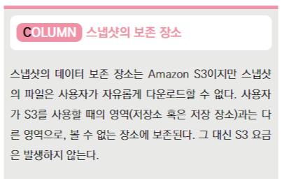

### 오토 스케일링 : 수요에 맞춰 자동으로 EC2 대수를 증감
서버의 액세스 상태에 따라 서버 대수를 늘리거나 줄이는 기능이다.

#### 감시와 인스턴스 수의 결정
오토 스케일링을 시작하려면 'Auto Scaling 그룹(인스턴스의 집합)을 생성하고 그룹에 인스턴스(서버)의 최소 대수와 최대 대수를 설정해야 한다.
그러면 **이 범위 안에서** 인스턴스 수가 증감한다.

인스턴스의 증감에는 3가지 방법이 있다.
1.EC2 인스턴스가 정지한 경우 분리하고 새로운 EC2 인스턴스를 생성하는 방법
2.일정에 맞춰 스케일링하는 방법.
3.CPU와 네트워크의 부하를 참고하여 특정 임계값을 넘을 때 인스턴스 수를 자동적으로 증감하는 방법.

-오토 스케일링의 요금은 무료이다.(증설분은 당연히 돈이 나감) 하지만 CloudWatch를 사용할 경우 모니터링에 관련된 요금이 부과된다.

## 5장 스토리지 서비스 Amazon S3

### Amazon S3란 
Amazon S3는 스마트한 객체 스토리지 서비스이다.
S3의 가장 큰 특징은 기능이 많다는 것.
대표적 기능은 웹서버 기능과 쿼리기능이다.

#### 요금체계
보유하고 있는 용량/전송량(get/put)

### 스토리지 클래스 
스토리지의 종류를 스토리지 클래스 라고 한다.

스토리지 클래스는 Standard 외에도 액세스 패턴에 따라 계층(비용이 다른 층)을 이동할 수 있는 클래스, 액세스가 빈도가 낮은 데이터를 위한 클래스 등이 있어서 목적에 맞게 선택 가능.
버킷(객체를 저장하는 컨테이너) 단위가 아닌 객체(파일) 단위로  클래스를 선택할 수 있다.

### 스토리지 클래스의 종류
- Stnadard
3곳  이상의 AZ(가용 영역)에 데이터가 저장되어 있기 때문에 99.9%의 가용성(시스템에 계속해서 가동하는 것)을 보장한다.

- Intelligent-Tiering
S3 Intelligent-Tiering은 빈번한 액세스와 간헐적 액세스에 최적화된 두 가지 계층에 객체(파일)을 저장한다. 어느 쪽에 저장할지는 객체별로 모니터링하여 그 결과에 따라 자동으로 이동된다.

ex)30일간 연속 액세스가 없는 객체는 간헐적 액세스 계층으로 이동.
액세스가 다시 늘어나면 비번 액세스 계층으로 이동.
이 클래스는 검색 요금/이동 요금이 부과되지 않는다.
but 최소 저장 기간에 대한 요금이 설정되어 있다.

- Infrequent Access
Standard에 비해 저장 요금이 낮은 대신 애세스 요금이 조금 높다.
액세스 반도가 낮고 용량이 큰 데이터에 적합.

- Reduced Redundancy Storage(RRS)
낮은 가격 but AZ가 한 군데이므로 문제 발생시 데이터 유실 가능성이 있음.

- S3 Glacier/S3 Glacier Deep Archive
Glacier는 데이터 아카이브와 장기간 백업을 고려하여 만든 스토리지 클래스.
'볼트'라고 하는 컨테이너에 저장된다.
따라서 저장된 데이터를 읽는 경우 다른 S3 버킷으로 옮겨야 하는 작업이 필요하다.

### S3의 사용 절차

#### S3 조작
버킷의 생성 및 각종 설정과 같은 기본적인 S3 조작은 관리 콘솔의 S3대시보드에서 수행한다.

#### S3 서비스의 기능
객체 : S3의 엔티티 단위. 텍스트나 이미지등의 파일
버킷 : 객체를 저장하는 컨테이너. 모든 객체는 버킷에 저장된다.
버킷명 : S3 버킷의 명칭은 다른 AWS 사용자를 포함하여 유일해야 한다.
웹서버로 사용할 경우는 도메인명이 버킷명이 된다.
객체 키 : 객체 식별자. 모든 객체는 반드시 한 개의 키를 가진다. 버킷, 객체 키, 버전을 조합하여 객체를 고유하게 식별한다. (객체 이름이라고 생각하면 편함)
객체 메타 데이터 : 이름과 값의 세트. 객체를 업로드할 때 설정할 수 있다. 객체 키는 S3가 파일을 식별하기 위한 데이터이지만 메타데이터는 사람이 파일을 쉽게 관리하기 위한 데이터.
리전 : 버킷의 물리적인 보관 장소가 있는 지역을 말한다.
Amazon S3의 데이터 일관성 모델 : S3은 가용성을 유지하기 위해 데이터를 자동으로 복제하여 저장하지만 쓰기 지연에 의한 데이터 불일치가 발생하면 안 되기 때문에 데이터의 무결성을 보장한다. 복제가 모두 반영되기까지 다소 시간이 걸릴 수 있다.
버전 관리 : 여러 버전을 보관. 다른 버전은 별도의 객체로 쥐급하는 것이 가능
로그 : 버킷 단위나 객체 단위의 로그를 기록할 수 있다. 하지만 객체 수준의 경우는 유료.
암호화 : S3에 저장되는 데이터를 자동으로 암호화
액세스 제어 : S3 버킷에 대한 권한 설정
웹 서비스 : S3 버킷을 웹 사이트로 사용하는 기능.

#### S3의 사용 절차.
EC2와 마찬가지로 관리 콘솔에서 S3 대시보드를 열고 버킷을 생성 한다.

#### S3 버킷 생성 전 검토해야 할 것
S3 버키을 생성한 후에는 이름과 리전을 변경할 수 없다.
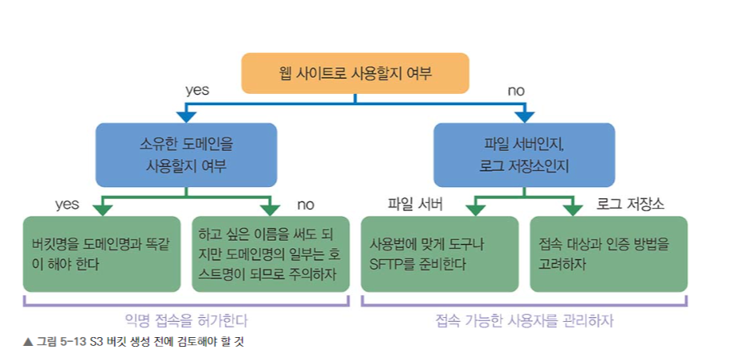


### 객체와 버킷 : 파일과 파일을 저장하는 장소

버킷 : 윈도 드라이브와 같은 것이고, 객체는 파일과 같은 것.
버킷은 폴더가 아니므로 버킷 안에 버킷을 다시 만드는 것은 불가능하다.
버킷 한 개에 저장할 수 있는 객체 수와 용량은 제한이 없다.

S3은 객체 스토리지이기 때문에 폴더나 디렉토리와 같은 개념이 없다.

객체는 버킷에 계층 구조가 아닌 병렬도 배치된다. 하지만 사용상 편의를 위해 관리 콘솔에 접속하면 폴더로 표시된다. 이렇게 생성된 폴더는 생성, 삭제, 업로드, 다운로드가 가능하다.

-S3에서 드라이브를 버킷이라 한다. 파일은 객체라 한다. 버킷에는 명명 규칙이 있다.

### 버킷 정책과 사용자 정책 : 액세스 제한 설정
S3 버킷 정책과 사용자 정책에 의해 버킷 접속을 제한할 수 있다.

#### S3 버킷에 대한 액세스 제한
- 버킷 정책 : 버킷 단위 제한
버킷에 접속하는 사용자를 지정
- 사용자 정책 : IAM 사용자 단위로 제한
접속 가능한 버킷을 지정
- 관리 정책 : ACL(액세스 제어 목록)에 의한 관리 정책
다른 계정에 대해 읽기/쓰기에 대한 허가/거부 설정 목록

#### 액세스 제한의 대상과 내용
액세스 제한은 리소스, 작업, 효과, 보안 주체에 대해 설정 가능.
'누가, 무엇을, 어떤 것에 대해 가능한가 여부'

- 리소스 : 제한 대상이 되는 버킷 및 객체. 아마존 리소스 이름을 사용하여 대상 식별
- 작업 : 실제로 가능한 작업. GET, DELETE가 있다. 작업 키워드를 사용하여 지정한다.
- 효과 : 설정 여부를 말한다. ALLOW, DENY를 설정
- 보안 주체 : 허가 / 거부할 사용자 및 계정, 서비스등을 말함.

### 웹 사이트 호스팅 : 웹 사이트 공개.

#### 웹 사이트 호스팅이란
S3는 정적 웹 사이트를 호스팅할 수 있다.
정적 웹 사이트 : 서버가 스크립트를 처리하지 않는 사이트. ex)HTML과 image만으로 이루어진 웹사이트 등.. 자바스크립트와 같은 클라이언트에서 처리하는 스크립트 포함 가능.
동적 웹사이트 : PHP, JSP, ASP.NET 등.. 서버에서 처리하는 언어가 포함된 사이트.

정적 웹사이트의 경우 URL설정 후 버킷을 그대로 오픈하면 웹 사이트가 됨.
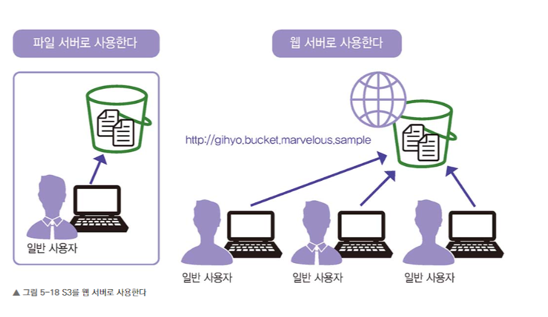

#### 웹 호스팅에 필요한 설정
- 정적 웹 호스팅 활성화
- 공용 액세스차단 해제 (public access)
- 버킷 정책 '모든 사용자' 설정
- 버킷명 : 사용할 도메인명으로 지정
- 개인 도메인 소지 경우 Amazon Route 53 등 DNS 서비스를 이용하여 설정.
- 무료(통신료 제외)
#### 다른 서비스로 구축한 웹 호스팅과의 차이
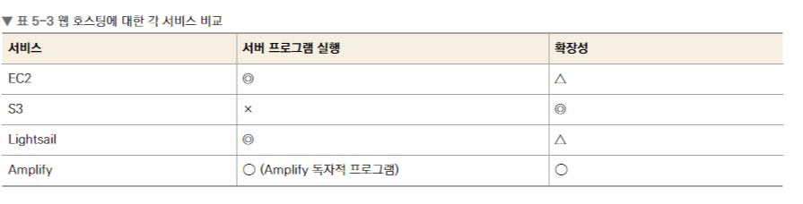

Amazon Lightsail 
- 필요한 기능을 선택하면 웹 사이트에 필요한 서비스 전체를 정해진 가격으로 구축할 수 있는 서비스.
ex)블로그 서버 구축 시 EC2의 경우 OS, 워드프레스, 고정 IP주소, DNS을 준비.
Lightsail : Lightsail만 계산.

다만 EC2 인스턴스와 달리 CPU, 메모리 같은 사양과 대수 변경불가능 등 유연성은 없음.

변경 시 스냅샷 -> LightSail사양 변경 신규 계약 -> 백업

AWS Amplify
- 웹을 개발하기 위한 도구 전체를 `제공하는 서비스로, 개발자 대상

자바스크립트로 AWS의 다양한 기능을 호출하여 시스템 구축.
HTML파일과 IMAGE를 S3를 통하여 배포하거나 Lambda를 사용하여 백엔드 프로그램 실행. AWS AMPLIFY는 이런 서비스를 조합하여 콘텐츠, 프로그램 배포.

### 파일 업로드와 다운로드 : 다양한 파일 업로드 방법
파일 업로드, 다운로드 : 관리콘솔, CLI 사용.
도구 및 프로그램에서 작업 : APIM SDK 사용.

- API와 SDK
API와 SDK를 사용하면 서드 파티(third party)도구를 사용해 파일을 업로드 할 수 있다.
IAM사용장게 액세스 키와 보안 액세스 키를 발행하여 사용하고 싶은 도구에 설정한다.

- 멀티 파트 업로드
객체를 여러 개로 나누어 세트 하나로 업로드 가능.
업로드 중에는 부분별로 표시되지만 업로드 완료되면 객체가 하나가 된다.

100MB 이상의 파일은 멀티 파트 업로드를 하는 것 추천. 업로드할 때 일반적인 요청이나 업로드에 대한 요금이 발생하지만 멀티 파트 업로드는 요금이 따로 발새앟지 않음.
관리 콘솔, CLI는 큰 파일을 업로드할 때 멀티 파터 업로드로 전환된다.

- AWS Transfer for SFTP
SFTP를 사용하여 파일을 전송.

- AWS DataSync
온프레미스 스토리지 시스템과 AWS 스토리지 서비스 간 대용량 데이터 전송을 위한 서비스. 

*공용 액세스  차단
버킷 단위로 모든 사용자에게 액세스를 허가할지 결정하는 기능.
각 액세스 제한보다 상위기능으로, 버킷 정책이나 사용자 정책이 모든 사용자에 대해 액세스가 가능하도록 허가되어 있다 하더라도 공용 액세스 차단이면 액세스 불가.

### 액세스 관리 및 변조 방지: 부정한 액세스 감시 
스토리지는 관리자가 아닌 사람이 액세스 하는 경우가 많기때문에 관리자가 작업 사항을 감시할 도구가 필요

#### 액세스 로그란 
서버에 어떤 요청이 있었는지를 기록.
버킷 소유자, 버킷명 요청자, 총 시간, 응답 시간, 작업, 응답 상태, 오류, 코드 등이 기록된다.
따로 요금은 부과되지 않음.

#### 그 외 액세스 관리 방법
- 스토리지 클래스 분석 
객체에 액세스 빈도를 분석. 액세스 빈도가 낮은 데이터는 S3 Intelligent-Tiering으로 이동하는 판단 자료로 사용된다.
대상 객체를 필터링해서 감시하는 것도 가능.

- 객체 잠금
객체 변경을 제한. 잠금 기능은 유효기간이 있지만, 법적으로 보존해야 하는 경우에는 제한 없음. 잠금 보호되는 버킷은 Cross-Region Replication(CRR)로 복사할 수 없다. 
  - 거버넌스 모드 : 특정 사용자에게만 객체 변경을 허가하는 모드.
  - 규정 준수 모드 : 모든 사양자가 객체 변경 불가. AWS계정 root 사용자도 변경 불가. 한 번 변경하면 변경불가하므로 주의.

- S3 인벤토리
인벤트리는 버킷에 들어있는 객체의 메타데이터의 목록을 매일 혹은 매주 생성하는 기능. CSV, ORc 등의 파일로 되어 있다.

*S3 배치 작업
Amazon S3 배치 작업을 사용하면 대상 객체에 대해 객체 복사, Amazon S3 Glacier에서 개체 복원 등 여러 작업 실행 가능. S3 배치 작업은 보통 Amazon S3 API를 사용하기 때문에 편리.

### 버전 관리·수명 주기·복제 : 저장된 객체 관리
- 버전 관리 : 객체를 여러 버전으로 저장하는 기능. 버킷 단위로 설정.
실수로 변경/삭제한 파일을 복원할 수 있다.

버전 관리는 미사용(기본), 활성화, 버전 일시 중지.

#### 수명 주기 정책 
S3은 수명 주기 정책을 설정 가능.
수명주기 정책 : 객체가 정기적으로 수행할 작업을 설정하는 기능.
Transition : 객체를 다른 스토리지 클래스로 이동
Expiration : 유효 기간이 만료된 객체 삭제. 객체관리되고있는 대상은 최선 버전에만 적용.
NoncurrentVersionTransition : 현재 스토리지 클래스에서 객체의 유지 시간을 지정.
NOncurrentVersionExpiration : 과거 버전의 객체를 삭제하기 전에 유지할 기간 지정.
AbortIncompleteMulipartUpload : 멀티 파트 업로드 진행 상태를 유지할 최대 시간을 지정.(지정 시간 내 업로드가 안되면 중지)
ExpiredObjectDeleteMarker : 만료된 객체 삭제 표시를 제거.

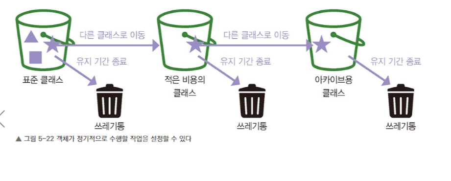

#### 교차 리전 복제

복제란 '복제본'을 생성하는 것.
교차 리전 복제 : 다른 리전의 버킷에 객체를 비동기적으로 복사.
복제에 사용할 두 버킷은 버전 관리가 활성화되어 있어야 한다.
같은 리전에 존재하는 버킷은 복제 설정 불가능.
이유 : 서울에 재해가 발생해도 데이터 유실않고 보존.

### 데이터 분석과 연계 : 저장된 데이터의 분석

데이터 분석과 연동 : S3의 객체나 객체의 내용에 대한 데이터를 분석하는 기능.

S3 Select
Amazon Athena : SQL SELECT문으로 정보 처리

#### 데이터 분석 서비스 

S3 Select : S3 로 저장된 데이터 파일 하나에 SQL문을 사용하여 집계 및 검색 가능. CVS파일 JSON외에도 로그 사용되는 Apache Parquet 형식도 지원한다.

Amazon Athena와 Amazon Redshit Spectrum
Amazon S3에 저장된 데이트 분석 가능.

S3 Select와 달리 어떤 대상에 대해 어떤 검색을 할지 사전 구성.
대신 여러 파일을 대상으로 수행 가능.

Amazon Athena와 Amazon Redshit Spectrum의 가장 큰 차이점은 분석을 위한 서버 존재 여부.

Athena는 매번 필요에 따라 분석용 서버를 자동으로 생성 실행. 
실행하는 순간만 비용
Redshift Spectrum은 미리 분석용 서버를 시작하고 이를 이용해 분석.
처리능력에 따라 저비용-고비용 서버 선택, 데이터 분산처리 가능.
대용량의 복잡한 데이터의 빠른 처리는 Redshit Spectrum이 좋다.

#### 데이터 분석 도구의 사용 구분
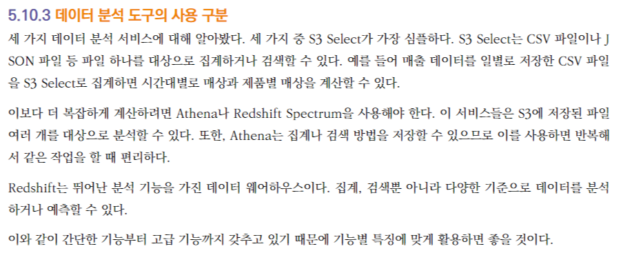

*AWS Lambda와 연동
Lambda는 이벤트 기반으로 코드를 실행하는 서비스.
ex)S3버킷에 객체를 업로드할 때 트리거로 Lambda함수를 호출하여 '특정 버킷에 이미지 파일을 업로드할 경우 해당 이미지의 썸네일을 생성한다. 파일이 업로드되면 알림을 보낸다.' 등등..

### Amazon CloudFront : 콘텐츠 배포 서비스
고속 콘텐츠 전송 네트워크 서비스. 
웹 콘텐츠를 빠르게 전송.
엣지 서버 사용. 각 리전 네트워크 말단에 위치함.
클라이언트 접속 네트워크 거리가 가깝기 때문에 반응속도도 빨라짐.
서버의 부하가 줄음.
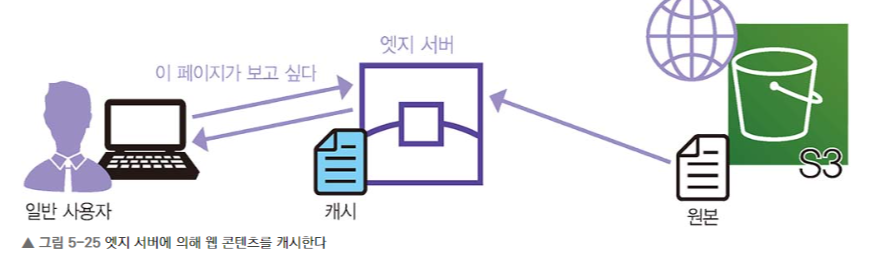

#### Amazon CloudFront의 요금 체계
Amazon ClouldFront는 기본적으로 데이터 송신에 대한 요금이 부과됨.
서버에서 엣지서버로 원본 데이터 캐시는 무료.

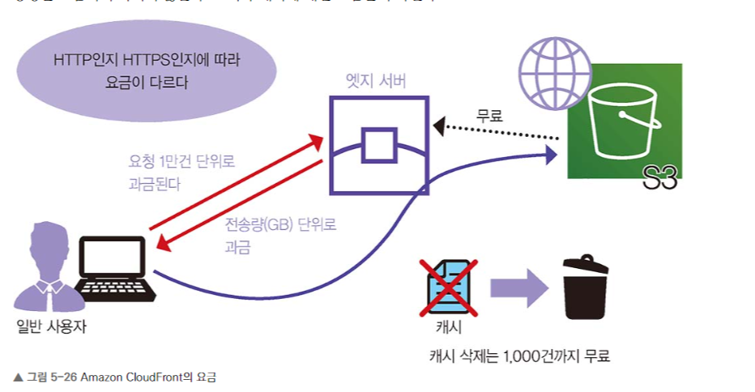

*암호화 통신 지원
CloudFront는 TLS/SSL에 의한 암호화 통신 지원. https://로 시작하는 URL에 접속하는 통신은 암호화된다.

일반적으로 암호화는 서버 인증서가 필요하지만, AWS Certificate Manager 서버를 사용하면 무료로 서버 인증서를 생성할 수 있다.

## 6장 가상 네트워크 서비스 Amazon VPC
Amazon VPC(Amazon Virtual Private Cloud)
AWS 계정 전용 가상 네트워크 서비스로, AWS에서 제공하는 리소스만 설치할 수 있다. 특히 EC2, RDS의 경우 VPC를 선택하지 않으면 서버를 생성할 수 없기 때문에, 리소스를 사용하기 위해서는 반드시 필요하다.

#### VPC의 구성
VPC내에 서버를 설치하면 해당 네트워크에 소속되지만, 별도로 설정하지 않으면 VPC자체는 격리된 네트워크가 된다. 외부와 통신하려면 VPC를 인터넷 혹은 회사 내 LAN과 연결해야 한다.

* 일반 네트워크
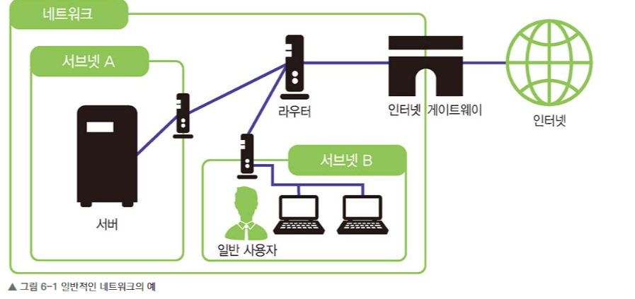

* VPC 네트워크
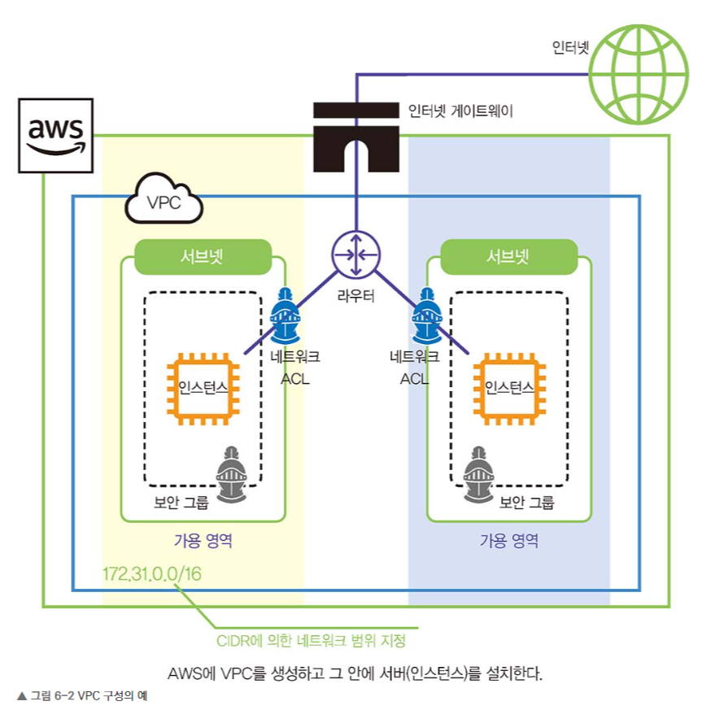

#### VPC의 기능
VPC는 네트워크와 서브넷 범위, 라우팅 테이블, 네트워크 게이트웨이 등 가상 네트워킹 환경 설정 가능.
IPv4, IPv6 사용가능.

#### VPC 네트워크의 특징과 라우팅 테이블
VPC는 물리적 라우터가 아닌 소프트웨어가 라우터 역할을 한다.
라우팅은 설정된 라우팅 테이블에 따라 동작. 
물리적 서버 : LAN, Wifi로 라우터와 연결.
VPC : 라우팅 테이블로 라우터와 연결

### VPC의 사용절차 : 가상 네트워크를 사용하자

VPC는 네트워크이다. 따라서 서버(인스턴스)가 어떤 환경에 설치되어 있는지 그리고 인터넷에 연결해야 하는지에 대한 설정이 필요하다.
인터넷 연결 여부, 오토 스케일링이 중요.
인터넷 연결해야 한다면 : 게이트웨이 설정
오토 스케일링 : IP주소를 많이 확보해야 한다.(서버가 자동으로 늘어나기 때문에)

#### VPC의 사용 절차 
1.VPC이름 설정 2.CIDR블록에 네트워크 범위 설정 3.네트워크를 작게 서브넷을 나눔. 4.(인터넷 연결 시)인터넷 게이트웨이를 생성 후 라우팅 설정. 5.보안도 설정(보안 그룹, 네트워크 ACL 등)

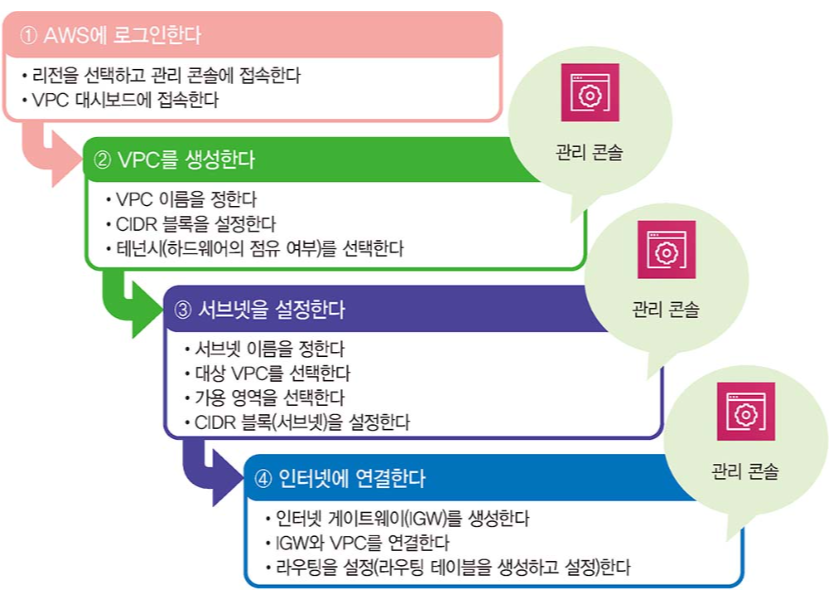

### 기본 VPC : AWS가 제공하는 기본 VPC

네트워크 기본 지식이 부족하다면 기본 VPC를 사용 추천.

기본 VPC : 특별한 설정 없이 바로 사용 가능. 
(기본 VPC에서 Elastic Load Balancing)과 같은 서비스도 이용 가능
Elastic Load Balancing : 트래픽 분산 장치 

#### 기본 VPC의 구성
서브넷, 인터넷 게이트웨이가 기본적으로 구성되어 있다.
대시보드에서 EC2나 RDS를 생성할 때도 기본 VPC를 선택할 수 있다.

인터넷에 접속하고 싶지 않다면 별도의 VPC를 생성하거나 VPC 대시보드에 접속하여 기본 VPC를 변경해야 한다.

### 서브넷과 DHCP 

서브넷 : 커다란 네트워크를 작게 나눈 네트워크를 말한다.
네트워크를 분할해 직접 통신할 수 있는 범위를 좁히고, 방화벽을 설정해 보안을 강화하는 것을 목적으로 한다.

서브넷 A는 공개, 서브넷 B는 비공개 식으로 역할을 다르게 부여할 수도 있다.

#### 네트워크의 범위와 CIDR 표기
CIDR(Cdlassless Inter-Domain Routing)네트워크와 서브넷의 범위를 나누는 데 사용되는 표기법.

네트워크 길이를 숫자로 적어서 표기한다.

IP주소개수. /24 -> 256개 /20 4096개

#### 네트워크 클래스
규모에 따라 A, B, C 클래스로 나뉜다.

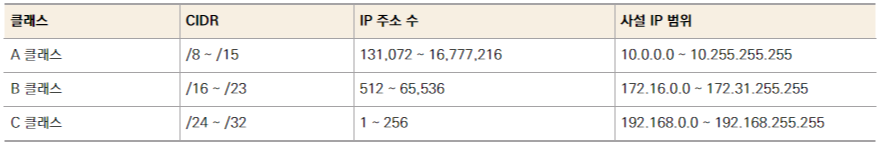

#### IP 주소 할당과 DHCP
일반적인 네트워크의 경우 IP주소를 할당할 수 있는 것은 EC2 인스턴스와 RDS 인스턴스(데이터베이스) 등이다. 하지만 AWS의 VPC는 EC2 인스턴스나 RDS인스턴나 RDS인스터스 외에도 라우터나 인터넷 게이트웨이의 IP주소로도 앞서 설명한 예약 주소를 사용할 수 있다.

DHCP(Dynamic Host Configuration Protocol)

### 라우팅과 NAT: 공인 IP 주소와 사설 IP 주소 변환

네트워크와 라우팅
네트워크 : PC여러 대가 서로 통신할 수 있도록 연결되어 있는 상태.

모든 pc를 1:1로 연결할 수 없기 때문에, 라우터로 모아서 다른 목적지로 보낸다.   

#### IP 주소와 게이트웨이
라우터는 정보를 전송할 때, IP를 기반으로 전송한다. 자신의 네트워크 내에 목적지가 있는지 확인하고, 없으면 다른 라우터로 보낸다.
-라우터는 게이트웨이라고도 한다.
게이트웨이중에 '자신 이외의 접속되어 있는 모든 것(대부분의 경우 인터넷과의 연결점)'을 **기본 게이트웨이**라고 한다.

#### IP 마스커레이드
LAN이외에는 대부분 인터넷을 거친다.
LAN에서 인터넷으로 데이터를 전송할 때 LAN 내부의 출입구가 되는 것이 게이트웨이이다. 게이트웨이는 기기의 역할을 말하며, 실제 기기는 라우터이다.

LAN 내부의 PC는 사설 IP주소를 할당하는데, 인터넷과 연결할 때 공인 IP로 변환하는 것이 IP 마스커레이드(NAPT)이다.

#### NAT
IP 마스커레이드틑 사용하면 내부에서 외부로 나가는 것은 가능하지만, 외부에서 내부로 들어오는 것은 불가능하다.
이럴 경우 서버만 양방향 통신가능하도록 IP 마스커레이드를 설정할 수 있다. 하지만 IP마스커레이드는 공인 IP를 한 개만 설정가능하기 때문에ㅡ 
NAT(Network Address Translation) : 공인 IP 주소를 여러 개 설정할 수 있음.ㅡ를 사용한다.

- IP 마스커레이드 : 1:N / 포트 변환 가능.
- NAT : N:N / 포트 변환 불가

NAT와 IP 마스커레이드는 AWS의 인터넷 게이트웨이와 NAT게이트웨이에 해당한다.

### 6.6 인터넷 게이트웨이와 NAT 게이트웨이 : VPC에서 인터넷으로 접속

#### 인터넷 게이트웨이
인터넷 게이트웨이는 인터넷 연결을 담당한다.
EC2 인스턴스에 웹 사이트를 설치했을 때 웹 사이트에 접속하는 사람은 그 페이지에 접속하고 싶다는 요청을 보낸다. 해당 요청은 DNS에서 변환되어 목적지인 공인 IP 주소로 전달된다. 하지만 EC2 인스턴스는 사설 IP주소밖에 설정할 수 없기 때문에 요청된 EC2 인스턴스의 연결 정보를 가지고 있는 인터넷 게이트웨이가 공인 IP주소(목적지)를 사설 IP주소로 변환하여 해당 EC2 인스턴스에 요청을 보낸다.

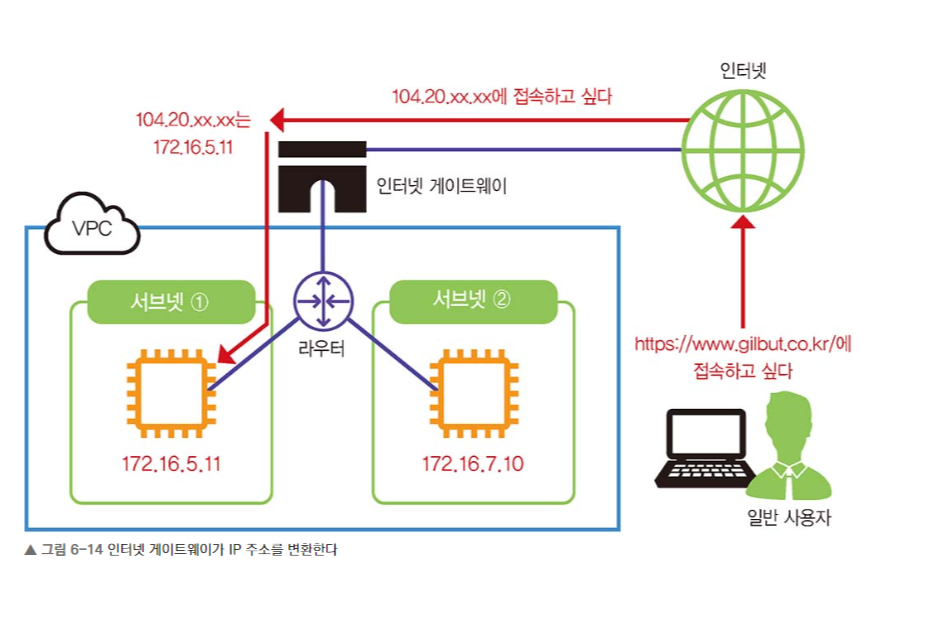

#### NAT 게이트웨이 
회사 내부에서만 사용하는 서버의 경우도 업데이트를 하려면 인터넷에 연결해야 할 때가 있다. 이럴 경우 NAT 게이트웨이를 사용한다.
NAT 게이트웨이는 서브넷에서 인터넷으로 접속할 수 있지만, 인터넷에서 서브넷으로 접속하지 못 하게 한다.


### 보안 그룹과 네트워크 ACL 보안 설정

#### 보안 그룹과 네트워크 ACL
VPC의 가상 방화벽

방화벽 : 네트워크 통신을 제어하는 방식
 ->인바운드 트래픽(데이터가 유입되는 것)
 ->아웃바운드 트래틱(데이터가 유출되는 것)

#### 인바운드 및 아웃바운드 설정과 알려진 포트
트래픽은 인바운드와 아웃바운드 각각에 대해 포트 단위로 허가 여부를 설정한다. 포트 번호로 지정한다.

포트 : '통신의 입구' 웹, 메일, FTP와 같이 서버에 어떤 데몬(서비스)이 동작할 때 해당 서비스를 사용하는 포트는 수신 대기 상태가 된다.

ex)웹 사이트 : http, https 포트를 연다.
사실 어떤 포트를 사용해도 상관은 없지만, 실제로는 서비스별로 잘 알려진 포트가 정해져 있어 그것을 보통 사용한다.

보안 그룹 : 인바운드 허가 x 아운바운드 허가 디폴트
네트워크 ACL : 양쪽 모두 허가 디폴트


## Youtube 쉽게 설명하는 AWS 기초

#### 가용영역(Availability Zone)
- 리전의 하부 단위
  - 하나의 리전은 반드시 2개 이상의 가용영역으로 구성
- 하나이상의 데이터 센터로 구성
- 리전 간의 연결은 매우 빠른 전용 네트워크로 연결
- 반드시 물리적으로 일정 거리(몇 KM이상) 떨어져 있음 ->재난 방지
- 다만 모든 AZ는 서로 100KM 이내의 거리에 위치 -> 통신상 적정거리
- 여러 재해에 대한 대비 및 보안
- 각 계정별로 AZ의 코드와 실제 위치는 다름
  - 예 : 계정 Test의 AZ-A는 계정 Test2의 AZ-A와 다른 위치(랜덤)
  - 보안 및 한 AZ로 몰림 방지
  
  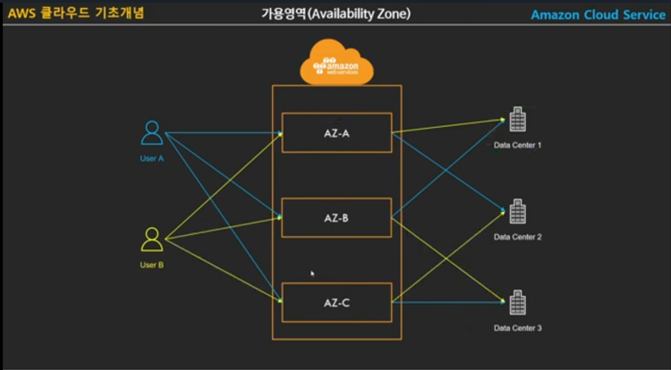

#### 엣지 로케이션 
- AWS의 CloudFront(CDN)등의 여러 서비스들을 가장 빠른 속도로 제공(캐싱)하기 위한 거점
- 전 세계의 여러 장소에 흩어져 있음.

```
모든 데이터는 저장되는 거점이 있는데, ex)한국, 아프리카에서 넷플릭스로 한국 드라마를 보려면 말도안되게 비효율적이 된다.
그래서 요청 데이터 등을 가까운 엣지 로케이션에 저장하여, 다른 사람을 포함한 재요청의 경우 엣지 로케이션에서 반환을 한다. 
```

#### 글로벌 서비스와 리전 서비스
- 글로벌 서비스 : 데이터 및 서비스를 전 세계의 모든 인프라가 공유
  - CloudFront
  - IAM
  - Route53
  - WAF 등..
- 지역 서비스 : 특정 리전을 기반으로 데이터 및 서비스를 제공
  - 대부분의 서비스
  - S3 : S3의 경우 전 세계에서 동일하게 사용할 수 있으나 데이터 자체는 리전에 종속된다.

#### ARN
Amazon Resource Name : AWS의 모든 리소스의 고유 아이디
- 형식 : "arn[partition]:[service]:[region]:[account_id]:[resource_tye]/resource_name/(qualifier)"
  - 맨 끝에 와일드카드(*)를 사용하여 다수의 리소스를 지정 가능
