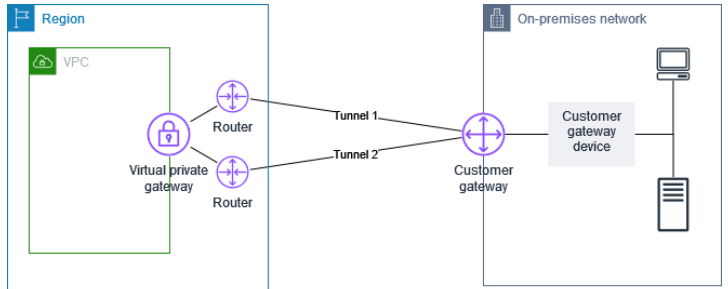

1. Amazon S3에 저장된 민감한 데이터를 자동으로 검색, 분류 및 보호해야 하는 한 사용자가 있다.
이러한 요구 사항을 충족할 수 있는 AWS 서비스는 무엇인가?
Amazon Macie : 자동 보안 평가 서비스 

2. 프리 티어를 초과한 경우 AWS는 AWS Lambda 사용량에 대한 요금을 어떻게 청구하는가? (2개 선택.)
- Lambda 함수를 실행하는 데 걸리는 시간 기준
- 지정된 Lambda 함수에 대한 요청 수 기준

3. 한 회사는 웹 사이트에서 발생한 신규 고객 주문을 기록하는 AWS상의 관계형 데이터베이스를 필요로 한다.

이 요구 사항을 충족하는 AWS 서비스 또는 기능은 무엇인가?
- Amazon Aurora

4. 다음 중 사용자의 AWS 리소스에 대한 무제한 액세스를 허용하는 보안 그룹을 식별하는 AWS 서비스는 무엇인가?
- AWS Trusted Advisor

```
Trusted Advisor는 리소스에 대한 무제한 액세스를 허용하는 규칙에 대해 보안 그룹을 확인합니다.
무제한 액세스로 인해 해킹, 서비스 거부 공격 또는 데이터 손실과 같은 악의적인 활동의 기회가 증가합니다.

비용 최적화, 보안, 내결함성, 서비스 제한 및 성능개션에 대한 AWS 모범 사례에 따라 프로비저닝하는 데 도움이 되는 실시간 지침을 제공

신뢰성
신뢰성 원칙은 워크로드의 기능이 필요한 때에 기능을 정확하고 일관되게 수행하는 역량을 포함합니다. 여러 가용 영역에서 Amazon RDS를 배포하면 단일 장애 지점이 줄어들기 때문에 신뢰성 목표를 달성하는 데 도움이 됩니다.

```

```

DynamoDB는 VPC를 사용하지 않는다.
Lambda등과 같은 vpc를 사용하지 않는 app환경과 궁합이 좋다.

Aurora (관계형 DB)
mySQL, PostgreSQL과 호환
견고하고 성능이 뛰어남.
AWS용으로 설계되어 속도가 빠르다.
매니지드 서비스.

EBS(Elastic Block Store)
- 영구 블록 스토리지 
- 가상 하드드라이브
- EC2 인스턴스가 종료되어도 계송 유지 가능
- EC2와 같은 가용영역에 존재.
```

5. 한 회사 내의 각 부서에 독립적인 자체 AWS 계정과 자체 결제 방법이 있다. 회사에서는 부서별 거버넌스를 중앙 집주화하고 결제를 통합하려고 한다.

회사는 AWS 서비스 또는 기능을 사용하여 이러한 목표를 어떻게 달성할 수 있는가?

- 하나의 계정 내에서 모든 기능이 활성화된 AWS Organizations에 조직을 생성한다. 조직에 가입하도록 모든 계정을 초대한다.

6. 한 회사는 회사의 온프레미스 서버와 AWS 간에 암호화된 연결을 필요로 한다. 연결은 회사의 기존 인터넷 연결을 사용해야 한다.

AWS Site-to-Site VPN
- Site-to-Site VPN은 온프레미스 네트워크와 AWS클라우드 네트워크 간에 암호화된 네트워크 경로를 생성합니다. 온프레미스 네트워크와 AWS 클라우드 네트워크 간의 이러한 연결은 인터넷을 사용합니다.

7. AWS 공동 책임 모델에 따라 고객이 책임을 져야 할 태스크는 무엇인가?

8. 한 회사에 Oracle 데이터베이스가 실행되는 온프레미스 Linux 기반 서버가 있다. 회사는 AWS의 Amazon EC2 인스턴스에서 실행되도록 데이터베이스 서버를 마이그레이션하고자 한다.

9. 한 회사에 Oracle 데이터베이스가 실행되는 온프레미스 Linux 기반 서버가 있다. 회사는 AWS의 Amazon EC2 인스턴스에서 실행되도록 데이터베이스 서버를 마이그레이션하고자 한다.

회사에서 마이그레이션을 완료하려면 어떤 서비스를 사용해야 하는가?

- AWS Application Migration Service
물리적 버서 및 해당 서버에서 실행되는 모든 데이터베이스, 어플리케이션을 AWS의 인스턴스로 마이그레이션할 수 있다.

```
AWS Database Migration Service (AWS DMS)
온프레미스 -> AWS DB로 '데이터'를 마이그레이션 한다. 하지만 AWS DMS는 실제 서버를 EC2인스턴스로 마이그레이션하지는 않는다.
```

10. 한 회사에서 학생들을 위한 학습 애플리케이션을 만들고자 한다. 학습 애플리케이션은 학생들이 텍스트가 소리내어 읽혀지는 버튼을 선택할 수 있는 옵션을 제공해야 한다.

이 요구 사항을 충족하는 AWS 기계 학습 서비스는 무엇인가?
- Amazon Polly 
텍스트를 음성으로 변환하는 기계 학습 서비스.

11. 한 회사가 모든 개발 활동을 AWS로 이전하고 있다. 이 회사는 개발자의 소스 코드를 저장하고 관리할 수 있는 솔루션을 원한다.

이 요구 사항을 충족하는 AWS 코딩 서비스는 무엇인가?
- AWS CodeCommit
소스 코드 버전 제어 서비스. 개발자의 소스 코드를 AWS에 저장하고 관리할 수 있도록 도와준다.

12. 전 세계 여러 국가에서 고객을 보유한 기업이 AWS 클라우드를 사용하면 어떤 이점이 있는가? (2개 선택.)
- 기업은 여러 AWS리전에 애플리케이션을 배포하여 지연 시간을 줄일 수 있다.
- Amazon ClouldFront는 지연 시간을 줄이기 위해 전 세계에 여러 엣지 로케이션을 보유하고 있다.
CloudFront는 데이터, 비디오, 애플리케이션 및 API를 짧은 지연 시간과 높은 전송 속도로 전 세게 고객에게 안전하게 제공하는 콘텐츠 전송 네트워크 서비스입니다.

13. 저렴한 비용으로 ETL(데이터 변환 워크로드) 및 분석을 수행할 수 있도록 Apache Spark와 같은 다양한 비즈니스 인텔리전스 도구를 지원하는 AWS 서비스는 무엇입니까?

- Amazon EMR(Elastic MapReduce)
Amazon EMR은 Apache Spark, Hadoop 및 기타 빅데이터 프레임워크를 쉽게 실행할 수 있는 관리형 클러스터 플랫폼입니다. EMR을 사용하면 대량의 데이터를 처리하고 분석하는 작업을 저렴한 비용으로 수행할 수 있습니다.
하둡 클러스터의 설정, 관리 또는 조정이나 클러스터가 사용하는 컴퓨팅 용량에 대해 걱정할 필요 없이 데이터를 처리하거나 분석하는 데 집중할 수 있습니다.

14. 가용성과 확장성이 뛰어난 AWS의 클라우드 DNS(Domain Name System) 웹 서비스는 무엇입니까?

 - Amazon Route 53
  Amazon Route 53은 도메인 이름을 IP 주소로 변환해주는 DNS 웹 서비스로, 높은 가용성과 확장성을 제공하며, AWS의 다른 서비스와도 쉽게 통합할 수 있습니다. 이를 통해 사용자들은 빠르고 안정적으로 도메인 이름을 관리하고, 웹 트래픽을 효율적으로 분산시킬 수 있습니다.

15. 다음 AWS 글로벌 인프라 구성 요소 중 각각 중복된 전원, 네트워킹 및 연결 기능을 갖추고 별도의 시설에 보관되어 있는 하나 이상의 개별 데이터 센터로 구성되어 있는 것은 무엇입니까?

- AZ(가용 영역)
가용 영역은 하나 이상의 개별 데이터 센터로 구성되어 있으며, 각 데이터 센터는 중복된 전원, 네트워킹 및 연결 기능을 갖추고 있습니다. 또한, 이러한 데이터 센터들은 물리적으로 서로 다른 위치에 분산되어 있어 장애로부터의 내성을 높이고 가용성을 보장합니다.

16. 고객이 드론 작업을 하며 환경 데이터를 수집하고 있습니다. 다음 중 공간이 제한된 환경에서 사용할 수 있는 테라바이트급의 데이터 스토리지를 쉽게 확보하고 이러한 데이터를 AWS로 전송할 수 있는 서비스는 무엇입니까?

- AWS Snowcone 
작은 크기 : Snowcone은 AWS Snow Family 중 가장 작은 장치로, 크기가 작아 공간이 제한된 환경에서 사용하기에 적합합니다.
데이터 스토리지 : 최대 8TB의 사용 가능한 스토리지를 제공합니다.
데이터 전송 : Snowcone에 저장된 데이터를 AWS로 전송하기 위해서는 두가지 방법
   - Snowcone을 AWS에 직접 배공
   - AWS DataSync 사용 : AWS DataSync와 통합되어 네트워크를 통해 데이터를 직접 AWS로 전송 가능.
(IoT, 차량, 드론 등..)

17. 다음 중 기존 서버 바인딩 소프트웨어 라이선스를 사용하여 규정 준수 요구 사항을 충족하고 비용을 절감하는 데 도움이 되는 Amazon EC2 인스턴스 구매 옵션은 무엇입니까?
- 전용 호스트
사용자가 물리적으로 특정 서버를 전용으로 사용할 수 있게 하여 기존 소프트웨어 라이선스를 AWS 클라우드에서 활용할 수 있도록 지원합니다.
Dedicated Hosts는 특정 물리적 서버에서 실행되는 인스턴스를 완벽하게 제어할 수 있게 하며, 이를 통해 서버 바인딩 라이선스 및 규정 준수 요구 사항을 충족할 수 있습니다. 이를 통해 온프레미스 환경에서 이미 보유한 라이선스를 AWS로 가져와 비용을 절감할 수 있습니다.

18. 회사가 AWS에서 새로운 시스템을 출시할 계획이지만 AWS 관련 전문 지식을 갖춘 직원이 없습니다. 다음 중 회사가 AWS에서 워크로드와 애플리케이션을 설계, 설계, 구축, 마이그레이션 및 관리하는 데 도움이 될 수 있는 AWS 채널은 무엇입니까?
- AWS 파트너 네트워크 컨설팅 파트너
:모든 규모의 고객이 AWS에서 새로운 애플리케이션을 설계, 마이그레이션 또는 구축할 수 있도록 지원하는 전문 서비스 회사.
SI, 전략 컨설팅업체, 리셀러, 디지털 에이전시 등..

- AWS 기술 파트너는 AWS 플랫폼에서 호스팅되거나 통합되는 소프트웨어 솔루션 제공
독립 소프트웨어 공급업체, SaaS, PaaS, 개발자 도구, 관리 및 보안 공급업체 등..

19. 어떤 AWS 리소스에 대해 사전 승인 없이 보안 평가 및 침투 테스트를 수행할 수 있습니까? (2개 선택)
- Amazon S3
- Amazn RDS

20. 다음 중 AWS의 Business support plan에 관한 올바른 설명은 무엇입니까?
- 프로덕션 시스템이 다운되는 경우 1시간이내 응답 지원 제공 
- 비즈니스에 중요한 시스템이 다운되는 경우 15분 응답 시간 지원 제공

21. 소셜 미디어 로그인을 통해 인증된 사용자와 인증이 필요하지 않은 게스트 사용자에게 임시 AWS 자격 증명을 제공해야 하는 경우 다음 중 무엇을 사용해야 합니까?
- Amazon Cognito
사용자 인증, 권한 부여 및 사용자 데이터 동기화를 위한 서비스, 소셜미디어 록인을 통해 인증된 사용자에게 임시 AWS 자격 증명을 제공합니다.
또한 인증되지 않은 게스트 사용자에게도 임시 자격 증명을 제공할 수 있습니다.
이를 통해 인증된 사용자와 게스트 사용자 모두 AWS 리소스에 접근할 수 있는 권한을 제어할 수 있습니다.

User Pool은 사용자 인증과 관련된 기능을 제공하고,
Identity Pool은 인증된 사용자에게 AWS 리소스에 접근할 수 있는 임시 자격 증명을 제공하는 데 사용됩니다.
질문에서 언급한 소셜 미디어 로그인 및 게스트 사용자에게 임시 AWS 자격 증명을 제공하기 위해서는 Cognito Identity Pool을 사용해야 합니다.

22. 소프트웨어 엔지니어가 EC2 인스턴스에서 라이선스 애플리케이션을 마이그레이션하고 구성하는 데 문제가 있습니다. 다음 중 AWS에서 애플리케이션을 신속하게 시작하고 실행하려면 어떤 옵션을 권장합니까?
- AWS Marketplace에서 자신의 애플리케이션 스택과 유사한 설정을 제공하는 AMI를 찾아봅니다.

23. EC2 예약 인스턴스 구매 시 가장 큰 할인 혜택을 제공하는 요금제는 무엇?
- 3년 약정 구매에 대한 모든 선결제

24. 온프레미스 데이터 센터에서 AWS 클라우드로 시스템을 마이그레이션할 때 얻을 수 있는 이점
- 고개깅 서버의 인프라를 관리하는 대신 비즈니스 활동에 집중할 수 있도록 한다.

25. 고객이 업데이트 및 보안 패치를 포함하여 게스트 운영 체제에 대한 책임과 관리를 맡는 AWS에서 새 데이터베이스를 시작해야한다는 요구사항이 있습니다. 다음 중 어떤 서비스를 사용해야 합니까?
- Amazon EC2 : 원하는 데이터베이스를 설치하고 필수 업데이트 및 보안 패치를 포함하여 게스트 운영 체제를 관리할 수 있다.

26. Amazon Simple Storage Service : 글로벌 서비스, 데이터는 리전에저장 한 파일 0~5tb. 사시상 무제한
스토리지 인프라.

27. 자가 치유가 가능하고 처리량이 높은 데이터베이스 
- Amazon Aurora
속도 및 안정성과 오픈소스 데이터베이스의 단순성 및 비용 효율성 RDS DB 스토리지도 자가 복구.
데이터 블록과 디스크는 지속적으로 오류를 검사하고 자동으로 복구됨.

28. 자연재해 복구 예방 조치 
- 서로 다른 리전에 어플 시작

29. 중복된 전원, 네트워킹 및 연결 기능을 갖추고 별도의 시설에 보관도어 있는 하나 이상의 데이터 센터로 구성되어 있는 것
- 가용 영역.
리전이란 여러 가용영역이 있는 물리적 위치를 말한다. 별도 개념이 아님.

30. 여러 리소스로 트래픽을 라우팅하고 각 리소스로 라우팅되는 트래픽의 양을 선택하려면 어떤 AWS Route 53 라우팅 정책을 사용해야 합니까?
- 가중치 기반 라우팅 정책

31. 저렴한 비용으로 ETL(데이터 변환 워크로드)

32. AWS 클라우드에서 고객의 책임
- AWS 계정에서 사용자 관리
- AWS 리소스에 저장된 데이터 관리.

33. EC2 인스턴스의 방화벽 역할 
- Security Group
오답 : Network ACL : 서브넷의 방화벽

34. 민첩성?
클라우드를 통해 광범위한 기술에 쉽게 액세스 할 수 있으므로, 더 빠르게 혁신하고 상상할 수 있는 거의 모든 것을 구축할 수 있습니다.
컴퓨팅, 스토리지 및 데이터베이스와 같은 인프라 서비스부터 사물 인터넷, 기계 학습, 데이터 레이크 및 분석 등에 이르기까지 필요에 따라 리소스를 빠르게 구동할 수 있습니다.

35. AWS Inspector : 애플리케이션 보안 취약성과 모범 사례와의 편차를 자동으로 분석하여 AWS 애플리케이션의 보안과 규정 준수를 평가하고 개선하는데 도움이 된다.

36. 고객이 최근 EC2에 호스팅된 웹 애플리케이션 데이터베이스에서 SQL 주입 공격을 경험했습니다. 고객은 AWS에 불만 티켓을 제출했습니다. AWS에서는 어떤 응답을 해야 합니까?
- AWS는 클라우드에서 앱의 보안에 대한 책임이 고객에게 있음을 상기
->AWS는 서비스 제공 인프라를 보호하지만(하드웨어, 소프트웨어, 네트워킹 및 시설) 고객은 스스로 다양한 보안 서비스를 통해 방화벽 구성, 스스로의 인프라를 보호해야한다.

37. AWS Well-Architected 6대 원칙
1.운영 우수성 원칙 : 프로세스와 절차를 지속적으로 개선
- AWS 환경에서 월별 게임 데이를 수행합니다.
- AWS CodeDeploy를 사용하여 프로덕션 서버에 소규모 증분 변경 사항을 배포합니다.(어플 전체에 영향을 미칠 수 있는 급격한 업데이트가 도입되지 않는다.)
2.보안 원칙 : 데이터의 기밀성 무결성 사용자 권한 관리 보안 이벤트 감지
3.안정성 원칙 : 실패로부터 신속하게 복구하는 방법
4.성능 효율성 원칙 
5.비용 최적화 원칙 : 불필요한 비용 발생 방지 중점
6.지속 가능성 원칙(가용성과 다름) : 리소스 최소화, 다운스트림 영향을 줄임

38. AWS 클라우드로의 마이그레이션의 비즈니스 가치를 설명하는 설명은 무엇입니까?
- AWS 클라우드로 마이그레이션하는 기업은 AWS가 내장된 중복성 및 재해 복구 옵션을 제공하므로 고가용성 및 재해 복구를 계획할 필요가 없습니다. 이를 통해 기업은 이러한 조치를 직접 계획하고 구현하는 데 드는 시간과 비용을 절약할 수 있습니다.
- AWS 클라우드로 마이그레이션하는 기업은 AWS가 종량제 가격 모델을 제공하고 기업이 자체 물리적 서버와 인프라를 유지할 필요가 없기 때문에 인프라와 관련된 IT 비용을 줄일 수 있습니다. 이를 통해 다른 사업 분야에 재투자할 수 있는 예산을 확보할 수 있습니다.

39. 회사는 AWS 계정 활동이 거버넌스, 규정 준수 및 감사 표준을 충족하는지 확인하려고 합니다. Cloud Practitioner로서 이 사례에 어떤 AWS 서비스를 추천하시겠습니까?
- CloudTrail
AWS 인프라 전반의 작업과 관련된 "계정 활동"을 기록, 모니터링 및 유지할 수 있다.

AWS Management Console에서 추적을 생성하면 기본적으로 추적이 모든 AWS 리전에 적용된다.

EC2인스턴스의 오류 로그를 캡처 : CloudWatch Logs

CloudWatch logs와 trail의 결합은 로그 데이터를 검색하고, 규정을 준수하지 않는 이벤트를 식별하고, 감사자 요청에 신속하게 대응할 수 있는 편리한 방법을 제공한다. 추적을 생성하면 기본적으로 모든 AWS리전에 적용. 또는 원하는 경우 특정 리전에만 트레일을 지정 가능.

40. AWS클라우드에 디렉토리를 설정하거나 AWS리소스를 기존 온프레미스 Microsoft Active Directory와 연결하 수 있는 서비스는?
- AWS Directory Service

41. Lambda 함수에 대한 추적 및 모니터링 기능을 제공하는 AWS 서비스는 무엇입니까?
- AWS X-Ray
AWS Lambda를 사용하여 구축된 서버리스 어플리케이션에 대한 요청을 추적할 수 있습니다.
이를 통해 서버리스 애플리케이션의 성능에 대한 통찰력을 얻을 수 있으므로 문제의 근본 원인을 정화히 찾아 해결할 수 있습니다.

```
서비스 맵 생성 – X-Ray는 애플리케이션에 대한 요청을 추적하여 애플리케이션에서 사용하는 서비스 맵을 생성할 수 있습니다.

오류 및 버그 식별 – X-Ray는 애플리케이션에 대한 각 요청에 대한 응답 코드를 분석하여 애플리케이션 코드의 버그나 오류를 자동으로 강조 표시할 수 있습니다.

자체 분석 및 시각화 앱 구축 – X-Ray는 X-Ray가 기록하는 데이터를 사용하는 자체 분석 및 시각화 앱을 구축하는 데 사용할 수 있는 쿼리 API 세트를 제공합니다.
```

42. 클라우드 아키텍처에서 CI/CD(지속적 통합 및 지속적 전달)을 구현할 때 애플리케이션 코드 코딩, 구축, 테스트 및 배포를 위한 전체 개발 및 지속적 전달 도구 체인을 쉽게 설정할 수 있게 해주는 서비스는?
- AWS CodeStar
AWS에서 애플리케이션을 신속하게 개발, 구축 및 배포할 수 있습니다.
AWS CodeStar는 통합 사용자 인터페이스를 제공하므로 소프트웨어 개발활동을 한 곳에서 쉽게 관리할 수 있습니다. AWS CodeStart를 사용하면 전체 지속적 전달 도구 체인을 몇 분 만에 설정할 수 있으므로 코드 릴리스를 더 빠르게 시작할 수 있습니다. 팀 전체가 쉽게 안전하게 협력할 수 있으므로 액세스를 쉽게 관리하고 소유자, 기여자 및 뷰어를 프로젝트에 추가할 수 있습니다.

43. 클라우드 투자가 디지털 혁신 목표와 비즈니스 성과를 가속하도록 특별히 맞춤화된 AWS Cloud Adoption Framework(CAF) 관점은 무엇입니까?

- 비즈니스 관점
AWS CAF 비즈니스 관점 기능
1.전략관리
2.포트폴리오 관리
3.혁신 관리
4.제품 관리
5.전략적 파트너십
6.데이터 수익 창출
7.비즈니스 인사이트
8.데이터 과학

- 거버넌스 관점 : 조직의 이익을 극대화하고 혁신 관련 위험을 최소화하면서 클라우드 이니셔티브를 조율하는 데 중점

- 인력 관점 : 기술과 비즈니스를 연결하는 가교 역할을 하여, 조직이 지속적인 성장과 학습의 문화로 더 빠르게 진화할 수 있도록 클라우드 여정을 가속화하며, 문화, 조직 구조, 리더십, 인력에 중점을 두고 변화를 일상화 합니다.

- 운영 관점 : 비즈니스 이해 관계자와 합의한 수준에서 클라우드 서비스가 제공되도록 보장하는데 중점
  - 성능 및 용량 관리 (Performance and Capacity Mgmt)
  - Observability
  - Evenet Mgmt
  - Indient and Problem Mgnt
  - Application Mgnt
  등등..

- 보안 관점 : 회사의 데이터와 인프라를 보호하기 위한 적절한 보안 제어를 통해 마이그레이션이 안전하게 수행되도록 하는 데 중점을 둡니다.

44. 빠르게 변화하는 데이터를 저장하고 읽기 및 쓰기 지연 시간이 짧은 경우 어떤 AWS 서비스를 사용해야 합니까? (2개 선택)
- Amazon EBS
- Amazon RDS
빠르게 변화하는 데이터 - 매우 자주 업데이트되어야 하는 데이터는 Amazon EBS 볼륨, Amazon RDS 또는 기타 '관계형' DB, DynamoDB와 같이 읽기/쓰기 지연시간이 낮은 스토리지 솔루션을 통해 더 잘 처리될 수 있습니다.

쿼리가 포함된 구조화된 데이터 - 특정 S3 객체를 검색하려면 버킷 이름과 키를 알아야 합니다. 따라서 S3을 단독으로 기존 DB로 사용할 수 없습니다. 대신 S3버킷과 객체에 대한 메타데이터를 인덱싱하고 쿼리하려면 S3을 DynamoDB와 같은 데이터베이스와 페`어링해야 합니다.
또는 객체를 통해 쿼리하려면 Redshift Spectrum을 사용해야 합니다.

데이터 워크로드란 (Data workload)는 데이터를 처리하고 분석하는 과정에서 발생하는 모든 작업과 관련된 부담이나 작업량을 의미합니다.
이 용어는 주로 IT 데이터 엔지니어링, 클라우드 컴퓨팅 등에서 사용되며 데이터의 수집, 저장, 처리, 분석, 그리고 이를 기반으로 하는 의사결정까지의 전체 프로세스를 포함합니다.
- 데이터 수집, 데이터 저장, 데이터 처리, 데이터 분석, 데이터 배포 및 활용 등을 포함한다.

45. 클라우드 컴퓨팅의 6가지 장점
- 고정 비용을 변동 비용으로 전환 - 사용 방법을 알기도 전에 데이터 센터와 서버에 막대한 투자를 할 필요 없이 컴퓨팅 리소스를 사용할 때만 비용을 지불하고 사용한 만큼만 지불하면 된다.
- 대규모 규모의 경제 혜택 
- 용량 추측 할 필요 없음
- 속도 및 민첩성 향상
- 데이터센터 운영 및 유지 관리 비용 x
- 몇 분만에 글로벌 진출 - 클릭 몇 번으로 전 세계 여러 지역에 어플리케이션을 쉽게 배포할 수 있다.

46. Amazon Redshift 
- 관리형 데이터 웨어하우스 서비스
대규모 데이터를 빠르고 효율적으로 분석. 
이를 통해 기업은 대량의 데이터를 효율적으로 관리하고 분석할 수 있다.

Redshift Specturm은 Amazon Redshift의 확장 기능. 
Redshift클러스터에 저장되지 않은 S3버킷에 있는 데이터를 직접 쿼리할 수 있게 해준다.
즉, S3에 저장된 데이터를 로드하지 않고도 Redshift SQL을 사용해 분석할 수 있다.

따라서 Amazon Redshift는 주로 데이터 웨어하우스 용도로 사용되며, Redshift Spectrum은 Redshift 클러스터 외부의 대규모 데이터를 분석할 필요가 있을 때 보완적으로 사용하는 도구.

47. DevOps 엔지니어의 임무는 가동 중지 시간을 최소화하면서 기존 전자 상거래 웹 사이트의 전체 인프라를 새 리전에 복제하는 것입니다.
- AWS CloudFormation
텍스트 파일이나 프로그래밍 언어를 사용하여 전체 인프라를 모델링 할 수 있다. 모든 리전 및 계정의 어플에 필요한 모든 리소스를 자동화되고 안전한 방식으로 모델링하여 프로비저닝 한다. 인프라를 코드로 전환하면 다른 리전에 코드를 배포할 수 있게 된다.

48. 다음 중 IAM 사용자보다 IAM 역할을 사용하는 것이 더 나은 경우?
- 특정 작업을 수행할 수 있는 AWS 서비스 권한을 제공하려는 경우.
- AWS 계정에서 특정 작업을 수행해야 하는 외부 엔터티가 있는 경우.

IAM역할을 사용하면 일반적으로 AWS 리소스에 액세스할 수 없는 사용자, 어플 또는 서비스에 액세스 권한을 위임할 수 있다.

AWS 계정이나 AWS Management Console과 같은 GUI에 지속적으로 액세스해야 하는 경우 IAM 사용자를 사용하는 것이 좋습니다. IAM 사용자는 계정 로그인을 위한 장기 자격 증명을 제공하기 때문입니다. 계정 핸들러 및 관리자와 같은 엔터티는 작업 효율을 높이기 위해 자체 IAM 계정을 보유해야 합니다.

IAM 역할(IAM Role)은 AWS에서 리소스에 액세스하기 위해 일시적으로 부여되는 권한 집합입니다. IAM 역할은 IAM 사용자와 유사하게 권한을 정의하지만, 사용자에게 직접 할당되는 것이 아니라 특정 상황에서 임시로 사용되며, 주로 서비스 간의 권한 위임이나 애플리케이션 내에서 AWS 리소스에 안전하게 접근하기 위해 사용됩니다.

즉 IAM역할은 임시권한을 토큰으로 인증하고, 지나면 만료되지만
사용자는 반영구권한을 받는 것.

49. AWS 서비스를 기준으로 월별 AWS 청구액을 추정하려고 합니다. Cloud Practitioner로서 이 사례에 어떤 AWS 서비스를 제안하시겠습니까?
- AWS Pricing Calculator
AWS 요금 계산기를 사용하면 AWS 서비스를 탐색하고 AWS 사례 비용에 대한 추정치를 생성할 수 있습니다. 솔루션을 구축하기 전에 솔루션을 모델링하고, 예상 가격과 계산을 탐색하고 요구 사항에 맞는 사용 가능한 인스턴스 유형과 계약 조건을 찾을 수 있습니다.
 AWS 요금 계산기는 서비스별로 계획된 리소스를 수동으로 입력하여 AWS 청구서를 추정하는 데 사용합니다.
->과거 소비를 기반으로 향후 비용과 사용량을 예측할 수 는 없음. 이 서비스는 Cost Explorer

AWS Cost & Usage Report(AWS CUR)는 상세한 비용 및 사용 데이터가 포함되어 있지만, 추정기능은 없다.

- 사전 승인 없이 AWS 인프라에 대한 보안평가 또는 침투 테스트
1. Amazon EC2 인스턴스, WAF, NAT 게이트웨이, Elastic Load Balancer
2. Amazon RDS
3. Amazon CloudFront
4. Amazon Aurora
5. Amazon API Gateway
6. AWS AppSync
7. AWS Lambda 및 Lambda Edge 함수
- S3 버킷을 대상으로 설정하는 것은 엄격히 금지됨.

50. 고객이 AWS환경에서 잠재적인 보안 문제나 의심스러운 활동의 근본 원인을 분석, 조사 및 식별할 수 있도록 지원하는 AWS 서비스는?
- Amazon Detective
AWS환경에서 의심되는 보안 취약성 또는 의심스러운 활동의 소스를 평가, 조사 및 찾아낼 수 있는 AWS 보안 서비스입니다. 기계 학습, 통게 분석 및 그래프 이론을 사용하여 AWS 환경의 대화형 시각화 및 모델을 구축하므로 보안 문제를 빠르고 쉽게 식별하고 조사할 수 있습니다.
Amazon Detective를 사용하면 VPC 흐름 로그, AWS CloudTrail, Amazon GuardDuty등 다양한 AWS 서비스에서 로그 데이터를 수집하고 분석하여 AWS 환경의 보안상태를 포괄적이고 중앙 집중식으로 볼 수 있습니다.

Amazon Detective를 사용하면 보안 문제나 의심스러운 활동의 근본 원인을 쉽게 분석, 조사하고 신속하게 식별할 수 있습니다. AWS리소스에서 로그 데이터를 자동으로 수집하고 "기계 학습", 통계 분석 및 그래프 이론을 사용하여 더 빠르고 효율적인 보안 조사를 쉽게 수행할 수 있는 연결된 데이터 세트를 구축합니다.

Amazon GuardDuty는 AWS계정, 워크로드 및 Amazon S3에 저장된 데이터를 보호하기 위해 악의적인 활동과 무단 행동을 "지속적으로" "모니터링"하는 위협 탐지 서비스 입니다. 이 서비스는 '기계 학습', 이상 탐지 및 통합 위협 인텔리전스를 사용하여 잠재적인 위협을 식별하고 우선 순위를 지정합니다.

Amazon Inspector : 앱 보안 취약성과 모범 사례와의 편차를 자동 분석하여 AWS 앱의 보안과 규정 준수를 평가하고 개선하는 데 도움이 된다.
잠재적 보안 문제나 의심스러운 활동의 근본 원인을 조사하고 식별하는데는 중점하지 않고, 앱 수준 보안에 중점을 둔 '보안 서비스'

51. 항상 사용 가능해야 하는 미션 크리티컬 워크로드가 포함된 동적 웹 애플리케이션을 시작하는 경우 좋은 재해 복구 예방 조치는 무엇입니까?
- 두 개의 서로 다른 AWS 리전에서 애플리케이션을 시작합니다.
리전 중단은 해당 지역의 모든 AZ에 영향을 미칩니다.

52. AWS 명령줄 인터페이스 (AWS CLI)를 통해 클라우드 리소스를 관리하는 데 사용되는 액세스 키와 연결된 IAM 자격 증명은 무엇입니까?
- IAM USER
액세스 키는 IAM 사용자 또는 AWS 루트 사용자에 대한 '장기 보완 인증'
따라서 IAM ROLE은 액세스 키를 사용하지 않는다.(임시 이기 때문)

53. 클라우드에서 가용성과 확장성이 뛰어는 웹 앱을 만드는 데 도움이 되는 서비스는 무엇입니까?
- Amazon EC2 Auto Scaling
- AWS ELB
로드 밸런서는 Auto Scaling 그룹으로 들어오는 모든 웹 트래픽에 대한 단일 연락 지점 역할을 합니다. 인스턴스가 Auto Scaling 그룹에 추가되면 로드 밸런서에 등록해야 합니다. 그렇지 않으면 트래픽이 라우팅되지 않습니다.

54. 회사는 Amazon S3를 사용하여 사진, 비디오 등의 정적 미디어 콘텐츠를 저장하고 있습니다. 특정 사용자에게 버킷에 대한 액세스 권한을 제공하려면?
- 버킷 정책
다른 AWS 계정 또는 IAM 사용자에게 버킷 및 그 안에 있는 객체에 대한 권한을 부여할 수 있습니다. 모든 객체 권한은 버킷 소유자가 생성한 객체에만 적용됩니다. 버킷 정책은 보완하며 대부분의 경우 ACL 기반 액세스 정책을 대체합니다.

55. AWS Config를 사용하면 어떤 이점?
- 규제 요구 사항 및 모범 사례 준수를 촉진합니다.
AWS리소스의 구성 기록을 기록하고 내부 정책 및 모범 사례를 준수하는지 평가할 수 있는 서비스입니다. 이 데이터는 운영 문제 진단, 감사, 규정 준수 관련 목적으로 활용될 수 있습니다.

56. 보안과 규정 준수 
AWS와 고객의 공동 책임.
- AWS의 책임 : 클라우드의 보안 - AWS 클라우드에서 제공되는 모든 서비스를 실행하는 인프라를 보호할 책임. 하드웨어, 소프트웨어, 네트워킹 및 시설(리전, AZ, 엣지 로케이션 등..)

- 고객의 책임 : 클라우드에서의 보안 - 서비스에 따라 달라짐.
특정 보안 환경 내에서 데이터를 라우팅하거나 영역을 지정해야 할 수 있는 서비스 및 통신 보호 또는 영역 보안


공동 책임 : 구성 관리 
AWS는 인프라 장치의 구성을 유지 관리하지만 고객은 자신의 게스트 운영 체제, 데이터베이스 및 애플리케이션을 구성할 책임이 있습니다.

57. 온프레미스에서 AWS로 마이그레이션 시 이점
가변 비용을 낮추고, 초기 비용을 낮춘다.

58. 회사는 비용 최적화를 추구하며 활용도가 낮은 모든 Amazon Elastic Compute Cloud(Amazon EC2) 인스턴스를 식별하려고 합니다. 수동 구성 없이 이 사용 사례를 해결하기 위해 기성품으로 사용할 수 있는 AWS 서비스는 무엇입니까? (2개 선택)
- AWS Cost Explorer
시간 경과에 따른 AWS 비용 및 사용량을 시각화, 이해 및 관리할 수 있는 사용하기 쉬운 인터페이스가 있습니다. AWS Cost Explorer에는 비용 발생 상위 5개 AWS 서비스와 관련된 비용 및 사용량을 시각화하는 데 도움이 되는 기본 보고서가 포함되어 있으며, 테이블 보기에서 모든 서비스에 대한 자세한 분석을 제공합니다. 보고서를 사용하면 기간을 조정하여 최대 12개월까지 기록 데이터를 보고 비용 추세를 이해할 수 있습니다.
 과거 소비를 기반으로 AWS 리소스의 "향후 비용과 사용량을 예측"할 수 있다.
AWS Cost Explorer의 적절한 크기 권장 사항 기능은 Amazon EC2의 인스턴스 크기를 줄이거나 종료하여 비용 절감 기회를 식별하는 데 도움이 됩니다.

- AWS Trusted Advisor
AWS 모범 사례에 따라 리소스를 프로비저닝하는 데 도움이 되는 실시간 지침을 제공하는 온라인 도구.
활용도가 낮은 인스턴스를 식별하고, 이를 기반으로 비용 최적화 권장 사항을 제공함.

오답
- CloudWatch : 예상 요금 모니터링 경보를 생성할 수 있다. 요금이 설정 기준액을 초과하면 알람 설정 가능 등
- AWS Cost and Usage Report(AWS CUR):사용가능한 가장 포괄적인 비용 및 사용 데이터 세트가 포함. 
CUR를 사용하여 소유한 S3버킷에 AWS 결제 보고서를 게시할 수 있다. 시간별, 월별, 제품이나 제품 리소스별, 또는 직접 정의한 태그 별로 비용을 분류한 보고서를 받을 수 있다. 
+주로 AWS 사용량과 비용에 대한 상세한 보고서를 제공하는 도구입니다. 이 보고서는 AWS 리소스에 대한 전체적인 비용 데이터를 분석하는 데 유용하지만, 직접적으로 특정 인스턴스의 활용도를 식별하고 이에 대한 권장 사항을 제공하지는 않습니다. 따라서 이 서비스를 사용하려면 수동으로 데이터를 분석하고 인스턴스 활용도를 파악해야 합니다.


59.  S3의 모든 민감한 데이터를 검색하고 식별하기를 원합니다.
- Amazon Macie
기계 학습 및 패턴 일치를 사용하여 AWS에서 중요한 데이터를 검색하고 보호하는 완전 관리형 데이터 보안 및 데이터 개인 정보 보호 서비스입니다.
Macie는 암호화되지 않은 버킷, 공개적으로 액세스 가능한 버킷, AWS Organizations에서 정의한 계정 외부의 AWS 계정과 공유된 버킷 목록을 포함하여 Amazon S3 버킷의 인벤토리를 자동으로 제공합니다. 그런 다음 Macie는 귀하가 선택한 버킷에 기계 학습 및 패턴 일치 기술을 적용하여 개인 식별 정보(PII)와 같은 민감한 데이터를 식별하고 경고합니다.

60. AWS환경에서 권한 및 액세세스 제어를 적용하는 IAM서비스는 ?
- IAM Policy 

61. 대규모 데이터 레코드 스트림을 실시간으로 수집하고 처리해야한다.
- Amazon Kinesis Data Streams(KDS)
데이터 스트리밍 서비스. 웹 사이트 클릭 스트림, 데이터베이스 이벤트 스트림, 금융 거래, IT 로그 및 위치 추적 이벤트와 같은 수십만 개의 소스에서 초당 기가바이트의 데이터를 지속적으로 캡처할 수 있습니다.

62. 대부분의 워크로드에 권장되며 부팅 볼륨으로도 사용할 수 있는 EBS 볼륨 유형은 무엇?
- 범용 SSD

63. AWS 고객이 가장 자주 묻는 질문과 요청이 AWS에서 제공하는 솔루션과 함께 나열되어 있는 포럼을 찾고 있다.
- AWS 지식 센터

64. Amazon Aurora의 기본 OS에 패치를 적용하는 엔터티는 무엇?
- AWS 제품 팀이 자동으로 실행
Amazon Aurora는 클라우드용으로 구축된 MySQL및 PostgreSQL 호환 관계형 데이터베이스 입니다. Amazon Aurora는 하드웨어 프로비저닝, 데이터베이스 설정, 패치 적용, 백업 등 시간이 많이 소요되는 관리 작업을 자동화하는 Amazon Relational Database Service(RDS)로 완벽하게 관리됩니다. AWS 제품 팀은 AWS Aurora의 기본 OS에 패치를 적용하는 일을 담당합니다.

65. 인프라를 현대화하고 운영을 클라우드롤 이전하기 위해 AWS를 사용하기로 했다. 해당하는 AWS CAF방법론 관점은 무엇인가.
- 플랫폼
기업 수준의 확장 가능한 하이브리드 클라우드 플랫폼을 구축하고, 기존 워크로드를 현대화하며, 새로운 클라우드 네이티브 솔루션을 구현하는데 도움을 줍니다.

66. 다음 중 IAM 그룹의 특성은?
- IAM 그룹에는 여러 사용자가 포함될 수 있으며 사용자는 여러 그룹에 속할 수 있습니다.

67. 지속적으로 변화하는 금융 데이터를 AWS에 저장하고 짧은 지연 ㅣ간 액세스가 필요한 고빈도 거래 애플리케이션을 배포할 계획. 어떤 서비스?
- Amazon EFS
- Amazon RDS

매우 자주 업데이트해야 하는 데이터를 저장하는 경우, EBS, RDS, DynamoDB, EFS를 고려합니다.

스토리지 서비스가 VPC 또는 EC2인스턴스의 동일한 가용 영역에 배치되지 않은 경우 읽기 및 쓰기 지연 시간이 발생할 수 있습니다. 이는 데이터가 서버에서 데이터 저장소로 전송되는 데 시간이 걸린다는 것을 의미합니다. Amazon EBS는 단일 EC2인스턴스의 데이터에 대한 가장 짧은 지연 시간 액세스를 제공합니다. 이는 EBS 볼륨이 EC2인스턴스에 직접 연결되고 가용 영역에 위치하기 때문입니다.

68. AWS의 Developer support plan에 관한 특징
- AWS Support API에 액세스 할 수 없습니다.
- 7가지 점검 항목이 Developer support plan에 포함됩니다.

AWS Support는 AWS 솔류션의 성공과 운영상태를 지원하는 도구와 전문 지식에 대한 액세스를 제공하는 다양한 계획을 제공합니다. 모든 support plan은 고객 서비스, AWS설명서, 백서 및 지원 포럼에 대한 연중무휴 액세스를 제공합니다. AWS 환경을 계획, 배포 및 개선하기 위한 기술 지원 및 추가 리소스를 위해 AWS 사용 사례에 가장 적합한 support pllan을 선택할 수 있습니다.

AWS Support는 Basic, Developer, Business, Enterprise On-Ramp 및 Enterprise의 5가지 support plan을 제공합니다. 기본 플랜은 무료이며 계정 및 청구 관련 질문과 서비스 한도 증가에 대한 지원을 제공합니다.
다른 계획은 장기 계약 없이 월별 지불 가격으로 기술 지원 사례를 무제한으로 제공하여 고객의 요구 사항에 맞는 지원 수준을 제공합니다.

모든 AWS 고객은 자동으로 Basic support plan의 다음 기능에 24시간 내내 액세스할 수 있습니다.

- 고객 서비스 : 계정 및 결제 관련 질문에 대한 일대일 응답.
- 지원 포럼
- 서비스 상태 점검
- 문서, 백서 및 모범 사례 가이드

개발자 지원(Developer Support)
- 모범 사례 안내
- 고객 PC진단 도구
- 빌딩블록 아키텍처 지원: 모든 AWS제품, 기능 및 서비스를 함께 사용하는 방법에 대한 지침
- AWS 계정 루트 사용자인 하나의 기본 연락처가 열 수 있는 지원 사례를 무제한으로 지원.

Business 또는 Enterprise support plan을 보유한 고객은 다음 기능에 액세스 가능
- 사용 사례 지침 : 특정 요구 사항을 가장 잘 지원하기 위해 사용할 AWS 제품, 기증 및 서비스
- 고객 환경을 검사하는 AWS Trusted Adviosr. 비용을 절감하고 보안 격차를 해소하며 시스템 안정성과 성능을 향상시킬 수 있는 기회를 식별
- 지원 센터 및 Trusted Adviosr과 상호 작용하기 위한 API. 자동화된 지원 사례 관리 및 Trusted Adviosr 작업이 가능
- 타사 소프트웨어 지원 : Amazon Elastic Compute Cloud(EC2)인스턴스 운영 체제 및 구서에 대한 도움. AWS에 가장 널리 사용되는 타사 소프트웨어 구성 요소의 성능을 지원.

AWS Support API는 AWS 지원 센터의 일부 기능에 대한 엑세스를 제공.
AWS 지원 센터 기능에 프로그래밍 방식으로 액세스하여 지원 사례를 생성, 관리 및 종료하고 Trusted Adviosr 점검 요청 및 상태를 운영적으로 관리할 수 있습니다. AWS는 Business 또는 enterprise support plan을 보유한 AWS Support고객에게 이 액세스 권한을 제공.

사전 예방적 지원 프로그램 – Well-Architected 검토, 운영 검토 및 인프라 이벤트 관리에 대한 액세스가 포함됩니다. (Developer support plan에는 없음..!)  Business support plan도 이벤트 관리에 대한 엑세스는 가능하지만 Well-Architected 검토 또는 운영 액세스는 불가능.


69. AWS Trusted Adviosr에서 AWS환경을 분석하고  모범 사례 권장 사항을 제공하기 위해 고려되는 5가지 범주에는 다음 옵션 중 어떤 것이 포함됩니까?
- 보안 격차 해소
- 성능 개선
- 복원력 향상
- 서비스 한도 추적
- 결함 허용

70. AWS 글로벌 인프라가 아닌 것
- 배치 그룹 : 짧은 네트워크 대기 시간, 높은 네트워크 처리량의 이점을 누리는 단일 가용 영역 내 인스턴스의 논리적 그룹

71. AWS 비용을 세부적으로 분류하고 추적할 수 있는 방법은?
- 비용 할당 태그
태그는 사용자 또는 AWS가 AWS리소스에 할당하는 레이블 입니다. 각 태그는 키와 값으로 구성됩니다. 키는 둘 이상의 값을 가질 수 있습니다. 태그를 사용하여 리소스를 구성하고 비용 할당 태그를 사용하여 AWS 비용을 세부적으로 추적할 수 있습니다.

비용 할당 태그를 활성화하면 AWS는 이러한 태그를 사용하여 비용 할당 보고서에서 리소스 비용을 구성하므로 AWS 비용을 더 쉽게 분류하고 추적할 수 있습니다. AWS는 AWS생성 태그와 사용자 정의 태그라는 두 가지 유형의 비용 할당 태그를 제공합니다. AWS는 AWS에서 생성된 태그를 정의, 생성 및 정용하며, Cost Explorer 또는 비용 할당 보고서에 태그를 표시하려면 먼저 두 가지 유형의 태그를 별도로 활성화해야 합니다.

AWS 예산 : 비용이나 사용량이 예산 금액을 초과하는 경우 경고하는 사용자 지정 예산을 설정할 수 있는 기능.

72. IT 보안 팀은 의도하지 않은 무단 액세스는 물론 잠재적인 취약점으로부터 모든 애플리케이션을 보호하려고 합니다.
다음 중 AWS CAF 보안 관점의 기능 중 이 문제를 해결하는 데 가장 적합한 기능은 무엇입니까?
- 인프라 보호

AWS 클라우드 채택 프레임워크는 기업이 AWS 클라우드 채택 여정을 계획, 설계 및 구현하는 데 도움을 주기 위한 포괄적인 프레임워크입니다. 이는 AWS와 고객으로부터 배운 모범 사례와 교훈을 기반으로 클라우드 채택에 대한 구조화된 접근 방식을 제공합니다. AWS CAF는 비즈니스, 사람, 거버넌스, 플랫폼, 보안, 운영이라는 6가지 관점으로 구성됩니다. 각 관점은 클라우드 전환 여정 관리와 기능적으로 관련된 다양한 기능으로 구성됩니다.

AWS 클라우드 채택 프레임워크의 보안 관점은 기업이 AWS에서 클라우드 인프라와 애플리케이션을 보호하는 데 도움이 되는 다양한 기능을 제공합니다. 이 관점은 데이터 보호, ID 및 액세스 관리, 네트워크 보안, 인프라 보호 등을 채택하여 기업의 가장 일반적인 보안 문제를 해결합니다. 그러나 인프라 보호는 외부 위협으로부터 인프라를 보호하는 것에 대한 모든 최고 정보 보안 책임자의 문제를 해결합니다. 이 기능에는 무단 액세스 및 공격으로부터 기본 클라우드 인프라를 보호하는 데 도움이 되는 다양한 기능이 포함되어 있습니다. 따라서 AWS CAF의 보안 관점을 활용하면 클라우드 인프라 보안 프로세스를 단순화하고 사람의 실수나 잘못된 구성으로 인해 발생하는 보안 침해 위험을 줄이는 데 도움이 됩니다.

오답 - ID 및 액세스 관리 : 이를 통해 AWS 사용자, 그룹 및 권한을 생성하고 관리하여 클라우드 인프라에 대한 액세스를 관리할 수 있습니다.

73. 스토리지 디바이스의 수명이 다하면 AWS는 어떻게 합니까?
AWS는 규정 준수 절차에 설명된 대로 엄격한 폐기 프로세스를 따릅니다.

74. 유효한 보안 그룹 규칙은 무엇입니까?
- 보안 그룹 ID를 소스로 사용하는 인바운드 HTTP 규칙
- 주소 범위를 소스로 사용하는 인바운도 RDP 규칙

75. AWS Identity and Access Management(IAM)를 사용하면 AWS 서비스 및 리소스에 대한 액세스를 안전하게 관리할 수 있습니다. 다음 중 IAM의 계정 별칭이 무엇인지 가장 잘 설명하는 것은 무엇입니까?

고객의 계정에 대한 웹 주소의 계정 ID를 대체

76. 로컬 데이터 센터에서 데이터를 마이그레이션하지 않고도 추가 스토리지 공간이 필요한 경우 어떤 서비스를 프로비저닝해야 합니까?
- AWS Storage Gateway
무제한 클라우드 스토리지에 대한 온프레미스 액세스를 제공하는 하이브리드 클라우드 스토리지 서비스.
게이트웨이는 AmazonS3, Glacier, EBS, Backup과 같은 AWS 스토리지 서비스에 연결하여 AWS의 파일, 볼륨, 스냅샷 및 가상 테이프용 스토리지를 제공합니다.
하이브리드 클라우드 스토리지는 데이터를 온프레미스에서 사용할 수 있고 Amazon S3, Amazon S3 Glacier, Amazon S3 Glacier Deep Archive 및 Amazon EBS를 포함한 AWS 클라우드 스토리지 서비스에 안정적으로 저장할 수 있음을 의미합니다. 데이터가 AWS로 이동되면 AWS 컴퓨팅, 기계 학습 및 빅 데이터 분석 서비스를 데이터에 적용할 수 있습니다. 또한 AWS Backup, AWS KMS, AWS Identity and Access Management(IAM), SNS 워크플로, Amazon CloudWatch 및 AWS CloudTrail을 포함한 전체 AWS 보안 및 관리 서비스 포트폴리오를 활용할 수 있습니다.

77. SOX(Sarbanes-Oxley Act) 연방법에 따라 미국 기반 회사는 클라우드 리소스에 대한 SOC1 및 SOC 2 보고서를 제공해야 합니다. 이러한 AWS 규정 문서는 어디에 있습니까?
- AWS Artifact

SOC(서비스 조직 통제) 보고서는 ICOFR(재무 보고에 대한 내부 통제)에 영향을 미칠 수 있는 AWS 통제의 효율성을 평가하는 데 사용됩니다. 감사는 SSAE 18 및 ISAE 3402 표준에 따라 수행됩니다. 많은 AWS 고객은 SOX(Sarbanes-Oxley) 활동의 필수적인 부분으로 이 보고서를 사용합니다.

AWS Artifact는 '규정 준수 관련 정보'를 제공하는 중앙 리소스입니다. AWS의 보안 및 규정 준수 보고서와 선별된 온라인 계약에 대한 온디맨드 액세스를 제공합니다. AWS Artifact에서 제공되는 보고서에는 SOC(Service Organization Control) 보고서, PCI(Payment Card Industry) 보고서, 그리고 AWS 보안 제어의 구현 및 운영 효과를 검증하는 리전 및 규정 준수 업종 전반에 걸친 인증 기관의 인증이 포함됩니다. AWS Artifact에서 제공되는 계약에는 BAA(Business Associate Addendum) 및 NDA(비공개 계약)가 포함됩니다.

모든 AWS 계정은 AWS Artifact에 액세스할 수 있습니다. 관리자 권한이 있는 루트 사용자 및 IAM 사용자는 관련 이용 약관에 동의하여 자신의 계정에서 사용할 수 있는 모든 감사 아티팩트를 다운로드할 수 있습니다. IAM 권한을 사용하여 관리자가 아닌 권한이 있는 IAM 사용자에게 AWS Artifact에 대한 액세스 권한을 부여해야 합니다. 이를 통해 사용자에게 AWS Artifact에 대한 액세스 권한을 부여하는 동시에 AWS 계정 내의 다른 서비스 및 리소스에 대한 액세스를 제한할 수 있습니다.

78. SSL 인증서를 업로드하려면 어떤 AWS 서비스를 사용해야하는가.
- AWS IAM
- AWS Certificate Manager

AWS Certificate Manager(ACM)은 AWS 웹 사이트와 어플을 보호하는 공개 SSL/TLS X.509 인증서와 키를 생성, 저장 및 갱신하는 과정의 복잡성을 처리합니다. ACM에서 직접 발급하거나 타사 인증서를 ACM 관리 시스템으로 가져와 지원되는 AWS 서비스에 대한 인증서를 제공할 수 있습니다. ACM인증서는 여러 도메인 이름과 도메인 내의 여러 이름을 보호할 수 있습니다.

ACM이 지원하지 않는 리전에서 HTTPS연결을 지원해야 하는 경우에만 IAM을 인증서 관리자로 사용할 수 있습니다. IAM은 개인 키를 안전하게 암호화하고 암호화된 버전을 IAM SSL 인증서 스토리지에 저장합니다. IAM은 모든 리전에서 버서 인증서 배포를 지원하지만 aws에서 사용하려면 외부 공급자로부터 인증서를 받아야 합니다.

79. 이 프로젝트에는 PHP 프레임워크를 사용하여 웹 애플리케이션을 생성하고 이를 AWS 클라우드에 릴리스하는 작업이 포함됩니다. 소프트웨어 엔지니어가 개별 리소스 자체를 구축하거나 시작하지 않고도 애플리케이션을 AWS 클라우드에 신속하게 배포할 수 있게 해주는 서비스는 무엇입니까?
- AWS Elastic Beanstalk
개발자가 손쉽게 AWS 클라우드에서 애플리케이션을 신속하게 배포하고 관리할 수 있습니다. 개발자가 애플리케이션을 업로드하기만 하면 Elastic Beanstalks가 자동으로 용량 프로비저닝, 부하 분산, Auto-Scaling, 어플 상태 모니터링 등의 배포 세부 정보를 처리합니다.
배포 가능한 코드(예: WAR 파일)를 업로드하기만 하면 나머지는 AWS Elastic Beanstalk에서 처리합니다. 

AWS 클라우드에서 어플을 몇 분 내로 배포하고 관리하기를 원하는 사람에게 적합. 클라우드 컴퓨팅 사용경험 없어도 괜찮다.
AWS Elastic Beanstalk는 Java, .NET, PHP, Node.js, Python, Ruby, Go, Docker 웹 어플을 지원한다.

80. EBS 지원 EC2 인스턴스를 시작할 때 필요하지 않은 것?
- 탄력적 IP 주소
EC2 인스턴스를 시작할 때 탄력적 IP 주소를 제공할 필요가 없습니다. 인스턴스가 퍼블릭 웹 서버인 경우 선택적으로 AWS 제공 퍼블릭 IP 주소를 할당하도록 선택할 수 있습니다. 이 IP 주소는 인스턴스를 시작한 서브넷의 설정에 따라 달라집니다.


루트 디바이스로 Amazon EBS를 사용하는 인스턴스에는 자동으로 Amazon EBS 볼륨이 연결됩니다. Amazon EBS 지원 인스턴스를 시작하면 사용하는 AMI에서 참조하는 각 Amazon EBS 스냅샷에 대해 Amazon EBS 볼륨이 생성됩니다. (Amazon Machine Image)

81. Amazon EBS가 암호화에 기본적으로 사용하는 AWS 서비스는 무엇입니까?
- AWS KMS
KMS는 암호화 작업에 사용되는 키를 쉽게 생성하고 제어할 수 있는 관리형 서비스 입니다. 이 서비스는 자체 어플리케이션 내에서 데이터를 암호화하거나 디지털 서명하거나 AWS 서비스 전체에서 데이터 암호화를 제어할 수 있는 고가용성 키 생성, 저장, 관리 및 감사 솔루션을 제공합니다.

AWS EBS 암호화는 암호화된 볼륨과 스냅샷을 생성할 때 AWS Key Management Service(AWS KMS) 고객 마스터 키 (CMK)를 사용합니다.

오답
- Amazon S3 SSE : Amazon S3 SSE는 EBS가 아닌 Amazon S3에서 사용하는 서버 암호화 유형입니다.
S3와 EBS암호화 서비스 이름이 좀 다른듯

82. 전 세계 사용자에게 동적 웹 콘텐츠를 제공할 수 있는 AWS서비스는 무엇입니까?
-  Amazon CloudFront
Amazon CloudFront는 개발자 친화적인 환경 내에서 짧은 지연 시간과 빠른 전송 속도로 전 세계 고객에게 데이터, 비디오, 애플리케이션 및 API를 안전하게 제공하는 빠른 콘텐츠 전송 네트워크(CDN) 서비스입니다. 

오답
Amazon S3 : Amazon S3는 정적 객체만 직접 제공할 수 있습니다. 이는 이 서비스를 사용하여 전 세계 사용자에게 동적 웹 콘텐츠를 제공할 수 없음을 의미합니다.

83. 회사에는 다양한 부서에 대한 여러 AWS 계정이 있습니다. 회사가 성장함에 따라 AWS 비용이 증가하고 있으며 사용 가능한 할인을 활용하여 비용을 최적화하려고 합니다.
다음 중 AWS에서 대량 구매 할인을 활용할 수 있는 조치는 무엇입니까?
- AWS Organization을 사용하고 통합 결제 기능을 활성화합니다.

청구 목적을 위해 AWS는 조직의 모든 계정을 하나의 계정처럼 취급합니다. Amazon EC2 및 Amazon S3와 같은 일부 서비스에는 특정 사용량 차원에 걸쳐 서비스를 많이 사용할수록 가격이 낮아지는 볼륨 요금 계층이 있습니다.

통합 결제를 통해 AWS는 모든 계정의 사용량을 결합하여 적용할 볼륨 가격 책정 계층을 결정하므로 가능할 때마다 전체 가격을 더 낮출 수 있습니다. 그런 다음 AWS는 계정 사용량을 기준으로 전체 볼륨 할인의 일부를 각 연결 계정에 할당합니다.

오답
3년 기간 동안 전체 선불 전환형 예약 인스턴스 가격을 선택합니다. : 이러한 유형의 할인은 예약 인스턴스에만 적용되며 볼륨 가격과는 관련이 없습니다.

84. Amazon SQS를 사용해야 하는 경우는 무엇입니까?
- 어플 이벤트 또는 메시지를 위한 내구성 있는 저장소가 필요한 경우
- 더 나은 내결함성을 위해 시스템의 특정 부분을 분리해야 하는 경우

Amazon SQS(Simple Queue Service)를 사용하면 메시지가 손실되거나 다른 서비스를 사용할 필요 없이 모든 처리량 수준에서 원하는 양의 데이터를 전송할 수 있습니다. SQS를 사용하면 어플 구성 요소를 분리하여 독립적으로 실행 및 실패하도록 하여 시스템의 전반적인 내결함성을 높일 수 있습니다. 모든 메시지의 여러 복사본은 필요할 때마다 사용할 수 있도록 여러 가용 영역에 걸쳐 중복 저장됩니다.

SQS를 사용하면 어플 구성 요소를 분리하여 독립적으로 실행 및 실패하도록 하여 시스템의 전반적인 내결함성을 높일 수 있습니다.
1. 구성 요소 분리 : SQS를 사용하면 어플의 각 부분, 즉 구성 요소들을 서로 독립적으로 분리할 수 있습니다. 이 말은 어플의 한 부분이 다른 부분과 직접적으로 연결되어 있지 않고, 대신 SQS queue를 통해 메시지를 주고받는다는 뜻입니다.
2. 독립적 실행 : 어플의 각 구성요소가 SQS 큐를 독립적으로 실행됩니다. 즉, 하나의 구성 요소가 어떤 작업을 수행한 후, 그 결과를 큐에 넣으면, 다른 구성 요소가 그 큐엣 메시지를 받아 작업을 이어서 처리합니다.
3. 독립적 실패 : 각 구성 요소가 독립적으로 실행되기 때문에, 한 구성 요소에서 문제가 발생하거나 실패하더라도 다른 구성 요소에 직접적인 영향을 미치지 않습니다. 예를 들어, 한 부분에서 오류가 발생해도 다른 부분은 정상적으로 작동할 수 있습니다.

결과 : 시스템 내결함성 증가.
이렇게 구성 요소들을 분리하고 독립적으로 실행 및 실패하게 만드는 구조는 시스템의 내결함성(fault tolerance)를 높입니다. fault tolerance가 높다는 것은 시스템이 부분적으로 실패하더라도 전체 시스템이 멈추지 않고 계속해서 정상적으로 작동할 수 있는 능력을 의미합니다.

SQS를 통해 구성 요소를 분리하고 독립적으로 관리하면, 시스템이 더 안정적이고, 오류 발생 시에도 전체적으로 무너지지 않는 강한 시스템을 구축할 수 있습니다.

85. 자체 Puppet Enterpise 인프라를 호스팅할 수 있는 AWS 서비스는 무엇입니까?
- AWS Opsworks

AWS OpsWorks for Puppet Enterprise는 Puppet의 관리형 인스턴스를 제공하는 구성 관리 서비스입니다.
Puppet은 코드를 사용하여 서버 구성을 자동화할 수 있는 자동화 플랫폼입니다. OpsWorks를 사용하면 Puppet을 사용하여 Amazon EC2 인스턴스 또는 온프레미스 컴퓨팅 환경에서 서버를 구성, 배포 및 관리하는 방법을 자동화할 수 있습니다.

AWS OpsWorks는 Puppet의 관리형 인스턴스를 제공하는 구성 관리 서비스

Puppet은 코드를 사용해서 서버 구성을 자동화하는 플랫폼.
Opsworks를 사용하면 Puppet을 사용해서 Ec2또는 온프레미스 환경에 서버를 구성, 배포 및 관리를 자동화할 수 있다.

Puppet : 서버구성배포관리 자동화플랫폼.
Opswork는 for Puppet Enterprise는 puppet의 관리형 인스턴스 제공.

86. 가장 빠른 경험을 제공하는 AWS 엔드포인트로 요청을 라우팅하여 고객의 성능을 향상시키기 위해 어떤 Amazon Route 53 라우팅 정책을 사용하시겠습니까?
- 지연 시간 라우팅 정책 

레코드를 생성할 때 라우팅 정책을 선택하게 되는데, 이는 Amazon Route 53이 쿼리에 응답하는 방식을 결정합니다.

단순 라우팅 정책(Simple routing policy) - 도메인에 대해 특정 기능을 수행하는 하나의 리소스만 있는 경우(예:example.com 웹 사이트의 콘텐츠를 제공하는 하나의 웹 서버)에 사용합니다. 단순 라우팅을 사용하여 프라이빗 호스팅 영역에서 레코드를 생성할 수 있습니다.

장애 조치 라우팅 정책(Failover routing policy) - 액티브-패시브 장애 조치를 구성하려는 경우에 사용합니다. 장애 조치 라우팅을 사용하여 프라이빗 호스팅 영역에서 레코드를 생성할 수 있습니다.

지리 위치 라우팅 정책(Geolocation routing policy) - 사용자의 위치에 기반하여 트래픽을 라우팅하려는 경우에 사용합니다. 지리적 위치 라우팅을 사용하여 프라이빗 호스팅 영역에서 레코드를 생성할 수 있습니다.

지리 근접 라우팅 정책 - 리소스의 위치를 기반으로 트래픽을 라우팅하고 필요에 따라 한 위치의 리소스에서 다른 위치의 리소스로 트래픽을 보내려는 경우에 사용합니다. 지리적 근접성 라우팅을 사용하여 프라이빗 호스팅 영역에 레코드를 생성할 수 있습니다.

지연 시간 라우팅 정책 - 여러 AWS 리전에 리소스가 있고 최상의 지연 시간을 제공하는 리전으로 트래픽을 라우팅하려는 경우에 사용합니다. 지연 시간 라우팅을 사용하여 프라이빗 호스팅 영역에서 레코드를 생성할 수 있습니다.

IP 기반 라우팅 정책 - 사용자의 위치에 기반하여 트래픽을 라우팅하고 트래픽이 시작되는 IP 주소가 있는 경우에 사용합니다.

다중 응답 라우팅 정책(Multivalue answer routing policy) - Route 53이 DNS 쿼리에 무작위로 선택된 최대 8개의 정상 레코드로 응답하게 하려는 경우에 사용합니다. 다중 값 응답 라우팅을 사용하여 프라이빗 호스팅 영역에서 레코드를 생성할 수 있습니다.

가중치 기반 라우팅 정책(Weighted routing policy) - 사용자가 지정하는 비율에 따라 여러 리소스로 트래픽을 라우팅하려는 경우에 사용합니다. 가중치 라우팅을 사용하여 프라이빗 호스팅 영역에서 레코드를 생성할 수 있습니다.

87. 회사는 비즈니스 커뮤니케이션 채널과 고객 서비스 경험을 개선하여 생산성을 높이고 싶어합니다. 다음 중 어떤 AWS 어플을 제안하시겠습니까?
- Amazon Chime
- Amazon Connect

Amazon Chime
모든 장치에서 원활하게 작동하는 사용하기 쉬운 앱을 통해 온라인 회의를 혁신하는 커뮤니케이션 서비스입니다. 단일 앱을 사용하여 조직 내부 및 외부에서 온라인 회의 및 화상 회의를 예약 및 참석하고 채팅, 통화 및 협업할 수 있습니다. 이제 어디서든지 생산적을 일할 수 있습니다. Microsoft Outlook 캘린더 및 google 캘린더와 통합되어 회의 일정을 쉽게 예약할 수 있습니다.

Amazon Connect는 기업이 기존 연락 센터 시스템보다 저렴한 비용으로 음성, 채팅 및 작업 전반에 걸쳐 우수한 고객 서비스를 제공할 수 있도록 지원하는 옴니채널 클라우드 연락 센터입니다. Amazon Lex 및 Amazon Polly와 같은 다른 AWS서비스와 채널 및 통합을 생성하여 고객을 위한 다양한 유형의 작업 및 응답 생성해줍니다.

오답
AWS Marketplace : ISV 및 컨설팅 파트너가 AWS 고객에게 솔류션을 판매하는 채널

88. MySQL OLTP 데이터베이스를 시작해야 하는 경우 어떤 AWS를 사용해야 합니까?
- Amazon Aurora
기존 엔터프라이즈 DB의 성능 및 가용성과 오픈소스 데이터베이스의 단순성 및 비용 효율성을 겹한한 클라우드용으로 구축된 MYSQL및 PostgreSQL호환 관계형 DB입니다.

Amazon Aurora는 표준 MySQL 데이터베이스보다 최대 5배 빠르고, 표준 PostgreSQL 데이터베이스보다 3배 빠릅니다. 1/10의 비용으로 상용 데이터베이스의 보안, 가용성 및 안정성을 제공합니다. Amazon Aurora는 하드웨어 프로비저닝, 데이터베이스 설정, 패치 적용, 백업 등 시간이 많이 소요되는 관리 작업을 자동화하는 Amazon Relational Database Service(RDS)로 완벽하게 관리됩니다.

오답
- Amazon DynamoDB는 확장성이 뛰어나지만 주로 비관계형 데이터베이스에 사용됩니다.
- Amazon ElastiCache : Amazon ElastiCache는 클라우드에서 Memcached 또는 Redis 캐시 서버 노드를 배포하고 실행할 수 있는 서비스입니다.
- Amazon Redshift : Amazon Redshift는 OLAP 워크로드에 가장 적합한 데이터 웨어하우징 솔루션입니다.

89. 통합 결제를 활성화하면 대량 할인을 제공하는 서비스는 무엇입니까?
- Amazon EC2 및 Amazon S3

오답
AWS CloudTrail, Amazon CloudFront 및 Amazon SNS는 볼륨 가격 책정 계층이 없기 때문에 통합 결제 볼륨 할인 기능에서 지원되지 않습니다.

90. 회사는 AWS를 사용하여 ETL 워크플로를 시각적으로 생성, 실행 및 모니터링할 계획입니다. 다음 중 어떤 서비스를 추천하시겠습니까?
- AWS Glue
AWS Glue는 분석, 기계 학습 및 어플 개발을 위해 데이터를 쉽게 검색, 준비 및 결합할  수 있게 해주는 서버리스 데이터 통합 서비스입니다. AWS Glue는 데이터 통합에 필요한 모든 기능을 제공하므로 몇 달이 아닌 몇 분만에 데이터를 분석을 시작하고 사용할 수 있습니다. AWS Glue는 데이터 통합을 더 쉽게 만들기 위해 시각적 및 코드 기반 인터페이스를 모드 제공합니다.

AWS Glue Studio기능을 사용하여 ETL 워크플로를 시각적으로 생성, 실행 및 모니터링 가능. 

ETL Workflow란
데이터를 추출(Extract), 변환(Transform), 적재(Load)하는 과정을 체계적으로 수행하는 일련의 절차.
ETL 프로세스는 데이터 웨어하우스나 데이터레이크와 같은 중앙 집중식 데이터 저장소로 데이터를 이동시키는데 사용된다.

ETL의 각 단계
추출(Extract):

데이터 소스에서 데이터 추출: 다양한 데이터 소스(예: 데이터베이스, API, 파일 등)에서 필요한 데이터를 가져옵니다. 이 단계에서는 데이터의 원본 형식이나 구조에 상관없이 데이터를 수집합니다.
변환(Transform):

데이터 변환 및 정제: 추출한 데이터를 분석에 적합한 형태로 변환합니다. 변환 과정에서는 데이터 형식을 변경하거나, 중복 데이터를 제거하고, 누락된 값을 처리하며, 비즈니스 규칙에 맞게 데이터를 정제합니다.
적재(Load):

데이터 적재: 변환된 데이터를 최종 목적지인 데이터 웨어하우스, 데이터 레이크, 또는 다른 데이터 저장소에 저장합니다. 이 저장소는 주로 분석, 보고, 또는 다른 비즈니스 인텔리전스 작업을 위해 사용됩니다.

ETL 워크플로의 중요성
데이터 통합: 여러 소스에서 데이터를 가져와 하나의 통일된 시스템에 저장함으로써, 분석과 의사결정에 필요한 통합된 데이터를 제공합니다.
데이터 품질 보장: 데이터를 정제하고 일관성 있는 형식으로 변환함으로써 데이터 품질을 보장하고, 이를 통해 신뢰할 수 있는 분석 결과를 도출할 수 있습니다.
자동화 및 효율성: ETL 워크플로를 자동화하면 데이터를 일관되게 처리할 수 있으며, 데이터 처리를 빠르고 효율적으로 수행할 수 있습니다.

예시
예를 들어, 회사의 매출 데이터를 여러 지역에서 수집한 후, 각 지역에서의 통화와 날짜 형식을 표준화(변환)하고, 이를 중앙 데이터 웨어하우스에 저장(적재)하여 글로벌 매출 분석에 활용하는 경우가 있습니다.

AWS의 Glue 같은 서비스는 ETL 워크플로를 자동화하고 관리하는 데 자주 사용됩니다.

91. AWS 계정과 워크로드를 보호하기 위해 악의적인 활동과 무단 행동을 지속적으로 모니터링하는 위협 탐지 서비스는 무엇입니까?
- Amazon GuardDuty
AWS 계정과 워크로드를 보호하기 위해 악의적인 활동과 무단 행동을 지속적으로 모니터링하는 위협 탐지 서비스입니다. 클라우드를 사용하면 계정 및 네트워크 활동의 수집 및 집계가 단순화되지만 보안 팀이 잠재적인 위협에 대해 이벤트 로그 데이터를 지속적으로 분석하는 데 시간이 많이 걸릴 수 있습니다. GuardDuty를 사용하면 AWS클라우드에서 지속적인 위협 탐지를 위한 지능적이고 비용 효율적인 
옵션을 갖게 됩니다.

이 서비스는 기계 학습, 이상 탐지 및 통합 위협 인텔리전스를 사용하여 잠재적인 위협을 식별하고 우선순위를 지정합니다. GuardDuty는 AWS CloudTrail, Amazon VPC 흐름 로그 및 DNS 로그와 같은 여러 AWS 데이터 소스에서 수백억 개의 이벤트를 분석합니다. 배포 또는 유지 관리할 소프트웨어나 하드웨어 없이 AWS Management Console에서 몇 번의 클릭만으로 GuardDuty를 활성화할 수 있습니다. GuardDuty 알림은 Amazon EventBridge(Amazon CloudWatch Events)와 통합되어 실행 가능하고, 여러 계정에 걸쳐 쉽게 집계되며, 기존 이벤트 관리 및 워크플로 시스템에 간단하게 푸시됩니다.

오답
AWS Shield : AWS에서 실행되는 앱을 보호하는 관리형 DDoS 보호 서비스.

92. AWS Shield Advanced는 다음 중 어떤 리소스에서 실행되는 웹 애플리케이션에 대해 확장된 DDoS 공격 보호를 제공합니까? (2개 선택)
- AWS Global Accelerator
- Amazon Route 53

AWS Shield Standard는 기본적으로 모든 AWS 고객에 대해 활성화됩니다. 공격으로부터 더 높은 수준의 보호를 받으려면 AWS Shield Advanced를 구독할 수 있습니다. Shield Advanced를 사용하면 고급 실시간 지표 및 보고서에 독점적으로 액세스하여 AWS 리소스에 대한 공격에 대한 광범위한 가시성을 확보할 수 있습니다. DRT(DDoS 대응 팀)의 지원을 통해 AWS Shield Advanced에는 네트워크 계층(layer 3) 및 전송 계층(layer 4) 공격뿐만 아니라 애플리케이션 계층(layer 7) 공격에 대한 지능형 DDoS 공격 탐지 및 완화 기능이 포함되어 있습니다.

AWS Shield Advanced는 EC2, Elastic Load Balancing(ELB), Amazon CloudFront, Amazon Route 53, AWS Global Accelerator 리소스에서 실행되는 웹 애플리케이션에 대해 확장된 DDoS 공격 보호 기능을 제공합니다.

93. 고객의 웹 서버는 콘텐츠 전달 성능이 상대로적으로 좋지 않습니다. 성ㅇ능과 비용 효율성을 어떻게 향상시킬 수 있습니까?
- 자주 액세스하는 콘텐츠를 저장하는 캐싱 메커니즘 적용
캐싱은 나중에 사용할 수 있도록 이전에 계산된 데이터를 저장하는 기술입니다. 이 기술은 어플의 성능을 개선하고 구현 비용 효율성을 높이는데 사용됩니다. 이는 IT 아키텍처의 여러 계층에 적용될 수 있습니다.

오답
더 많은 웹서버를 실행하여 작업 부하 분산 : 가장 효율적 방법 x

서버에 더 빠른 네트워크 케이블을 사용하도록 AWS에 요청 : 물리적 인프라를 개선하는 것은 쉽게 요청할 수 없기 때문에 올바르지 않으므로 대신 고객 측에서 개선 사항을 도입하는 것이 좋습니다.

94. 규제 및 규정 준수 이유로 인해 조직은 클라우드의 모든 데이터 암호화 작업에 하드웨어 장치를 사용해야 합니다. 이 규정 준수 요구 사항을 충족하려면 어떤 AWS 서비스를 사용할 수 있습니까?
- CloudHSM
AWS 클라우드 내에서 전용 HSM(Hardware Security Module) 인스턴스를 사용함으로써 데이터 보안에 대한 기업, 계약 및 규제 준수 요구 사항을 충족하는 데 도움이 됩니다. AWS와 AWS Marketplace 파트너는 AWS 플랫폼의 중요한 데이터를 보호하기 위한 다양한 솔루션을 제공하지만, 암호화 키 관리에 대한 계약 또는 규제 요건이 적용되는 일부 앱과 데이터의 경우 추가 보호가 필요할 수 있습니다. CloudHSM은 기존의 데이터 보호 솔류션을 보완합니다. 이름 통해 사용자는 안전한 키 관리를 위한 정부 표준에 따라 설계되고 검증된 HSM 내에서 암호화 키를 보호할 수 있습니다. CloudHSM을 사용하면 데이터 암호화에 사용되는 암호화 키를 사용자만 액세스 할 수 있는 방법으로 안전하게 생성, 보관 및 관리할 수 있습니다.

HSM(하드웨어 보안 모듈)은 변조 방지 하드웨어 디바이스 내에서 안전한 키 스토리지와 암호화 작업을 제공합니다. HSM은 암호화 키 자료를 안전하게 저장하고 해당 키 자료를 하드웨어의 암호화 경계 외부에 노출하지 않고 사용하도록 설계되었습니다.

CloudHSM 서비스를 사용하여 데이터베이스 암호화, 디지털 권한 관리(DRM), 공개 키 인프라(PKI), 인증 및 권한 부여, 문서 서명, 트랜잭션 처리 등과 같은 다양한 사용 사례와 애플리케이션을 지원할 수 있습니다.

95. AWS에서 고객에게 영향을 미칠 수 있는 이벤트가 발생할 때 AWS는 고객에게 알리기 위해 어떤 서비스를 사용합니까?
- AWS Health
문제 해결을 가속화하는데 도움이 되는 즉각적인 이벤트 가시성과 지침을 얻을 수 있도록 AWS 리소스의 상태 변화에 따라 트리거되는 경고 및 알림을 제공합니다.

오답
CloudWatch : 모든 AWS리소스, 앱 및 서비스에서 데이터를 수집합니다. 예상 요금 경보를 보낸다.

96. Git 레포지토리에서 온프레미스 서버로 웹 어플을 배포하고 쉽게 롤백하려면 어떤 서비스를 이용하는가
- AWS OpsWorks
OpsWorks는 - OpsWorks는 고객이 Chef 및 Puppet을 사용하여 온프레미스와 AWS클라우드에서 앱을 구성하고 운영하는 데 도움이 됩니다.

CodeDeploy – AWS CodeDeploy는 Amazon EC2 인스턴스 및 온프레미스에서 실행되는 인스턴스를 포함한 모든 인스턴스에 대한 코드 배포를 자동화합니다. AWS CodeDeploy를 사용하면 새로운 기능을 더 쉽고 빠르게 출시할 수 있고, 애플리케이션 배포 중 가동 중지 시간을 방지하며, 애플리케이션 업데이트의 복잡성을 처리할 수 있습니다.

오답
AWS CloudFormation : AWS CloudFormation은 온프레미스 데이터 센터에 있는 서버가 아닌 AWS리소스에만 어플을 배포할 수 있습니다.

97. 3년 동안 무중단 워크로드를 실행하는 앱을 호스팅하기 위한 가장 비용 효율적인 인스턴스 구매 옵션은 무엇인가
- Amazon EC2 표준 예약 인스턴스
예약 인스턴스는 온디맨트 인스턴스 가격에 비해 상당한 할인을 제공합니다. 또한 예약 인스턴스가 특정 가용 영역에 할당되면 용량 예약을 제공하므로 필요할 때 인스턴스를 시작할 수 있다는 확신을 갖게 됩니다.

표준 예약 인스턴스는 1년 또는 3년 기간으로 구매할 수 있습니다. 온디맨드 인스턴스의 평균 할인은 기간 및 선택한 결제 옵션에 따라 다릅니다.(1년의 경우 최대 40%, 3년의 경우 최대 60%). 고객은 표준 예약 인스턴스의 가용 영역, 인스턴스 크기 및 네트워킹 유형을 유연하게 변경할 수 있습니다.

컨버터블 예약 인스턴스는 온디맨드 인스턴스에 비해 상당한 할인을 제공하며 1년 또는 3년 기간으로 구매할 수 있습니다. 예약 인스턴스 기간동안 다양한 인스턴스 제품군, 운영 체제 또는 테넌시를 사용할 수 있는 기능과 같은 "추가적인 유연성"이 필요한 경우 컨버터블 예약 인스턴스를 구매합니다. "표쥰 예약 인스턴스보다 가격 할인이 적습니다."

98. 회사는 음성 기반 인터페이스를 지원하는 분석 애플리케이션을 구축하고 있습니다. 애플리케이션은 사용자로부터 음성 기반 입력을 받은 다음 음성을 통해 결과를 전달합니다.
- 다운스트림 분석을 위해 Amazon Transcribe을 사용하여 음성을 텍스트로 변환합니다.
그런 다음 Amazon Polly을 사용하여 음성을 통해 텍스트 결과를 전달합니다.

Amazon Transcribe을 사용하여 어플에 음성-텍스트 변환 기능을 추가할 수 있습니다. Amazon Transcribe은 자동 음성 인식(ASR)이라는 딥 러닝 프로세스를 사용하여 음성을 텍스트로 빠르고 정확하게 변환합니다. 고객 서비스 통화를 기록하고, 자막 및 자막을 자동화하고, 미디어 자산에 대한 메타데이터를 생성할 수 있습니다.

Amazon Polly를 사용하면 텍스트를 실제와 같은 음성으로 변환하여 말하는 앱을 만들 수 있습니다. Polly의 TTS 서비스는 고급 딥 러닝 기술을 사용하여 사람의 자연스러운 음성을 합성합니다.

Amazon Translate는 언어 번역에 사용됩니다. 딥 러닝 모델을 통해 신경 기계 번역을 사용하여 기존 통계 및 규칙 기반 번역 알고리즘보다 더 정확하고 자연스러운 번역을 제공합니다.

99. 빠르고 일관된 처리량이 필요한 EC2 인스턴스에 자주 액세스하고 처리량 집약적인 워크로드가 있는 비디오 스트리밍 애플리케이션을 배포할 계획입니다. 성능과 비용을 극대화하려면 어떤 EBS 볼륨 유형을 사용해야 합니까?
- 처리량 최적화 HDD
HDD 기반 볼륨은 기준 성능 속성이 스루풋인 "대규모 스트리밍 워크로드"에 최적화되어 있습니다. HDD 볼륨 유형으로는 스루풋 최적화 HDD와 콜드 HDD가 있습니다.

오답
SSD
SSD 지원 볼륨은 작은 I/O 크기의 읽기/쓰기 작업을 자주 처리하며 기준 성능 속성은 IOPS인트랜잭션 워크로드에 최적화되어 있습니다. SSD 지원 볼륨 유형으로는 범용 SSD와 프로비저닝된 IOPS SSD가 있습니다.

100. 다음 중 비용 최적화를 위한 예약을 지원하는 AWS 서비스는 무엇입니까?
- Amazon RDS
- Amazon DynamoDB
- Amazon Elastic Compute Cloud(EC2)

오답
- Amazon S3
- AWS Lambda : 서버를 프로비저닝하거나 관리하지 않고도 코드를 실행할 수 있습니다. 사용한 컴퓨팅 시간에 대해서만 비용을 지불하면 됩니다.

101. 온프레미스 데이터 센터에서 호스팅되는 RESTful API에 액세스하는 Amazon EC2 인스턴스에서 실행되는 웹 서버가 있습니다. 회사는 어떤 종류의 아키텍처를 사용하고 있나요?
- 하이브리드 아키텍처
하이브리드 클라우드 아키텍처는 조직이 온프레미스 및 클라우드 운영을 통합하여 온프레미스 및 클라우드 환경 전반에 걸쳐 공통 클라우드 서비스, 도구 및 API 세트를 사용하여 광범위한 사용 사례를 지원하도록 돕습니다.

[ 오답 ]
서버리스 아키텍처 : 서버리스 아키텍처를 사용하면 서버에 대해 생각하지 않고도 애플리케이션과 서비스를 구축하고 실행할 수 있습니다.

서비스형 소프트웨어(SaaS) : 서비스형 소프트웨어(SaaS)는 특정 서비스 제공업체가 실행하고 관리하는 완성된 제품을 제공하는 일종의 클라우드 컴퓨팅 모델입니다.

서비스형 플랫폼(PaaS) : 서비스형 플랫폼(PaaS)는 아키텍처 유형이 아니라 조직이 기본 인프라(일반적으로 하드웨어 및 운영 체제)를 관리할 필요성을 제거하고 고객이 애플리케이션 배포 및 관리에 집중할 수 있도록 하는 클라우드 컴퓨팅 모델 유형입니다.

102. 프로그래밍 방식 사례 관리를 위해 AWS Support API에 액세스해야 하는 경우 사용할 수 있는 가장 비용 효율적인 AWS Support plan은 무엇입니까?
- Business
AWS Support API는 AWS 지원 센터의 일부 기능에 대한 액세스를 제공합니다. 이 API를 사용하면 AWS 지원 센터 기능에 프로그래밍 방식으로 액세스하여 지원 사례를 생성, 관리 및 종료하고 Trusted Advisor 점검 요청 및 상태를 운영적으로 관리할 수 있습니다. AWS는 비즈니스 또는 엔터프라이즈 support plan을 보유한 AWS Support 고객에게 이 액세스 권한을 제공합니다. Business 지원 계획은 Enterprise보다 저렴하므로 가장 비용 효율적인 지원 계획은 Business입니다.

103. RDS 프로덕션 인스턴스를 장기간 사용할 때 어떻게 비용 효율성을 높일 수 있습니까?
- 예약 인스턴스를 요청하여 인스턴스 비용을 할인받을 수 있습니다.

[ 오답 ]
필요할 때 RDS 인스턴스를 쉽게 백업, 종료 및 복원할 수 있습니다. : 가능은 하지만 너무 많은 노력이 필요합니다.

이 시간 동안 AWS에서 요금을 청구하지 않도록 유휴 상태일 때 RDS 인스턴스를 중지할 수 있습니다. : 필요한 것보다 더 많은 노력이 필요하므로 비용을 절약하는 최선의 방법은 아닙니다.

AWS는 RDS가 유휴 상태일 때 비용을 청구하지 않습니다. : 유휴 시간 여부에 관계없이 RDS 인스턴스가 실행되면 AWS는 이에 대한 비용을 청구합니다.

104. AWS 계정을 생성하기 전에도 AWS가 즉시 제공하는 비용 관리 기능은 무엇입니까?
- AWS에서의 월별 지출을 추정할 수 있습니다. (AWS Pricing Calculator)
AWS 요금 계산기(AWS Pricing Calculator)는 지정한 사용 매개변수를 기반으로 AWS 서비스 사용에 대한 대략적인 비용을 제공하는 추정 도구입니다. AWS를 사용하면 AWS 가격 계산기를 통해 약정 없이 월별 및 연간 지출 가능성을 추정할 수 있으며, 아키텍처 요구 사항에 맞는 AWS 서비스와 가격을 살펴볼 수 있습니다.

AWS 요금 계산기는 AWS를 사용해 본 적 없는 사람과 AWS 사용량을 재구성하거나 확장하려는 사용자 모두에게 유용합니다. 이 도구를 사용하면 솔루션을 구추가기 전에 솔루션을 모델링하고, 예상 가격과 계산을 탐색하고, 요구 사항에 맞는 사용 가능한 인스턴스 유형과 계약 조건을 찾을 수 있습니다. 아직 AWS 게정을 만들지 안은 경우에도 가격 계산기를 무료라 사용할 수 있습니다.

105. 외부 엔터티와 공유되는 리소스를 식별하고 액세스 활동을 기반으로 정책을 생성하는 데 도움이 되는 AWS 서비스는 무엇입니까?
- AWS IAM Access Analyzer
외부 엔터티와 공유되는 조직 및 계정의 리소스를 식별합니다.
정책 문법 및 모범 사례에 대해 IAM 정책을 검증합니다.
AWS CloudTrail 로그의 액세스 활동을 기반으로 IAM 정책을 생성합니다.

계정에 대한 Analyzer를 생성하면 Analyzer는 신뢰 영역(선택한 계정)에서 지원되는 모든 리소스를 추적합니다. IAM Access Analyzer는 액세스 권한이 있는 신뢰할 수 있는 영역 외부의 외부 보안 주체를 감지하면 결과를 생성합니다. 결과에는 리소스, 액세스 권한이 있는 외부 엔터티, 부여된 권한에 대한 세부 정보가 포함되어 있어 필요한 조치를 취할 수 있습니다.
정책 생성을 위해 IAM Access Analyzer는 분석을 위해 CloudTrail 로그를 사용하고 인식된 작업 및 서비스를 기반으로 IAM 정책을 생성합니다. 그런 다음 이 정책을 사용하여 엔터티를 IAM 사용자 또는 역할에 연결하여 엔터티에 대한 권한을 세분화할 수 있습니다.

[ 오답 ]
AWS Proton : AWS Proton는 배포 워크플로 도구입니다. 주로 인프라를 표준화하고 서버리스 및 컨테이너 기반 애플리케이션의 배포를 자동화하는 데 사용됩니다.

106. 수요가 변화하고 기술이 발전하더라도 수요 수준을 충족하기 위해 올바른 컴퓨팅 리소스를 사용하는 방법을 논의하는 잘 설계된 AWS 핵심 요소는 ?
- 성능 효율성

Well-Architected 프레임워크는 클라우드 설계자가 앱을 위한 안전하고 성능이 뛰어나며 복원력이 뛰어나고 효율적인 인프라를 구축할 수 있도록 개발되었습니다.
1.운영 우수성
2.보안
3.안정성
4.성능효율성
5.비용 최적화
6.지속 가능성

성능효율성원칙은 IT및 컴퓨팅 리소스를 효율적으로 사용하는 데 중점을 둡니다. 컴퓨팅 리소스를 효율적으로 사용하여 시스템 요구 사항을 충족하고 수요 변화와 기술 발전에 따라 효율성을 유지하는 능력에 중점을 둡니다.

안정성 : 안정성 원칙에서는 워크로드의 기능이 필요한 때에 기능을 정확하고 일관되게 수행하는 역량에 대해 다룹니다. 여기에는 전체 수명 주기에 걸쳐 워크로드를 운영 및 테스트할 수 있는 기능이 포함됩니다.

비용 최적화 : 비용 최적화 원칙은 시스템을 실행하여 최저 가격으로 비즈니스 가치를 제공할 수 있는 역량을 포함합니다.

운영 우수성 : 운영 우수성 원칙은 효과적인 개발 및 워크로드 실행을 지원하고, 작업에 대한 인사이트를 얻고, 지원 프로세스 및 절차를 지속적으로 개선하여 비즈니스 가치를 제공할 수 있는 능력을 포함합니다.

107. 클라우드 서비스가 비즈니스 이해관계자가 합의한 수준에서 일관되게 제공되기를 원합니다. 이 회사는 클라우드 운영을 안내하기 위해 AWS Cloud Adoption Framework(AWS CAF) 사용을 고려하고 있습니다.
AWS CAF의 운영 관점 내에서 어떤 기능이 회사에 가장 도움이 될까요?
- 성능 및 가용성

AWS Cloud Adoption Framework(CAF)는 조직이 클라우드 채택 전략을 효과적으로 계획하고 구현하는 데 도움이 되도록 설계된 포괄적인 가이드입니다. 

성능 및 용량 관리는 Operations Perspective의 기능 중 하나입니다. 클라우드 리소스와 서비스의 성능과 용량을 최적화하는 데 중점을 둡니다. 성능 및 용량 관리 방식을 구현함으로써 조직은 클라우드 기반 "앱 및 인프라의 성능을 모니터링, 분석 및 최적화" 할 수 있습니다. 이 기능은 클라우드 서비스가 합의된 SAL(서비스 수준 계약) 및 비즈니스 "이해관계자의 성능 기대치를 충족하는지 확인"하는 데 도움이 됩니다.

108. 회사는 최근 급증하는 고객 트래픽을 처리하기 위해 전자상거래 애플리케이션을 AWS로 마이그레이션했습니다. 애플리케이션은 Amazon EC2 인스턴스에서 호스팅되며 Amazon RDS를 사용하여 제품 카탈로그와 재고를 관리합니다.
다음 중 Amazon EC2에 재해 복구 솔루션을 제공하는 옵션은 무엇입니까?
- Amazon EBS Snapshots
- Amazon EC2 AMI

Amazon Elastic Block Store(Amazon EBS)는 AWS에서 제공하는 블록 스토리지 서비스입니다. 이를 통해 Amazon EC2 인스턴스에 연결할 수 있는 영구 블록 스토리지 볼륨을 생성할 수 있습니다. Amazon EBS 볼륨은 데이터베이스 스토리지, 애플리케이션 파일 스토리지, 백업 및 재해 복구 솔루션 등 다양한 사용 사례에 사용할 수 있는 가용성이 높고 안정적인 스토리지를 제공합니다. Amazon EBS는 SSD 및 HDD 옵션을 포함한 다양한 볼륨 유형을 지원하고 스냅샷, 암호화, 자동 백업 및 복구와 같은 기능을 제공합니다.

AWS에서는 EBS 스냅샷을 재해 복구 솔루션의 일부로 사용할 수 있습니다. EBS 스냅샷은 오류나 재해 발생 시 EBS 볼륨을 이전 상태로 복원하는 데 사용할 수 있는 Amazon S3에 저장된 EBS 볼륨의 특정 시점 복사본입니다. 데이터 복원력을 보장하기 위해 스냅샷을 자동화하고 여러 위치에 저장할 수 있습니다.

또한 EC2 인스턴스의 AMI를 생성한 다음 이를 다른 리전에 복사하거나 AMI를 사용하는 시작 구성 또는 Auto Scaling 그룹을 생성할 수 있습니다. 이는 보조 리전에서 새 인스턴스를 시작하는 프로세스를 자동화하는 데 도움이 될 수 있습니다.

오답
Amazon RDS Snapshots : EC2 콘솔에는 RDS 스냅샷 생성 옵션이 없습니다.

109. AWS 공유 책임 모델에 따르면 다음 중 AWS의 책임은 무엇입니까?
- 내구성을 유지하기 위해 다양한 가용 영역에서 Amazon S3 데이터 유지 관리
- Amazon EC2 인스턴스의 결함이 있는 하드웨어 교체

AWS 공유 책임 모델에 따르면 AWS는 "클라우드 보안"을 담당합니다. 여기에는 AWS 클라우드에서 제공되는 모든 서비스를 실행하는 인프라를 보호하는 것이 포함됩니다. 이 인프라는 AWS 클라우드 서비스를 실행하는 하드웨어, 소프트웨어, 네트워킹 및 시설로 구성됩니다.
Amazon EC2 인스턴스의 결함이 있는 하드웨어 교체 - Amazon EC2 인스턴스의 결함이 있는 하드웨어 교체는 클라우드의 인프라 유지 관리에 포함됩니다. 이는 AWS의 책임입니다.

내구성을 유지하기 위해 다양한 가용 영역에서 Amazon S3 데이터를 유지 관리 - AWS는 AWS 클라우드의 데이터를 안전하고, 내구성 있고, 사용 가능하며, 안정적으로 유지할 책임이 있습니다. 데이터 인프라를 장애로부터 안전하게 유지하는 것은 AWS의 책임입니다.

[오답]
적절한 사용자 액세스를 위한 s3버킷 정책 생성
Amazon S3 데이터 액세스를 위한 버킷 정책 생성은 고객의 책임입니다. 고객은 자신이 s3에 저장한 데이터에 액세스 할 수 있는 사람을 결정하고 AWS 도구를 사용하여이러한 요구 사항을 구현할 것 입니다.

110. 예약 사용률이 정의된 임계값 아래로 떨어질 때 알림을 받는 데 도움이 되는 AWS 서비스는 무엇입니까?
- AWS Budgets
비용이나 사용량이 예산 금액을 초과하는 경우(또는 초과할 것으로 예상되는 경우)경우하는 사용자 지정 예산을 설정하는 기능을 제공합니다.
또한 AWS Budgets을 사용하여 예약 활동도 또는 적용 범위 목표를 설정하고 활용도의 정의한 임계값 아래로 떨어지면 알림을 받을 수도 있습니다. 예약 알림은 Amazon EC2, Amazon RDS, Amazon REdshit, Elasticchae, Elasticsearch 에약에 대해 지원됩니다.

[오답]
CloudTrail : AWS 계정의 거버넌스, 규정 준수, 운영 감사 및 위험 감사를 지원하는 서비스. AWS 인프라 전반의 작업과 관련된 계정 활동을 기록하고 지속적으로 모니터링하고 유지할 수 있습니다. AWS계정 활동의 기록을 제공합니다. 

111. 다음 중 AWS 데이터베이스 서비스는 무엇입니까?
- Redshift

112. 기존 온프레미스 IT 인프라에 비해 AWS 클라우드가 제공하는 이점은 무엇입니까?
- 고정 비용을 변동 기용으로 전환
- 인프라 용량 요구 사항에 대한 추측 제거
인프라 용량 요구 사항을 추측하지 않아도 됩니다. 애플리케이션을 배포하기 전에 용량을 결정하면 값비싼 유휴 리소스를 사용하거나 제한된 용량으로 처리하게 되는 경우가 많습니다. 클라우드 컴퓨팅을 사용하면 이러한 문제가 해결됩니다. 필요한 만큼 용량을 많이 또는 적게 이용할 수 있으며, 몇 분만에 필요에 따라 규모를 늘리거나 줄일 수 있습니다.

[오답]
데이터 센터에 서버 및 기타 필수 리소스를 미리 준비하여 속도와 민첩성 향상- > 미리준비 x 속도 민첩성 향상 o
속도 및 민첩성 향상 : 클라우드 컴퓨팅 환경에서는 클릭 한 번으로 새로운 IT 리소스를 이용할 수 있습니다. 즉, 개발자가 해당 리소스를 사용할 수 있도록 하는 시간을 몇 주에서 단 몇 분으로 단축할 수 있습니다. 그 결과 실험 및 개발에 소요되는 비용과 시간이 크게 줄어들기 때문에 조직의 민첩성이 크게 향상됩니다.

113. 다음 중 AWS가 자동으로 처리하는 것은 무엇입니까?
- EC2 하이퍼바이저에 업데이트 및 패치 도입
최신 보안 패치가 하드웨어에 적용되었는지 확인하는 것이 포함됩니다. 하이퍼바이저 : 하드웨어
- 환경 위험으로부터 AWS 데이터 센터 보호

[오답]
EC2 게스트 운영 체제에 업데이트 및 패치 도입
게스트 운영 체제를 패치하고 AWS 내부 및 외부에서 고객 데이터를 관리하는 것은 고객의 책임입니다.
WAF는 고객의 선택에 따라 시작되며 CloudFront, Load balancer 같은 서비스에 연결됩니다.

게스트 운영 체제에 업데이트 및 패치 도입은 클라이언트가 한다.

114. IP주소, HTTP 헤더 또는 사용자 정의 URI를 포함하는 조건을 기반으로 웹 트래픽을 필터링하는 규칙을 만들 수 있는 서비스는 무엇입니까?
- AWS WAF
AWS Web Application Firewall을 사용하면 SQL 주입이나 교차 사이트 스크립팅과 같은 일반적인 공격 패턴을 차단하는 보안 규칙과 정의한 특정 트래픽 패턴을 필터링하는 규칙을 생성할 수 있어 트래픽이 앱에 도달하는 방식을 제어할 수 있습니다.

AWS WAF 조건에는 IP주소, HTTP헤더, HTTP본문, URI문자열, SQL주입 및 교차 사이트 스크립팅이 포함됩니다.또한 특정 사용자 에이전트, 특정 IP 주소 또는 특정 요청 헤더가 포함된 트래픽을 차단하거나 속도를 제한할 수 있는 규칙을 생성할 수 있습니다.

[오답]
AWS Trusted Advisor : AWS Trusted Advisor는 AWS 모범 사례에 따라 리소스를 프로비저닝하는 데 도움이 되는 실시간 지침을 제공하는 온라인 도구입니다.

Network ACLs
Security Group
: 네트워크 액세스 제어 목록과 보안 그룹은 모두 VPC 내부의 보안 계층입니다.

- 프로비저닝이란?
IT와 네트워크 관리에서 자원을 준비하고 설정하는 과정을 말합니다. 예를 들어, 새로운 사용자가 시스템에 접근할 수 있도록 계정을 생성하고, 필요한 소프트웨어와 하드웨어를 배치하고 설정하는 것이 포함됩니다. 클라우드 환경에서는 가상 머신, 스토리지, 네트워크 자원 등을 자동으로 할당하고 설정하는 프로세스를 의미하기도 합니다.

하드웨어 프로비저닝: 물리적인 서버, 네트워크 장비, 스토리지 디바이스 등을 설치하고 구성합니다.
소프트웨어 프로비저닝: 애플리케이션과 운영체제 등을 설치하고 구성합니다.
서비스 프로비저닝: 특정 서비스나 기능(예: 이메일, 데이터베이스)을 사용자가 사용할 수 있도록 설정합니다.

115.  AWS Trusted Advisor 모범 사례 점검의 핵심 점검에만 액세스를 제공합니까? (2개 선택)
- AWS Basic Support
- AWS Developer Support
-> 아예 Trusted ADvisor과 관계가 없는 것은 아니구나. 모범 사례 점검의 핵심사례에는 접근 가능

나머지는 전체 권한획득.

116. Amazon EBS 볼륨의 특정 시점 백업을 생성할 계획입니다.다음 중 올바른 설명은 무엇입니까? (2개 선택)
- EBS 백업은 Amazon S3에 영구적으로 저장됩니다.
- EBS 스냅샷을 통해 특정 시점 백업을 생성할 수 있습니다.
특정 시점 스냅샷을 생성하여 Amazon EBS 볼륨의 데이터를 Amazon S3에 백업할 수 있습니다. 스냅샷은 증분 백업입니다. 즉, 가장 최근 스냅샷 이후에 변경된 장치의 블록만 저장됩니다. 이를 통해 스냅샷 생성에 필요한 시간을 최소화하고 데이터를 복제하지 않아 스토리지 비용을 절약할 수 있습니다. 각 스냅샷에는 데이터(스냅샷이 생성된 순간부터)를 새 EBS 볼륨으로 복원하는 데 필요한 모든 정보가 포함되어 있습니다.

[오답]
Amazon 머신 이미지(AMI)를 생성하여 EBS 백업을 수행할 수 있습니다. : EBS 백업 볼륨은 AMI라고 부르지 않습니다. Amazon 머신 이미지(AMI)는 모든 EBS 볼륨과 함께 EC2 인스턴스의 백업입니다. 단일 볼륨만 백업하면 되므로 대신 EBS 스냅샷을 생성해야 합니다.
->AMI는 전체 카피(EBS+EC2) 같은 느낌이라, EBS 백업의 개념은 아닌듯. EBS 백업은 스냅샷으로.

117. 회사에는 온프레미스 데이터 센터가 AWS의 클라우드 리소스와 상호 작용하는 하이브리드 클라우드 아키텍처가 있습니다. 다음 중 온프레미스에서 실행되는 서버에 웹 애플리케이션을 배포하는 데 사용할 수 있는 AWS 서비스는 무엇입니까? (2개 선택)

118. AWS 글로벌 인프라의 구성 요소에 관해 아래에서 올바른 설명은 무엇입니까?
- AWS 리전에는 여러 가용 영역이 포함되어 있습니다.
AWS의 리전은 여러 가용 영역으로 구성됩니다. 각 가용 영역은 각각 중복 전력, 네트워킹, 연결성이 있으며 각각 별도의 시설에 보관되어 있습니다.

[오답]
가용 영역에는 엣지 로케이션가 포함됩니다.
엣지 로케이션은 단순히 CloudFront가 모든 위치의 사용자에게 더 빠른 전송을 위해 콘텐츠 사본을 캐시하는 데 사용하는 사이트입니다.

119. RDP 없이 Windows EC2 인스턴스를 패치할 수 있는 AWS 서비스는 무엇입니까?
- AWS Systems Manager
여러 AWS 서비스의 운영 데이터를 중앙 집중화하고 AWS 리소스 전체에서 작업을 자동화할 수 있습니다.
어플, 어플 스택의 다양한 계층, 프로덕션 환경과 개발 환경 등 리소스의 논리적그룹을 생성할 수 있습니다.

Patch Manager라는 기능을 통해 RDP 접속 없이도 EC2 인스턴스의 운영체제를 자동으로 패치할 수 있습니다.

RDP(Remote Desktop Protocol) : 네트워크 원격

120. Git 기반 리포지토리를 호스팅하고 풀 요청, 분기 및 병합을 통해 팀의 코드 협업을 활성화할 수 있는 완전 관리형 소스 제어 서비스는 무엇입니까?
-AWS CodeCommit

121. AWS에서는 (사용량 통합)이 통합 결제의 장점 중 하나입니다.

[오답]
AWS 및 AISPL(Amazon Internet Services Private Limited) 계정을 하나의 과금으로 통합 : AWS와 AISPL(Amazon Internet Services Private Limited) 계정은 서로 다른 두 엔터티로, 통합 할 수 없습니다.

122. 회사에는 온프레미스 데이터 센터에서 호스팅되는 RESTful API에 액세스하는 Amazon EC2 인스턴스에서 실행되는 웹 서버가 있습니다. 회사는 어떤 종류의 아키텍처를 사용하고 있나요?

이 회사는 온프레미스 데이터 센터에서 호스팅되는 RESTful API에 액세스하는 Amazon EC2 인스턴스에서 실행되는 웹 서버를 보유하고 있으므로 하이브리드 클라우드 컴퓨팅 배포 모델을 사용하는 것으로 간주됩니다.

[오답]
서비스형 플랫폼(PaaS) : 서비스형 플랫폼(PaaS)는 아키텍처 유형이 아니라 조직이 기본 인프라(일반적으로 하드웨어 및 운영 체제)를 관리할 필요성을 제거하고 고객이 애플리케이션 배포 및 관리에 집중할 수 있도록 하는 클라우드 컴퓨팅 모델 유형입니다.

123. Amazon RDS 및 Amazon Redshift와 같은 서비스의 데이터베이스 비밀을 안전하게 저장하고 자동 교체할 수 있는 서비스는 무엇입니까?
- AWS Secrets Manager는 애플리케이션, 서비스 및 IT 리소스에 액세스하는 데 필요한 암호를 보호하는 데 도움이 됩니다. 이 서비스를 사용하면 수명주기 전반에 걸쳐 데이터베이스 자격 증명, API 키 및 기타 비밀을 쉽게 교체, 관리 및 검색할 수 있습니다. 사용자와 애플리케이션은 Secrets Manager API를 호출하여 비밀을 검색하므로 민감한 정보를 일반 텍스트로 하드코딩할 필요가 없습니다.
Secrets Manager는 Amazon RDS, Amazon Redshift 및 Amazon DocumentDB에 대한 기본 통합을 통해 암호 교체를 제공합니다. 비밀을 교체하면 비밀과 데이터베이스 모두에서 자격 증명이 업데이트됩니다. AWS Secrets Manager에서 비밀을 검색하는 애플리케이션은 교체 후 자동으로 새 자격 증명을 얻습니다.

[오답]
KMS는 주로 저장 데이터와 전송 중인 데이터를 암호화하는 데 사용됩니다.

124. 고객은 고객 트랜잭션을 처리하기 위해 동시에 실행되는 여러 온디맨드 인스턴스를 가지고 있습니다. 때때로 이러한 인스턴스의 대부분은 수요가 낮을 때 어떤 작업도 수행하지 않습니다. 이 경우 구현할 수 있는 좋은 비용 최적화 전략은 무엇입니까?
- 한 번에 실행되는 인스턴스 수를 제어하는 Auto Scaling 그룹을 구현합니다.

인스턴스에서 다양한 수준의 트래픽이 발생하는 경우 Auto Scaling 그룹을 사용하여 워크로드에 따라 인스턴스를 확장하는 것이 가장 좋습니다. 따라서 수요가 낮을 때 Auto Scaling 그룹은 실행 중인 인스턴스 수를 최소한으로 조정할 수 있습니다.

[오답]
활용도가 낮을 때 인스턴스를 자동으로 종료하는 스크립트를 만듭니다. : 언제 다시 시작할지 알아야 하며 Auto Scaling 그룹을 사용하는 것보다 작업이 너무 많습니다.

125. 다음 중 온프레미스 데이터 센터에 호스팅된 시스템을 AWS로 마이그레이션할 때 얻을 수 있는 주요 재정적 이점은 무엇입니까?

126. 사용자가 대화형 대시보드 및 보고서를 쉽게 생성하고 게시할 수 있도록 해주는 비즈니스 인텔리전스 도구는 무엇입니까?
- Amazon QuickSight 
사용자가 대화형 대시보드 및 보고서를 생성하고 게시할 수 있는 Amazon Web Services 비즈니스 인텔리전스 서비스 입니다. 
사용이 간펴하고 시각화 기능을 통해 다양한 수준의 기술 능력을 갖춘 소비자를 지원하기 위해 만들어 졌습니다.

127.  IAM 및 리소스 기반 정책을 테스트하고 문제를 해결하는 데 사용할 수 있는 서비스는 무엇입니까?
- IAM Policy Simulator

IAM 정책 시뮬레이터는 선택한 정책을 평가하고 지정한 각 작업에 대한 유효 권한을 결정합니다. 시뮬레이터는 AWS 서비스에 대한 실제 요청 중에 사용되는 것과 동일한 정책 평가 엔진을 사용합니다. 그러나 시뮬레이터는 다음과 같은 점에서 실제 AWS 환경과 다릅니다.

- 시뮬레이터는 실제 AWS 서비스 요청을 하지 않으므로 실제 AWS 환경에 원치 않는 변경을 초래할 수 있는 요청을 안전하게 테스트할 수 있습니다.

- 시뮬레이터는 선택한 작업 실행을 시뮬레이션하지 않기 때문에 시뮬레이션된 요청에 대한 응답을 보고할 수 없습니다. 반환되는 유일한 결과는 요청된 작업이 허용되는지 또는 거부되는지 여부입니다.

- 시뮬레이터 내부에서 정책을 편집하면 이러한 변경 사항은 시뮬레이터에만 영향을 미칩니다. AWS 계정의 해당 정책은 변경되지 않습니다.

CLI를 사용하여 EC2 인스턴스 목록을 검색하려면 액세스키가 필요하다.

128. AWS 공동 책임 모델에서 다음 중 AWS와 고객 모두의 공동 책임은?
-구성 관리

공유 제어 : 인프라 계층과 고객 계층 모두에 적용되지만 완전히 다른 컨텍스트나 관점에서 적용되는 제어.

공유된 제어 항목 - 인프라 계층과 고객 계층에 모두 적용되지만, 컨텍스트 또는 관점이 완벽하게 구분되는 제어 항목. 공유된 제어에서는 AWS는 인프라에 대한 요구 사항을 제고아고 고객은 자사의 AWS서비스 사용 내에서 자체적인 제어 구현을 제공해야 합니다.
1. 패치 관리 - AWS는 인프라와 관련된 결함 수정과 패치에 대한 책임이 있으며, 고객은 게스트와 OS와 앱 패치에 대한 책임이 있습니다.
2. 구성 관리 - AWS는 인프라 디바이스의 구성을 유지 관리하고, 고객은 자체 게스트 운영 체제, 데이터베이스 및 어플의 구성에 대한 책임이 있습니다.
3. 인지 및 교육 - AWS는 직원을 교육하고, 고객은 자사의 직원을 교육해야 합니다.

129. 수백만 개의 이미지를 검색, 확인 및 구성할 수 있는 강력한 시각적 분석 기능을 앱에 추가할 수 있는 서비스는 무엇입니까? 
- Amazon Rekognition
앱에 이미지 및 비디오 분석을 쉽게 추가할 수 있습니다. 이미지나 비디오를 제공하기만 하면 서비스가 객체, 사람, 텍스트, 장면 및 활동을 식별하고 부적절한 콘텐츠를 감지할 수 있습니다.
다양한 사용자 확인, 인원수 계산, 공공 안전 사례에 대해 얼굴을 감지, 분석 및 비교할 수 있습니다.

130. 유럽과 북미의 플레이어는 지연 시간이 길어 게임 경험에 영향을 미칩니다.
회사는 어떻게 지연 시간을 줄이고 이 리전 플레이어의 게임 경험을 향상시킬 수 있습니까?
- 유럽 및 북미에 추가 게임 서버를 배포합니다.

[오답]
Amazon CloudFront를 콘텐츠 전송 솔루션으로 구현합니다. : CloudFront는 주로 최종 사용자에게 더 가까운 엣지 로케이션에서 이미지, 비디오, 웹 페이지와 같은 "정적 콘텐츠"를 "캐싱"하고 제공하는 데 중점을 둡니다. 
실시간 데이터는 서버 상호 작용의 대기 시간을 줄이기 위해 플레이어와 서버가 '물리적'으로 가까워야 한다.

131. 단 몇 분 만에 Windows 또는 Linux 데스크톱을 프로비저닝하고 쉽게 확장하여 직원에게 수천 대의 데스크톱을 제공할 수 있는 AWS 서비스는 무엇입니까?
- Amazon Workspace 
DaaS(Desktop-as-a-Service) 

132. Multipart Upload API를 통해 Amazon S3 요청에 멀티스레딩을 사용하는 것은 어떤 AWS 클라우드 모범 사례의 예입니까?
- 병렬화

133. 웹 사이트는 하루 종일 다양한 수준의 트래픽이 있으며 항상 서버 용량을 완전히 소모하지 않습니다. 트래픽 로드 처리와 관련하여 AWS 클라우드는 기존 데이터 센터에 비해 어떤 이점을 제공합니까?
- 탄력성
탄력성은 필요할  때 리소스를 획득하고 더 이상 필요하지 않을 때 리소스를 해제하는 기능입니다.

134. 회사는 웹 애플리케이션을 실행하기 위해 여러 EC2 인스턴스를 시작합니다. 다음 중 보안 규정 준수를 보장하는 데 사용할 수 있는 서비스는 무엇입니까? (2개 선택)
- Inspector
AWS에 배포된 애플리케이션의 보안 및 규정 준수를 개선하는 데 도움이 되는 자동화된 보안 평가 서비스입니다. Amazon Inspector는 애플리케이션의 노출, 취약성 및 모범 사례와의 편차를 자동으로 평가합니다.
- Trusted Advisor
AWS 환경을 최적화하여 비용을 절감하고, 성능을 높이며, 보안을 강화하는 데 도움이 되는 온라인 리소스입니다. AWS Trusted Advisor는 AWS 모범 사례에 따라 리소스를 프로비저닝하는 데 도움이 되는 실시간 지침을 제공합니다.

135.  AWS NoSQL 데이터베이스 서비스로 이동하여 서울 및 도쿄 AWS 리전 모두에서 active-active 구성을 지원하려고 합니다. 리전 간 지원이 포함된 active-active 구성은 회사가 고려하는 모든 데이터베이스 솔루션의 주요 기준입니다.
- 글로벌 테이블이 있는 Amazon DynamoDB
DynamoDB는 완전 관리형 서버리스 키-값 NoSQLDB이다.
내장된 보안, 지속적인 백업, 자동화된 자중 리전 복제, 인 메모리 캐싱 및 데이터 내보내기 도구를 제공.

DynamoDB 글로벌 테이블은 선택한 AWS 리전에 자동으로 데이터를 복제하고 워크로드에 맞게 용량을 자동으로 확장합니다. 글로벌 테이블을 사용하면 전 세계에 분산된 애플리케이션이 선택한 리전의 로컬 데이터에 액세스하여 한 자릿수 밀리초의 읽기 및 쓰기 성능을 얻을 수 있습니다. DynamoDB는 회사에 필요한 활성-활성 교차 리전 지원을 제공합니다.

136. 다음 중 타사 소프트웨어와의 AWS 상호 운용성에 대한 지침, 구성 및 문제 해결에 대한 액세스를 제공하는 AWS Support plan은 무엇입니까? (2개 선택)
- AWS Enterprise Support
- AWS Business Support

137. 최고 기술 책임자(CTO)는 AWS Organizations를 사용하여 여러 AWS 계정의 서비스 사용을 제어하려고 합니다. 이 요구 사항을 충족하려면 다음 중 무엇을 사용해야 합니까?
- 서비스 제어 정책(Service Control Policy)
각 회원 계정의 사용자와 역할이 액세스할 수 있는 AWS 서비스, 리소스 및 개별 API작업을 제한할 수 있습니다. AWS서비스, 리소스 및 API작업에 대한 액세스를 제한하기 위한 조건을 정의할 수도 있습니다.

138. 인스턴스에 임시 블록 수준 스토리지를 제공하는 AWS 스토리지 서비스는 무엇입니까?
- 인스턴스 스토어

139. AWS 환경과 프로그래밍 방식으로 상호 작용하려면 무엇이 필요합니까? (2개 선택)
- AWS SDK 
- Access keys
AWS SDK를 사용하여 AWS 리소스소아 프로그래밍 방식으로 상호 작용할 수 있습니다. IAM사용자의 고유 식별자인 액세스 키를 사용하면 안전한 방식으로 리소스에 연결할 수 있습니다.

140. EBS 및 EFS스토리지 유형의 가용 영역(AZ) 특정 특성에 대한 설명은?
- EBS 볼륨은 동일한 가용 영역(AZ)의 단일 인스턴스에 연결할 수 있는 반면, EFS 파일 시스템은 여러 가용 영역(AZ)에 걸쳐 인스턴스에 탑재할 수 있습니다.

EBS
볼륨과 동일한 가용 영역(AZ)에 있는 하나의 인스턴스에 사용 가능한 EBS 볼륨을 연결할 수 있습니다.

EFS
EFS 파일 시스템은 여러 가용 영역(AZ)에 걸쳐 인스턴스에 탑재될 수 있습니다.

141. AWS에 장기간 보관할 로그 파일이 많고 검색 시간은 12시간 이하여야 합니다. 이 목적에 가장 비용 효율적인 스토리지 클래스는 무엇입니까?
- S3 Glacier Deep Archive 
12시간 이내에 복원 가능 

142. 고객에게 비용을 청구하는 작업은 무엇입니까?
- 두 AWS 리전 간 EC2파일 전송

AWS는 서로 다른 두 리전 간에 전송된 데이터에 대해 요금을 청구합니다. 이는 AWS 네트워크와 퍼블릭 인터넷 간의 데이터 전송으로 인해 발생하는 비용과 유사합니다.

[오답]
VPN을 통해 데이터 센터에서 S3로 데이터를 전송하는 데 드는 네트워크 요금 - 데이터 센터에서 AWS로 들어오는 데이터에는 요금이 부과되지 않습니다.

143. Amazon Elastic Compute Cloud(EC2)는 어떤 유형의 클라우드 컴퓨팅을 나타냅니까?
- IaaS

144. ________은(는) AWS 고객이 최종 사용자와 효과적으로 통신하고 이메일, 문자 메시지(SMS) 및 모바일 푸시 알림을 포함한 여러 채널에서 사용자 참여를 측정할 수 있도록 지원하는 AWS의 디지털 사용자 참여 서비스입니다.
-Amazon Pinpoint 
AWS고객이 최종 사용자와 효과적으로 통신하고 이메일, SMS, 모바일 푸시 알림을 포함한 여러 채널에서 사용자 참여를 측정할 수 있도록 지원하는 AWS 디지털 사용자 참여 서비스입니다.

Amazon Pinpoint는 서비스 기반 아키텍처를 기반으로 구축되었습니다. 개발자는 Amazon Pinpoint 채널(이메일, SMS 및 모바일 푸시)을 통해 애플리케이션에서 직접 메시지 보내기, 세분화 데이터에 액세스하여 사용자 세그먼트에 대한 애플리케이션 동작 변경, 생성 및 실행 등 다양한 방법으로 애플리케이션과 백엔드 서비스를 확장할 수 있습니다. 애플리케이션에서 직접 캠페인을 실행하고 전달 가능성 및 분석 데이터에 액세스하여 애플리케이션에 대한 사용자 참여를 향상시킵니다. 이 시스템은 고객이 적절한 메시지를 적절한 대상에게 적절한 시간에 가장 효과적인 채널을 통해 보낼 수 있도록 지원합니다.

145. 중앙 집중식 파일 스토리지가 필요한 온프레미스 서버가 있습니다. 대규모 병렬 액세스를 지원할 수 있어야 합니다. 다음 중 이용하기에 가장 적합한 서비스는 무엇인가요?
- Amazon EFS : AWS 클라우드 서비스 및 온프레미스 리소스와 함께 사용할 수 있는 간단하고 확장 가능하며 완전 관리형 탄력적 NFS파일 시스템을 제공합니다.
앱을 중단하지 않고 온디맨드 방식으로 페타바이트까지 확장할 수 있도록 구축되었으며, 파일을 추가하고 제거할 때 자동으로 확장 및 축소되므로 확장을 수용하기 위해 용량을 프로비저닝하고 관리할 필요가 없습니다.
Amazon EFS는 수천 개의 Amazon EC2 인스턴스에 대한 대규모 병렬 공유 액세스를 제공하도록 설계되어 애플리케이션이 지속적으로 낮은 지연 시간으로 높은 수준의 집계 처리량 및 IOPS를 달성할 수 있도록 합니다.

[오답]
Amazon Redshift : Amazon Redshift는 AWS에서 제공하는 데이터 웨어하우징 서비스입니다.

146.  Amazon S3 리소스에 액세스하는 데 필요한 권한을 부여하는 정책은 무엇입니까? (2개 선택)
- 사용자 정책
- 버킷 정책
버킷 정책과 사용자 정채은 리소스에 권한을 부여하는 데 사용할 수 있는 정책입니다.
버킷에 버킷 정책을 추가하여 다른 AWS 계정 또는 IAM사용자에게 버킷 및 그 안에 있는 객체에 대한 액세스 권한을 부여합니다.
사용자 정책은 IAM 사용자가 버킷 중 하나에 액세스하도록 허용하는 정책입니다.

147. 다음 클라우드 모범 사례 중 SOA(서비스 지향 아키텍처)설계 원칙의 사용을 강화하는 것은 무엇입니까?
- 구성요소 분리
앱을 구축할 때 모범사례 
1.실패에 대비한 설계
2.구성요소 분리
3.탄력성 구현
4.병렬 구성

148. AWS 클라우드에서 마이크로서비스 기반 애플리케이션의 구성 요소를 분리하는 데 사용할 수 있는 AWS 서비스는 무엇입니까? (2개 선택)
- Simple Queue Servcie (SQS)
- Simple Notification Service (SNS)
마이크로서비스, 분산 시스템 및 서버리스 앱을 분리할 수 있게 해주는 게시/구독 메시징 서비스. 게시자 시스템에서 SQS대기열, Lambda함수 및 HTTP/S 휍후크를 비롯한 병렬 처리를 위해 메시지를 다수의 구독자 엔드포인트로 팬아웃할 수 있습니다.
SNS을 사용하면 모바일 푸시, SMS, 이메일을 통해 최종 사용자에게 알림을 전달할 수 있습니다.

149. 가입 후 AWS로부터 상속받는 서비스는?
- 고객의 요구 사항을 충족하도록 구축된 AWS정책, 아키텍처 운영 프로세스의 모든 모범 사례

AWS 고객은 외부 보증 프레임워크에 대해 검증된 보안 정책, 아키텍처 및 운영 프로세스에 대한 모범 사례를 포함하여 보안 제어의 모든 이점을 상속받습니다.

AWS는 AWS 클라우드에서 제공되는 모든 서비스를 실행하는 인프라를 보호할 책임이 있습니다. 이 인프라는 AWS 클라우드 서비스를 실행하는 하드웨어, 소프트웨어, 네트워킹 및 시설로 구성됩니다. 고객 책임은 고객이 선택하는 AWS 클라우드 서비스에 따라 결정됩니다. 이에 따라 고객이 보안 책임의 일부로 수행해야 하는 구성 작업의 양이 결정됩니다.

[오답]
조직의 보안 및 규정 준수 정책을 시행하는 데 필요한 모든 책임
: AWS는 클라우드의 보안을 처리하고 고객은 클라우드에서의 보안을 처리합니다. (나눠갖는다는 것,,)

150. 온보드 스토리지 및 컴퓨팅 기능을 갖춘 어플라이언스를 사용하여 테라바이트에서 페타바이트의 데이터를 AWS로 들어오고 나가는 속도를 높이는 데이터 전송 솔루션은 ?

AWS Snowball Edge는 대용량 데이터 전송 및 로컬 컴퓨팅 작업을 위한 하드웨어 장치입니다. 이 서비스는 대규모 데이터를 클라우드로 전송하거나 클라우드에서 데이터를 가져올 때 사용되며, 네트워크 대역폭이 제한된 환경에서 유용합니다.

Snowball Edge는 두 가지 옵션으로 제공되는" 데이터 마이그레이션" 및 "엣지 컴퓨팅" 디바이스입니다.
로컬 저장 및 대규모 데이터 전송에 매우 적합. 
원격 위치의 디바이스에서 앱을 배포하여 데이터를 수집, 사전 처리 및 반환 가능. 

[오답]
AWS Snowmobile : 페타바이트-엑사바이트 규모 데이터 일괄 클라우드로 마이그레이션하는데사용

151. EC2 인스턴스를 사용하여 내결함성 아키텍처가 있는 과학 컴퓨팅 애플리케이션을 실행하려고 합니다. 애플리케이션에는 빠른 I/O 성능을 제공하는 고성능 하드웨어 디스크가 필요합니다.
- Instance Store
"EC2 인스턴스가 핵심."
S3, EBS, EFS모두 인스턴스의 하드웨어 디스크로 사용할 수 없다.

152.  Amazon S3를 사용하여 자주 액세스하지 않는 데이터를 저장하고 비용을 절감할 계획입니다. 데이터는 다시 생성 가능하며 보조 백업으로 사용됩니다. 또한 S3의 낮은 대기 시간과 높은 처리량 성능이 필요합니다. 다음 스토리지 클래스 중 가장 저렴하고 가장 적합한 옵션은 무엇입니까?
키워드 : 자주 액세스 x. 낮은 대기시간. 높은 처리량
- One Zone-IA 
자주 액세스하지 않지만 필요할 때 빠르게 액세스해야 하는 데이터에 적합. 최소 3개의 AZ에 데이터를 저장하는 다른  S3스토리지 클래스와는 달리, S3 One Zone-IA는 단일 AZ에 데이터를 저장하여 비용이 S3 Standard-IA보다 20%적다. 가용성 및 복원력이 필요 없는 고객에게 적합. 쉽게 다시 생성할 수 있는 데이터 사본 저장으로 좋은 선택.

[오답]
액세스 자주 x but 백업 또는 재해 복구 사용 사례와 같이 대규모 데이터 집합을 검색. 몇 분~ 몇 시간까지 대기 시간 발생.

153. AWS 글로벌 서비스는?
- AWS WAF
- Route 53

글로벌 서비스는 적다
IAM, STS Route 53, CloudFront, WAF 

[오답]
VPC, Lambda, CloudTrail

154. AWS 공동 책임 모델에서 Amazon EC2 인스턴스의 호스트 운영 체제를 패치하는 것은 누구의 책임입니까?
- AWS 
"호스트 운영체제 " 자체를 패치하는 건 AWS인듯..?
거기서 인프라를 관리하는 건 고객이고..?

155.회사가 AWS를 사용하고 온프레미스 데이터 센터에서 분리하면 다음 중 어떤 이점을 얻을 수 있습니까? (2개 선택)
- 출시 시간을 단축합니다.
- TCO를 절감합니다. (비용 절감) : 인프라 비용 절감/클라우드로 이전 회피.

AWS Cloud VAlue Framework
1. TCO(비용 절감)
2. 직원 생산성 
3. 운영 복원력 : 가용성, 보안 및 규정 준수 상태 개선 혜택
4. 비즈니스 민첩성 : 새 기능/ 어플 배포 시간 단축 및 오류 감소
5. 지속 가능성 : 비즈니스 운영의 환경 영향 최소화

155. 장비 비용 측면에서 클라우드 컴퓨팅의 장점은 무엇?
1. AWS 매년 서비스 비용 절감을 도입합니다.

[오답]
AWS는 물리적 장치가 지속적으로 보호되고 모니터링되는지 확인합니다.

AWS클라우드에서 제공되는 모든 서비스를 실행하는 인프라를 보호할 책임이 있습니다. 이 인프라는 AWS 클라우드 서비스를 실행하는 하드웨어, 소프트웨어, 네트워킹 및 시설로 구성되며, 고객의 책임은 고객이 선택하는 AWS ...

AWS는 매년 운영 및 인프라 비용을 줄이기 위해 최선을 다합니다. 이러한 비용 절감은 고객에게 AWS 리소스 사용에 대한 더 낮은 가격을 제공합닌다. 또한 연구에 따르면 클라우드의 유연성과 가격 할인 으로 인해 로컬에서 실행하는 것보다 클라우드에서 워크로드를 실행하는 것이 거의 항상 더 저렴한 것으로 나타났습니다. 고객에게 고품질 서비스를 제공하면서 시장에서 비용 효율성을 유지하는 것은 항상 AWs의 우선 순위 중 하나입니다.

156. 온프레미스에서 AWS 클라우드로의 데이터 마이그레이션을 전문으로 하는 AWS 서비스는 무엇?
- AWS Database Migration Service(AWS DMS)
- AWS Snowball

Snowball은 물리적 전송을 위해 안전하게 설계된 스토리지 디바이스를 사용하여 AWS 서비스 안팎으로 테라바이트에서 페타바이트 규모의 데이터를 빠르게 이동하는 데이터 전송 솔루션 입니다.

DMS는 온프레미스에서 AWS로 데이터베이스를 빠르고 안전하게 마이그레이션하는 데 도움이 됩니다. DMS는 가장 널리 사용되는 상용 및 오픈 소스 데이터베이스 간에 데이터를 마이그레이션할 수 있습니다.

157. 전 세계 여러 리전의 사용자들이 새로 출시된 사진 공유 웹사이트의 고해상도 이미지 로딩 속도가 느린 것에 대해 불만을 토로하고 있습니다. 가능한 가장 낮은 지연 시간으로 파일을 제공하려면 어떤 AWS 서비스 조합을 사용해야 합니까? (2개 선택)

- CloudFront
- Amazon S3

Amazon S3 및 Amazon CloudFront를 사용하여 정적 콘텐츠를 제공하고 최종 사용자 지연 시간을 줄이도록 애플리케이션을 구성할 수 있습니다. 고해상도 이미지, 비디오 및 기타 정적 파일을 Amazon S3에 저장할 수 있습니다. CloudFront는 엣지 로케이션으로 알려진 데이터 센터의 글로벌 네트워크를 활용하여 콘텐츠를 최종 사용자 가까이에 캐싱함으로써 전달 시간을 단축함으로써 콘텐츠 전달 속도를 높입니다.

CloudFront는 콘텐츠가 아직 엣지 로케이션에 있지 않은 경우 Amazon S3 버킷, Amazon EC2 인스턴스, Amazon Elastic Load Balancing 로드 밸런서 또는 자체 웹 서버와 같은 오리진에서 콘텐츠를 가져옵니다. CloudFront를 사용하면 동적, 정적, 스트리밍 및 대화형 콘텐츠를 포함하여 전체 웹 사이트 또는 애플리케이션을 제공할 수 있습니다. Amazon S3 버킷을 CloudFront 웹 배포의 오리진으로 설정할 수 있습니다.

[오답]
Amazon EFS : S3와 달리 정적 콘텐츠를 저장하는 데 사용하기에 적합한 서비스가 아닙니다. 고가용성과 내구성을 위해 여러 가용 영역 내부 및 전체에 걸쳐 데이터를 저장하는 리전 서비스입니다. S3과 달리 CloudFront에 직접 연결할 수 없습니다.

158. AWS 리소스를 시작할 수 있는 AWS 클라우드의 논리적으로 격리된 섹션을 프로비저닝할 수 있는 AWS 서비스는 무엇입니까?
- Amazon VPC
정의한 가상 네트워크에서 AWS리소스를 시작할 수 있는 논리적으로 격리된 섹션을 프로비저닝할 수 있습니다. 자체 IP주소 범위 선택, 서브넷 생성, 라우팅 테이블 및 네트워크 게이트웨이 구성을 포함하여 가상 네트워킹 환경을 완벽하게 제어할 수 있습니다.

[오답]
AWS Elastic Beanstalk : AWS Elastic Beanstalk는 애플리케이션을 쉽게 배포할 수 있는 플랫폼일 뿐이고 서비스가 인프라 프로비저닝 프로세스를 자동으로 처리합니다.

159. SaaS 클라우드 컴퓨팅 유형에 속하는 서비스는?
- Amazon Rekognition
Amazon Rekognition을 사용하면 기계 학습 전문 지식이 필요하지 않은 검증되고 확장성이 뛰어난 딥 러닝 기술을 사용하여 애플리케이션에 이미지 및 비디오 분석을 추가할 수 있습니다. Amazon Rekognition을 사용하면 이미지와 비디오에서 객체, 사람, 텍스트, 장면 및 활동을 식별하고 부적절한 콘텐츠를 탐지할 수 있습니다. Rekognition은 Saas(Software as a Service) 모델의 한 예입니다.

[오답]
ELB : IaaS(Infrastructure as a Service)
IaaS는 가상화된 컴퓨팅 자원, 스토리지, 네트워크 등을 제공하여 사용자가 자체 인프라를 구축하고 관리할 수 있도록 지원합니다. 

160. 수평적 확장성(탄력성)의 예는?
- Amazon RDS의 복제본 읽기
- ELB
"수평 확장 가능한" : 더 많은 컴퓨터를 추가하여 용량을 늘릴 수 있는 시스템. 이하는 하나의 컴퓨터에만 프로세스를 실행하도록 제한되는 '수직 확장 가능' 시스템과 대조됩니다.

Amazon Relational Database Service(Amazon RDS)를 사용하면 클라우드에서 관계형 데이터베이스를 쉽게 설정, 운영 및 확장할 수 있습니다. 읽기 전용 복제본을 사용하면 마스터 데이터베이스와 동기화되는 읽기 전용 복사본을 생성할 수 있습니다. 더 나은 성능을 위해 사용자에게 더 가까운 다른 AWS 리전에 읽기 전용 복제본을 배치할 수도 있습니다. 읽기 전용 복제본은 리소스의 수평적 확장의 한 예입니다.

[오답]
컴퓨터에 더 큰 CPU 추가 : 단일 컴퓨터나 노드에 더 큰 리소스가 추가되므로 수직적 확장이 적용됩니다.

161. 회사의 클라우드 아키텍트가 회사의 AWS 환경을 관리합니다. 어느 날 클라우드 설계자는 EC2 인스턴스 중 하나가 30일 넘게 논스톱으로 실행되었으며 사용 비용이 급증했다는 알림을 받았습니다. 클라우드 설계자는 문제의 근본 원인을 파악하고 인스턴스 사용 비용을 줄일 수 있는 방법을 찾아야 합니다.
다음 중 클라우드 설계자가 문제를 식별하고 실행 중인 리소스가 AWS 모범 사례를 준수하는지 확인하는 데 도움이 될 수 있는 AWS 서비스는 무엇입니까?

- AWS Trusted Advisor
AWS환경을 검사하고 비용 절감, 시스템 성능 개선 또는 보안 격차 해소를 위한 권장 사항을 제시합니다.

[오답]
앱을 모니터링하고 시스템 전반의 성능 변화에 대응하고 리소스 활용도를 최적화하고 운영 상태에 대한 통합 보기를 얻을 수 있는 데이터와 실행 가능한 통찰력을 제공합니다.

162. S3을 기본 스토리지 플랫폼으로 사용하여 데이터 레이크를 구축할 계획입니다. 다음 중 비용이 발생하는 옵션은?
- 데이터를 인터넷으로 송신
- S3 수명주기 정책을 설정합니다.

Data Lake : 다양한 형식의 대규모 데이터를 중앙에 저장하고 관리할 수 있는 스토리지 리포지토리.

인터넷으로 데이터 송신 - 데이터를 인터넷으로 전송할 때 월별 스토리지 크기와 객체가 전송될 리전에 대한 요금이 부과됩니다.

S3 수명주기 정책 설정 - S3  버킷에서 이를 구성할 때 객체가 다른 스토리지 클래스로 이동할 위치를 지정하게 됩니다. 즉, 스토리지 요금을 지불하고 PUT, COPY 또는 수명 주기 규칙을 사용하여 데이터를 S3스토리지 클래스로 이동할 때 요청당 수집 요금이 부과됩니다.

[오답]
인터넷에서 데이터를 수신합니다.
인터넷에서 Amazon S3으로 "들어오는" 데이터 전송에는 요금이 부과됮 ㅣ않습니다. S3에서 인터넷으로 "송신" 되는 데이터 전송에 대해서만 비용을 지불합니다.

163. S3을 사용하여 매일 고해상도 위성 이미지와 비디오를 저장하고 있습니다. 업로드 시간을 최소화하려면 다음 중 무엇을 해야 합니까?
- 멀티파트 업로드 API 사용
멀티파트 업로드를 사용하면 단일 객체를 파트 집합으로 업로드할 수 있습니다. 각 부분은 객체 데이터의 연속된 부분입니다. 이러한 객체 부분을 독립적으로 순서에 관계없이 업로드할 수 있습니다. 어떤 부분의 전송이 실패하더라도 다른 부분에 영향을 주지 않고 해당 부분을 재전송할 수 있습니다. 객체의 모든 부분이 업로드된 후 Amazon S3는 이러한 부분을 조합하여 객체를 생성합니다. 일반적으로 객체 크기가 100mb에 도달하면 단일 작업으로 객체를 업로드하는 대신 멀티파트 업로드 사용을 고려해야 합니다.

이점

-개선된 처리량 개선 : 부분을 병렬적으로 업로드하여 처리량을 개선합니다.
-네트워크 문제로부터 빠른 복구 : 더 작아진 부분 크기는 네트워크 오류로 인해 실패한 업로드 재시작의 영향을 최소화합니다.
-객체 업로드 일시 중지 및 재개 : 객체 부분을 장시간에 걸쳐 업로드할 수 있습니다. 일단 멀티파트 업로드가 시작되면 제한 시간이 없습니다. 멀티파트 업로드를 명시적을 ㅗ완료하거나 중단해야 합닌다.

- 객체 크기를 알기 전에 업로드를 시작 - 객체를 생성하는 동안 업로드할 수 있습니다.

다음 방법으로 멀티파트 업로드를 사용하는 것이 좋습니다.

- 안정적인 높은 대역폭 네트워크를 통해 큰 객체를 업로드하는 경우, 멀티파트 업로드를 사용하여 멀티 스레드 성능을 위해 여러 객체 부분을 동시에 업로드함으로써 대역폭 사용을 극대화합니다.

- 불규칙한 네트워크를 통해 업로드하는 경우, 멀티파트 업로드를 사용하여 업로드가 다시 시작되는 것을 방지하여 네트워크 오류에 대한 복원력을 높입니다. 멀티파트 업로드를 사용하는 경우, 업로드 중에 중단된 부분만 다시 업로드해야 합니다. 객체 업로드를 처음부터 다시 시작하지 않아도 됩니다.

[오답]
S3 Intelligent-Tiering 스토리지 클래스로 전환 : 이는 주로 성능에 영향을 주거나 운영 오버헤드 없이 데이터 액세스 패턴을 기반으로 스토리지 비용을 자동으로 최적화하는 데 사용됩니다.

164. 회사는 API 게이트웨이, Lambda 함수 및 DynamoDB 데이터베이스로 구성된 서버리스 애플리케이션의 문제를 해결해야 합니다. 전체 애플리케이션을 통해 이동할 때 "사용자 요청을 추적"하려면 어떤 서비스를 사용해야 합니까?
- AWS X-RAy 
개발자가 마이크로서비스 아키텍처를 사용하여 구축된 프로덕션, 분산 앱을 분석하고 디버깅하는 데 도움이 됩니다. X-Ray를 사용하면 앱과 기본 서비스가 어떻게 작동하는지 이해하여 성능 문제와 오류의 근본 원인을 분석하고 해결할 수 있습니다. X-Ray는 요청이 앱을 통해 이동하는 동안 요청에 대한 End-to-End 보기를 제공하고 앱의 기본 구성 요소에 대한 맵을 보여줍니다.

X-Ray를 사용하면 단순한 3계층 앱부터 수천 개의 서비스로 구성된 복잡한 마이크로서비스 앱까지 개발 및 프로덕션 단계의 애플리케이션을 모두 분석할 수 있습니다.

[오답]
AWS CloudTrail : AWS CloudTrail은 Lambda, DynamoDB 및 SNS에 대한 모든 API 호출만 추적할 수 있지만 AWS X-Ray를 사용하여 애플리케이션을 디버깅하는 것이 여전히 더 좋습니다.

Amazon Inspector : Amazon Inspector는 주로 Lambda가 아닌 EC2에 사용됩니다.

Amazon CloudWatch : 로그를 확인하여 문제를 해결할 수 있지만 서버리스 애플리케이션을 보다 효과적으로 분석하고 디버깅할 수 있도록 AWS X-Ray를 사용하는 것이 더 좋습니다.

165. 소프트웨어 엔지니어 그룹이 새로운 Microsoft SQL Server 데이터베이스를 AWS에서 호스팅해야 하는 프로젝트를 진행하고 있습니다. 팀은 긴급한 기한을 맞추기 위해 데이터베이스를 빠르고 효율적으로 설정할 수 있는지 확인해야 합니다.

요구 사항을 충족하려면 다음 중 어떤 AWS 서비스를 사용해야 합니까? (2개 선택)

- Amazon RDS
- Amazon EC2

Cloud(Amazon EC2) 및 Amazon Elastic Block Store(Amazon EBS)의 SQL Server를 사용하면 온프레미스에 설치된 것처럼 모든 설정을 완벽하게 제어할 수 있습니다. Amazon Relational Database Service(Amazon RDS)는 모든 유지 관리, 백업 및 패치 적용을 대신 처리하는 관리형 서비스입니다.

RDS : 모든 유지 관리, 백업 및 패치 적용을 대신 처리하는 관리형 서비스

[오답]
Amazon Aurora : Aurora는 주로 MySQL또는 PostgreSQL 호환 관계형 데이터베이스입니다.(Microsoft SQL아님)

166. EC2 인스턴와 같은 서비스를 다루는 클라우드 컴퓨팅 모델은?
IaaS

PaaS의 예시
Elastic Beanstalk 
: 어플을 배포, 관리할 수 있도록 도와주는 플랫폼으로, 앱 코드만 업로드하면 자동으로 필요한 인프라(서버, 네트워크, 로드 밸런서, 데이터베이스 등)을 설정하고 관리합니다. 이를 통해 사용자는 인프라 관리에 신경 쓰지 않고 앱 개발에 집중할 수 있습니다.

->Platform은 서버, 네트워크, 로드밸런서, DB를 설정하고 관리해주는 것 
EC2는 OS까지는 선택해주지만 그것은 그냥 Interface측인듯.

167. 소스 코드를 컴파일하고,테스트를 실행하고, 배포할 준비가 된 소프트웨어 패키지를 생성하는 완전 관리형 지속적 통합 서비스는 무엇입니까 ?
- CodeBuild
빌드 서비스. 소스 코드를 컴파일하고, 단위 테스트를 실행하고, 배포할 준비가 된 아티팩트를 생성합니다. CodeBuild 자체 빌드 서버를 프로비저닝, 관리, 확장할 필요가 없습니다. 이 서비스는 Apache Mavn, Gradle 등과 같은 널리 사용되는 프로그래밍 언어 및 빌드 도구에 맞게 사전 패키지된 빌드환경을 제공합니다. 자체 빌드 도구를 CodeBuild 사용상도록 빌드 환경을 사용자 지정할 수도 있습니다.

이점
1.완전관리형
2.온디맨드
3.기본 CodeBuild 제공 : 가장 많이 사용되는 프로그래밍 언어를 위한 사전 구성된 빌드 환경을 제공. 빌드 스크립트를 선택하여 시작하기만 하면 됩니다.

[오답]
CodeDeploy : Amazon EC2 인스턴스, 온프레미스 인스턴스, 서버리스 Lambda함수 또는 ECS서비스로 앱 배포를 자동화하는 "배포 서비스"
CodePipeline : 소프트웨어 릴리스에 대한 필요한 단계를 모델링, 시각화 및 자동화하는 데 사용할 수 있는 지속적 전달 서비스. 소프트웨어 릴리스 프로세스의 여러 단계를 신속하게 모델링하고 구성할 수 있습니다. CodePipeline 소프트웨어 변경 사항을 지속적으로 릴리스하는 데 필요한 단계를 자동화합니다.

CodeCommit : Amazon Web Services에서 호스트하는 버전 관리 서비스.
클라우드에서 자산(예:문서,소스코드,바이너리 파일)을 비공개로 저장하여 관리하는 데 사용.

168. SOA(서비스 지향 아키텍처)
클라우드는 시스템 구성 요소가 더 느슨하게 결합될수록 시스템이 더 크고 잘 확장된다는 원칙
- 구성요소 분리

169. Enterprise support plan이 AWS 고객에게 제공하는 것은 무엇입니까? (2개 선택)
- 온라인 자습형 실습에 액세스
- 사전 예방 프로그램

[오답]
생산 시스템(프로덕션시스템)이 다운된 경우 15분 응답 시간 지원
 ->1시간 
일반 지침 <24시간
시스템 손상 < 12시간
프로덕션 시스템 손상 < 4시간
프로덕션 시스템 중단 < 1시간
비즈니스/미션 크리티컬 시스템 중단 < 15분

169. 회사가 고객을 위한 사용자 관리 및 인증 서비스를 만들 계획입니다. 사용자가 웹 및 "모바일 애플리케이션"에 액세스하려면 외부 ID 공급자를 통해 로그인해야 합니다. 이 요구 사항을 충족하려면 어떤 AWS 서비스를 사용해야 합니까?
- Amazon Cognito
사용자 인증, 권한 부여 및 사용자 데이터 동기화를 위한 서비스, 소셜미디어 록인을 통해 인증된 사용자에게 임시 AWS 자격 증명을 제공합니다.
또한 인증되지 않은 게스트 사용자에게도 임시 자격 증명을 제공할 수 있습니다.
이를 통해 인증된 사용자와 게스트 사용자 모두 AWS 리소스에 접근할 수 있는 권한을 제어할 수 있습니다.

인증된 사용자에게 AWS  자격증명.
인증되지 않은 사용자에게 임시 자격.

[오답]
AWS IAM : AWS IAM은 AWS 계정에서만 사용자의 액세스를 관리할 수 있는 서비스입니다. AWS IAM은 "외부 자격 증명 공급자"를 통해 사용자를 인증하는 데 사용하기에 적합한 서비스가 아닙니다. Amazon Cognito와 달리 "모바일 인증"도 제공하지 않습니다.

170. 다음 중 온프레미스 VPN과 Amazon VPC(Amazon Virtual Private Cloud) 간의 연결을 해결하는 데 사용할 수 있는 것은 무엇입니까? (2개 선택)
- customer gateway
- Amazon Route 53

고객 게이트웨이 디바이스는 온프레미스 네트워크(Site-to-Site VPN 연결에서 사용자 측)에서 소유하거나 관리하는 물리적 또는 소프트웨어 어플라이언스입니다. 사용자 또는 네트워크 관리자가 Site-to-Site VPN 연결 작업을 수행하도록 디바이스를 구성해야 합니다.



Amazon Route 53은 가용성과 확장성이 뛰어난 클라우드 DNS(도메인 이름 시스템) 웹 서비스입니다. 이는 www.buw.co.kr과 같은 이름을 컴퓨터가 서로 연결하는 데 사용하는 192.0.2.1과 같은 숫자 IP 주소로 변환하여 최종 사용자를 인터넷 애플리케이션으로 라우팅하는 매우 안정적이고 비용 효율적인 방법을 개발자와 기업에 제공하도록 설계되었습니다.

또한 이 서비스는 AWS Direct Connect 또는 VPN 솔루션을 통해 Amazon VPC 및 온프레미스 네트워크에 대한 재귀 DNS를 제공하는 Amazon Route 53 Resolver를 사용하여 하이브리드 클라우드 아키텍처를 생성하는 데 도움이 될 수 있습니다.

[오답]
NAT Gateway : NAT Gateway를 사용하면 프라이빗 서브넷의 EC2 인스턴스가 인터넷이나 다른 AWS 서비스에 연결할 수 있지만 인터넷이 해당 인스턴스와 연결을 시작하는 것은 방지됩니다.

171. 실시간 데이터 스트리밍에 일반적으로 사용되는 AWS 서비스는?
- Amazon Kinesis Data Streams(KDS)
Amazon Kinesis는 기계 학습, 분석 및 기타 애플리케이션을 위한 비디오, 오디오, 애플리케이션 로그, 웹 사이트 클릭스트림 및 IoT 원격 측정 데이터와 같은 실시간 데이터를 수집하는 데 사용되는 서비스입니다. Amazon Kinesis를 사용하면 처리가 시작되기 전에 모든 데이터가 수집될 때까지 기다릴 필요 없이 데이터가 도착하고 즉시 응답하는 대로 처리하고 분석할 수 있습니다.

Kinesis는 또한 매우 짧은 지연 시간으로 원하는 양의 스트리밍 데이터를 처리하고 수십만 개의 소스에서 데이터를 처리할 수 있습니다. 마지막으로 스트리밍 데이터를 실시간으로 수집, 버퍼링 및 처리할 수 있으므로 몇 시간 또는 며칠이 아닌 몇 초 또는 몇 분 만에 통찰력을 얻을 수 있습니다.

[오답]
Amazon Data Pipeline : Amazon Data Pipeline는 지정된 간격으로 온프레미스 데이터 소스뿐만 아니라 다양한 AWS 컴퓨팅 및 스토리지 서비스 간에 데이터를 안정적으로 처리하고 이동하는 데 도움이 되는 단순한 웹 서비스입니다.

172. 평가판 기간이 끝난 후 정확히 3개월 후에 인스턴스 패밀리, 운영 체제 및 테넌시를 변경하도록 예정된 베타 프로그램에 대해 새 EC2 인스턴스를 시작해야 합니다. 어떤 유형의 예약인스턴스 (RI)를 사용해야 합니까?
- 컨버터블 RI
컨버터블 Ri의 경우 기간 동안 인스턴스 패밀리, 인스턴스 유형, 플랫폼, 범위 또는 테넌시를 포함한 새로운 속성을 갖춘 다른 전환형 예약 인스턴스로 교환할 수 있습니다.

173. 의료 정보 처리를 허용하기 위해 AWS가 달성한 규정 준수 요구 사항은 무엇입니까?
- HIPAA
HIPAA(Health Insurance portablilty and Accountability Act of 1996) 의료 정보 보호를 위한 데이터 개인 정보 보호 및 보안 조항을 제공하는 미국 법률.
AWS는 HIPAA가 적용되는 해당 법인과 그 비즈니스 제휴사가 안전한 AWS 환경을 사용하여 보호되는 건강 정보를 처리, 유지 관리 및 저장할 수 도있도록 지원합니다.

174. 다음 중 기존 데이터베이스 관리에 비해 Amazon Relational Database Service(Amazon RDS)를 사용하면 어떤 이점이 있습니까?
- 기본 운영 체제의 자동 소프트웨어 패치 및 유지 관리를 통해 관리 부담을 줄입니다.

[오답]
표준 MySQL 데이터베이스보다 5배 빠르며 표준 PostgreSQL 데이터베이스보다 3배 빠릅니다. : 이는 Amazon RDS의 기능이 아니라 Amazon Aurora의 기능입니다.

175. 온프레미스 데이터 센터에 있는 여러 서버에 지난 몇 년 동안 먼지가 쌓였습니다. 이 경우 클라우드로 전환하면 어떤 이점이 있나요?
- 필요할 때만 리소스를 프로비저닝하는 이점
클라우드에서 수행하는 모범 사례 중 하나는 고정 서버 대신 일회용 리소스를 보유하는 것입니다.
따라서 필요할 때 리소스를 쉽게 프로비저닝하고 클라우드에 있지 않을 때는 리소스를 삭제할 수 있으며 이는 온프레미스에서 서버를 보유하는 것에 비해 얻을 수 있는 이점입니다.

[오답]
물리적 서버는 AWS에서 관리하고 유지 관리 : 사용하지 않는 서버를 데이터 센터에 두어 먼지를 모으는 것보다 클라우드로 전환해야 하는 이유에 대한 주요 장점은 이것이 아닙니다.

176. 다음 중 AWS Organaztions가 제공하는 이점은 무엇입니까?
- 여러 AWS 계정의 정책을 중앙에서 관리
- AWS 계정 생성 및 관리 자동화

Organaztion의 이점
- 여러 AWS 계정의 정채을 중앙에서 관리
- AWS 계정 생성 및 관리 자동화
- 여러 AWS 계정에 대한 결제 통합
- AWS 서비스, 리소스 및 리전에 대한 액세스 관리
- 여러 계정에 걸쳐 AWS 서비스 구성.

177. 개발자는 키-값 데이터베이스를 사용하여 서버리스 애플리케이션을 구축할 계획입니다. 다음 중 이 요구 사항을 충족하는 데 사용할 수 있는 AWS 서비스는 무엇입니까? (2개 선택)
- Lambda
- DynamoDB

AWS Lambda는 서버리스 컴퓨팅 서비스입니다. 서버를 프로비저닝하거나 관리하지 않고도 코드를 실행할 수 있습니다. 서버리스 컴퓨팅을 사용하면 서버에 대해 생각하지 않고도 애플리케이션과 서비스를 구축하고 실행할 수 있습니다. 서버리스 컴퓨팅을 사용하면 애플리케이션이 여전히 서버에서 실행되지만 AWS가 모든 서버 관리를 수행합니다.

Amazon DynamoDB는 서버리스 애플리케이션의 가치, 즉 애플리케이션 로드에 따른 자동 확장, 사용한 만큼만 지불하는 가격, 시작하기 쉽고 관리할 서버가 없다는 가치에 부합합니다. 덕분에 DynamoDB는 AWS에서 실행되는 서버리스 애플리케이션에 매우 인기 있는 선택이 되었습니다.

178. VPC의 서브넷과 상관관계가 있는 것은 무엇입니까?
- 가용 영역
VPC는 해당 리전의 모든 가용 영역에 걸쳐 있습니다. VPC를 생성한 후 각 가용 영역에 하나 이상의 서브넷을 추가할 수 있습니다. 각 서브넷은 하나의 가용영역 내에 완전히 상주해야 하며 영역을 확장할 수 없습니다. 가용 영역은 다른 가용 영역의 오류로부터 격리되도록 설계된 고유한 위치 입니다. 

서브넷의 트래픽이 인터넷 게이트웨이로 라우팅되는 경우 해당 서브넷을 퍼블릭 서브넷이라고 합니다. 퍼블릭 서브넷의 인스턴스가 IPv4를 통해 인터넷과 통신하도록 하려면 퍼블릭 IPv4 주소 또는 탄력적 IP 주소(IPv4)가 있어야 합니다.

[오답]
: AWS 리전과 엣지 로케이션은 모두 올바르지 않습니다. 서브넷이 AWS 리전과 엣지 로케이션과 직접적으로 연관되어 있지 않기 때문입니다.

179. 다음 중 기존 보유 라이선스를 사용할 수 있는 RDS 엔진은 무엇입니까?
Oracle
"라이선스 포함"과 "BYOL(Bring your Own License)이라는 두 가지 라이선스 모델로 Oracle용 Amazon RDs를 실행할 수 있습니다.

"BYOL" 모델은 기존 Oracle 데이터베이스 라이선스를 사용하거나 Oracle에서 직접 새 라이선스를 구매하려는 고객을 위해 설계되었습니다.

180. 다음 중 AWS 클라우드에서 보다 효과적이고 효율적으로 "구축"하는 데 도움이 되는 기술 리소스 모음을 제공하는 것은 무엇?
- AWS Architecture Center
AWS 아키텍쳐 센터는 AWS클라우드에서 보다 효과적이고 효울적으로 구축하는 데 도움이 되는 기술 리소스 모음을 제공합니다.

워크로드 상태를 검토하고 이를 최신 AWS 아키텍처 모범 사례와 비교하는 데 도움이 되는 AWS Well-Architected 도구를 사용할 수 있습니다. 이 도구는 클라우드 설계자가 안전하고 성능이 뛰어나며 복원력이 뛰어나고 효율적인 애플리케이션 인프라를 구축할 수 있도록 개발된 AWS Well-Architected 프레임워크를 기반으로 합니다.

[오답]
AWS Trusted Advisor : AWS Trusted Advisor는 AWS 모범 사례에 따라 리소스를 프로비저닝하는 데 도움이 되는 실시간 지침을 제공하는 온라인 도구입니다. AWS Trusted Advisor는 비용 최적화, 성능, 보안, 내결함성 및 서비스 제한에 대한 권장 사항을 제공합니다.

181. AWS에서 엣지 로케이션을 사용하면 어떤 이점이 있습니까?
- 사용자에게 더 가까운 곳에 콘텐츠를 제공하여 앱 성능을 향상시킵니다.
- 원본 서버의 부하를 줄이는 캐싱을 제공합니다.

182. Amazon RDS 및 Amazon ECS와 같은 서비스를 위한 클라우드 컴퓨팅 모델은 무엇입니까?
- PaaS
RDS 및 ECS는 서버, 스토리지 및 네트워크 설정에 대해 걱정할 필요가 없기 때문에 PaaS로 간주됩니다.
어플리케이션과 데이터만 관리하면 됩니다.

SaaS는 앱, 데이터 둘 다 관리 안해도 되나봄.

183. 일련의 규정 준수 지침에 따라 AWS 리소스의 규정 준수 상태를 모니터링할 수 있는 AWS서비스는 무엇입니까?
- AWS Config

---
고객은 클라우드에서 어플과 데이터를 보호할 책임이있습니다.

184. 소프트웨어 개발자가 애플리케이션을 개발 중입니다. 회사는 고객이 음성 및 텍스트를 통해 앱과 상호 작용할 수 있는 대화형 인터페이스를 통합하려고 합니다.

다음 중 개발자가 애플리케이션을 구축하는 데 도움이 되는 AWS 서비스는 무엇입니까?

- Amazon Lex 
개발자가 "대화형 어플리케이션 인터페이스를 구축"할 수 있도록 지원하는 강력한 인공 지능 서비스입니다. Amazon Lex를 사용하면 개발자는 자연어 입력을 이해하고 인간과 유사한 방식으로 사용자 요청에 응답할 수 있는 지능형 봇을 빠르게 만들 수 있습니다. 이 서비스는 고급 자연어 처리 및 기계 학습 알고리즘을 사용하여 사용자 입력을 해석하고 적절한 응답을 생성합니다.

Amazon Lex의 주요 이점 중 하나는 사용 편의성입니다. 이 서비스는 개발자가 봇을 신속하게 구성하고 배포할 수 있는 사용하기 쉬운 콘솔을 제공합니다. 개발자는 콘솔을 사용하여 봇의 의도, 샘플 발화 및 슬롯 유형을 지정할 수 있습니다. 또한 Amazon Lex는 AWS Lambda, Amazon DynamoDB, Amazon S3 등의 다른 Amazon 서비스와 원활하게 통합되므로 개발자는 복잡한 작업을 수행할 수 있는 강력한 데이터 기반 봇을 구축할 수 있습니다.

[오답]
Amazon Polly : Amazon Polly는 딥 러닝 기술을 사용하여 자연스러운 사람의 음성을 합성합니다. 이 서비스를 사용하면 기사를 음성으로 변환할 수 있습니다. 실제와 같은 수십 가지 음성을 광범위한 언어로 제공하므로 Amazon Polly를 사용하여 음성 작동 애플리케이션을 구축할 수 있습니다.

-> 대화형 어플이 아닌, 텍스트를 음성으로 바꾸어주는 기술.

185. 개발자가 AWS 서비스와 상호 작용하는 데 사용할 수 있는 것은 무엇입니까? (2개 선택)
- AWS SDKs
- AWS CLI 
-> 프로그래밍방식으로 필요한 두가지와 같다.

186. 다음 중 고객이 AWS에서 실행되는 소프트웨어 및 서비스를 찾고, 구입하고, 즉시 사용할 수 있는 곳
- AWS Marketplace

187. AWS에서 _______은(는) 자체 하드웨어 모듈을 관리할 필요 없이 암호화 작업에 사용되는 암호화 키를 쉽게 생성하고 제어할 수 있게 해주는 관리형 서비스입니다.
- AWS KMS

188. 개발자 팀은 AWS에서 수십만 개의 완전관리형 배치 컴퓨팅 작업을 실행해야 합니다. 다음 중 어떤 서비스를 선택해야 합니까?
- AWS Batch

189. 다음 중 Amazon Relational Database Service(Amazon RDS)와 같은 AWS 관리형 서비스를 사용하면 어떤 이점이 있습니까?
- AWS 관리형 Amazon RDS인스턴스의 성능은 고객 관리형 데이터베이스 인스턴스보다 우수합니다.
RDS 인스턴스는 메모리, 성능, 또는 I/O에 최적화되어 있으므로 AWS 관리형 RDS 인스턴스의 성능은 고객 관리형 DB 인스턴스보다 낫습니다.

[오답]
다음 중 Amazon Relational Database Service(Amazon RDS)와 같은 AWS 관리형 서비스를 사용하면 어떤 이점이 있습니까?
데이터베이스 인스턴스 유형 및 크기를 최적화할 필요가 없습니다. (O/X)

Amazon RDS와 같은 AWS 관리형 서비스를 사용하면 많은 관리 작업이 자동화되지만, 데이터베이스 인스턴스의 유형과  크기를 최적화하는 것은 여전히 사용자의 책임입니다. 사용자는 앱의 요구 사항에 맞게 적절한 인스턴스 유형과 크기를 선택하고 필요에 따라 조정해야 합니다.

AWS가 관리하는 부분: 하드웨어 유지보수, 소프트웨어 패치, 백업, 복구 등.
사용자가 관리하는 부분: 데이터베이스 인스턴스의 유형과 크기 선택, 성능 모니터링 및 최적화 등.

190. 