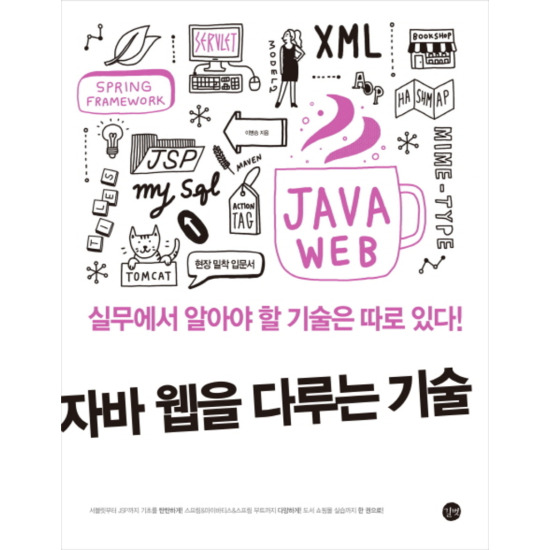
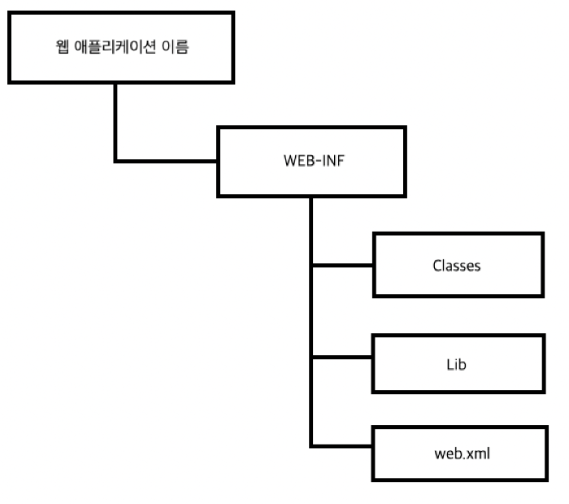
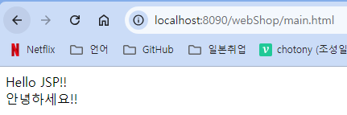

자바 웹을 다루는 기술 


# 1장 프로그램의 발전 과정

일반적인 웹 페이지는 대부분 미리 서버에 등록해 두었다가 웹 브라우저가 서버에 특정 데이터를 요청하면 이를 웹 브라우저로 전송해서 보여줍니다.
이를 가능하게 하는 기술 중 하나가 JSP입니다.

웹 프로그램은 클라이언트 PC 기반 프로그램에서 시작하여 클아이언트 서버 기반 프로그램, 엡 기반 프로그램 순으로 진화해 왔습니다.

## 클라이언트 PC 기반 프로그램

인터넷이 세상에 나오기 전 PC 기반 프로그램은 기능이나 화면의 형태가 바뀌면 코드를 추가한 후 일일이 PC에 다시 설치하거나 업데이트를 해야 했습니다.
게다가 클라이언트 프로그램에 데이터베이스 접속 정보라도 들어 있다면 정보가 쉽게 노출될 수 있어 보안이취약하다는 문제도 있습니다.
이러한 클라이언트 PC 기반 프로그램의 문제점을 보완하여 나온 것이 클라이언트-서버 기반 프로그램입니다.

## 클라이언트 - 서버 기반 프로그램 동작 방식 
이 구조는 기존 클라이언트가 수행하는 모든 기능을 서버에서 수행합니다. 
클라이언트의 기능은 대폭 축소되었지요. 클라이언트는 처리할 데이터가 있으면 네트워크를 통해 서버에 전달하고, 서버가 처리한 결과를 네트워크를 통해 다시 받아 결과를 화면에 출력하는 역할만 합니다.

클라이언트-서버 기반 프로그램은 기능(로직)이 변경되어도 모두 서버에서 처리하면 되기 때문에 클라이언트 프로그램을 수정할 필요가 없습니다. 중요한 기능은 서버에서 처리하므로 클라이언트 PC기반 프로그램보다 데이터 보안 측면에서도 훨씬 우수합니다.

하지만 클라이언트-서버 기반 프로그램에도 한계가 있습니다. 지금처럼 환율 계산기 기능에 파운드와 유료 환율 변환 기능만 단순히 추가하는 경우라면 서버에서 기능을 쉽게 추가할 수 있지만, 사용자가 파운드와 유로를 서택할 수 있도록 셀렉트 박스에 '파운드'와 '유로' 항목을 추가해서 보여주어야 합니다. 즉, 로직 뿐만 아니라 클라이언트 프로그램도 수정해야 합니다.

## 웹 기반 프로그램 동작 방식
웹 기반 프로그램의 경우 클라이언트는 자신이 사용하는 클라이언트 프로그램을 직접 설치하는 것이 아니라 사용자 컴퓨터의 웹 브라우저를 통해 화면에 해당되는 HTML 문서를 서버에 요청합니다.
그러면 서버에서는 요청 받은 HTML 문서를 전송하여 해당 기능을 담당하는 화면을 보여줍니다.

죽, 웹 기반 프로그램의 경우 사용자가 사용하는 프로그램의 기능이나 화면이 바뀌면서 서버에서 모두 처리합니다.
클라이언트-서버 기반 프로그램과 마찬가지로 클라이언트가 특별히 수행해야 할 작업이 없습니다. 그리고 모든 기능을 서버에서 처리하므로 보안 면에서도 월등히 우수합니다.

```
서블릿 기반 프로그램의 실습 방법은 이 책 뒷부분에서 상세히 설명하므로 지금은 어떤 과정을 통해 웹프로그램 방식이 등장했으며 동작하는지 정도만 확인.
```
이처럼 웹 기반 프로그램은 클라이언트 측 "웹 브라우저"가 요청을 하면 웹 서버에서 계산 기능을 구현하여 결과를 돌려주는 방식입니다.

# 2장 웹 프로그래밍과 JSP
## 2.1 웹 프로그래밍의 기본
JSP가 나오기 전에는 Apache같은 웹 서버를 이용해 웹 페이지들을 브라우저에 표시하는 방식이 있었다. (정적 웹 프로그래밍)
정적 웹 프로그래밍 : 웹 서버에 미리 보여줄 HTML, CSS, 이미지, JAVASCRIPT 파일을 저장해 놓고 브라우저에서 요청할 경우 그대로 전달하는 방식.
따라서 사용자는 페이지가 변경되지 않는 한 고정된 웹 페이지를 보게 된다.
요즘 환율 정보다, 주가 정보 등 실시간으로 변하는 정보를 표시해야 할 일이 많기 때문에 거의 사용되지 않는다.
BUT 정적 웹 프로그래밍 구성 요서는 JSP에서도 여전히 화면 디자인과 기능 처리를 담당하고 있음.

### 웹 프로그래밍의 핵심 구성 요소들
- 웹 서버 : 각 클라이언트에게 서비스를 제공하는 컴퓨터를 의미.
- 클라이언트 : 네트워크로 서버에 접속한 후 서버로부터 서비스를 제공받는 컴퓨터를 의미.
- HTTP 프로토콜 : Hyper Text Transfer Protocol의 약자로, www 서비스를 제공하는 통신 규약을 의미. 웹 서버와 클라이언트는 이 프로토콜을 이용해 정보를 주고받는다.
- HTML : Hyper TText Markup Language의 약자, www 서비스를 제공하기 위한 표준 언어.
- 자바스크립트 : HTML 웹 페이지의 여러 가지 동적인 기능으 제공하는 스크립트 언어
- CSS(Style Sheet) : HTML 문서에서 서체나 색상, 정렬 등 세부적인 HTML 페이지의 디자인에 관련된 여러 가지 기능을 제공.

## 2.2 정적 웹 프로그래밍

정적인 방식으로 환율 정보를 얻는 과정
클라이언트 -> 환율 정보 요청 -> 웹서버 <- 수시로 환율 정보 업데이트 <- 관리자
          <-  환율 정보 반환 <-

- 사용자에게 화면 디자인 같은 고정된 정보만 제공합니다.
- 정보 수정 시 관리자가 직접 HTML 소스를 수정하여 사용자에게 정보를 제공합니다.

## 2.3 동적 웹 프로그래밍
정적 웹 프로그래밍에서 '관리자'가 하던 역할을 '웹 어플리케이션 서버'가 수행한다.
DB에 실시간 환율 정보가 저장되어있고, 클라이언트 요청마다 웹 어플 서버가 DB에 접근하여 정보를 불러온다.

처음 동적 방식 프로그램을 제공하는 기능은 CGI(Common Gate Interface, 공용 게이트웨이 이터페이스) 였다. 
프로그래밍 언어인 perl이 대표정인 CGI 프로그래밍 언어.

- CGI 동작 방식 특징
  - 초기 웹 서비스 프로그램에서 사용하는 방식
  - 프로세스 방식으로 실행됨
  - 서버의 부하가 심함

ex)
클라이언트들이 환율 정보 요청 -> 웹 어플 서버 : 환율 조회 기능 process를 memory에 생성 -> DB와 연동하여 클라이언트들에게 환율 정보 반환.
초기에는 인터넷 사용자도 적고, 기능도 적어 문제가 없었다.
하지만 요즘같은 시대에는 memory에 과부하가 걸린다.

이러한 문제에 대한 개선 : JSP, ASP, PHP

## 2.4 JSP 프로그램의 특징
JSP는 기본적으로 스레드(thread)방식으로 실행하기 때문에 CGI 방식보다는 효율적으로 기능을 수행합니다.

클라이언트 1이 환율 정보를 요청하면, 웹 애플리 서버는 환율 조회 기능을 memorty에 로드한 후 전송.
클라이언트 2가 요청하면, 기존의 메모리에서 기능을 꺼내와서 전송. (요청시마다 따로따로 메모리에 로드하지 않게 됨.)

*프로그램을 외부 장치에서 메모리로 로드하는 것이 과부하의 큰 원인이었음.
현재 대부분의 웹 프로그램이 스레드 방식으로 동작한다.

- JSP 동작 방식
  - 프로세스 방식이 아닌 스레드 방식으로 실행
  - 클라이언트의 요구를 처리하는 기능은 최초 한 번만 메모리에 로드.
  - 클라이언트가 동일한 기능 요구 시, 기존에 사용한 기능을 재사용.

# 3장 개발 환경 설정하기

## JDK 환경 변수 설정
설치된 JDK를 명령 프롬프트에서 사용하려면 환경 변수를 설정해야 하낟.
이클립스는 실행 시 자동으로 JDK 위치를 인식하지만, MAVEN같은 자바 관련 개발 도구들은 JDK의 위치를 환경 변수로 인식한다.
따라서 JSP 개발 시 환경 변수를 반드시 설정해야 함.

## 톰캣 컨테이너 설치하기
웹 컨테이너.
서블릿이나 JSP를 실행하여 웹 페이지에 가격 정보를 동적으로 표시해 주는 것.

java se 는 standart edition / java ee는 enterprise edition.

sqlplus에서 비밀번호 잊어버렸을 때에는
sys as sysdba 로 접속해서 (password : 그냥 엔터)
alter user system identified by 1234;


# 4장 웹 애플리케이션

서블릿 : 자바로 만든 CGI 프로그램

CGI(Common Gateway Interface) : 웹 서버와 외부 프로그램 간의 인터페이스를 정의하는 표준 프로토콜.
CGI 프로그램을 작성하면 웹 서버에 실행되는 외부 프로그램을 통해 동적 컨텐츠를 생성할 수 있습니다.

웹 컨테이너에서 실행되는 JSP, 서블ㄹ릿, 자바 클래스들을 사용해 정적 웹 프로그래밍 방식의 단점을 보완하여 서비스를 제공하는 서버 프로그램을 웹 어플리케이션이라고 합니다.

## 4.2 웹 애플리케이션의 기본 구조



이러한 구조를 갖추지 않고 컨테이너에서 웹 앱을 실행하면 오류 발생.

- webShop : 웹 앱의 루트 디렉토리. 다른 웹 앱과 이름과 중복을 허용하지 않으며, 여기에는 JSP, HTML 파일이 저장된다.
- WEB-INF : 웹 앱에 관한 정보가 저장되는 곳. "이 디렉토리는 외부에서 접근할 수 없다."
- classes : 웹 앱이 수행하는 서블릿과 다른 일반 클래스들이 위치하는 곳.
- lib : 웹 앱에서 사용되는 라이브러리 jar파일이 저장되는 곳. DB연동 드라이버나 프레임워크 기능 관련 jar 파일. lib directory의 jar는 클래스패스가 자동으로 저장된다.
- web.xml : 배치 지시자(deployment descriptor)로서 일종의 환경 설정 파일입니다. 웹 앱에 대한 여러 가지 설정을 할 때 사용됩니다.
- bin : 앱에서 사용되는 각종 실행 파일이 저장된 곳.
- conf : 프레임워크에서 사용하는 각종 설정 파일이 저장된 곳.
- src : 자바 소스 파일이 저장된 곳.

## 4.3 컨테이너에서 웹 앱 실행하기.
- 톰캣 컨테이너에서 실행 후 웹 브라우저에서 실행되는지 확인.

### 컨테이너에 웹 앱 등록
웹 앱은 PC에서 실행되는 자바 앱과 달리 단독 실행될 수 없다.
웹 앱은 톰캣과 같은 "웹 컨테이너"에서 실행된다.

#### 웹 앱을 톰캣 컨테이너에 등록 방법
1. %CATALINA_HOME%webApps 디렉토리에 앱 저장
2. server.xml에 직접 웹 앱 등록

- 1번 방법 
Tomcat9.0폴더의 하위 폴더로 webapps가 있음.
여기에 webShop폴더 전체를 복사한 후 붙여 넣는다.

#### 브라우저에서 웹 앱 요청
http://IP주소:포트번호/컨텍스트이름/요청파일이름

http://127.0.0.1:8090/webShop/main.html
        localhost
        

##### 컨텍스트란?
webShop 프로젝트를 미리 webapps 폴더에 위치시켜 놓은 다음 톰캣을 실행했을 때 자동으로 webShop이 등록되어 실행됐었다.
이 방법은 웹 앱 개발을 모두 완료한 후 사용자에게 서비스를 할 때 사용하면 편리하다.
그런데 실제 개발과정에서는 수시로 테스트가 필요하다.

따라서 실제 개발 때에는 특정 위치에 폴더를 만들고, server.xml에 등록해놓고 톰캣을 실행하는 식으로 개발이 된다.(당연) -> 톰캣이 server.xml에 입력된 정보에 따라 해당 위치로 이동하여 앱을 확인한 후 실행함.

** 이 때, server.xml에 등록하는 "웹 앱"을 "컨텍스트(Context)"라고 부른다. 
컨텍스트 이름은 웹 앱 이름과 같게 만드는 것이 일반적이나, 보안 상의 이유 또는 이름이 긴 경우 다르게 만들 수도 있음.

- 컨텍스트의 주요 특징
  - 웹 앱당 하나의 컨텍스트가 등록된다.
  - 웹 앱 이름과 같을 수도 있고 다를 수도 있다.
  - 컨텍스트 이름은 중복되면 안 된다. (당연..컨텍스트 이름으로 브라우저에서 요청하는데, 같으면 어떻게)
  - 웹 앱의 의미를 가장 잘 나타낼 수 있는 "명사형"으로 지정.
  - "대소문자 구분"
  - server.xml에 등록한다.

#### 톰캣 컨테이너에 컨텍스트로 등록하기
server.xml은 톰캣 설치 루트 + conf폴더 안에 있음.

등록되지 않은컨텍스트 이름으로 요청하면 404 오류 발생.

#### 이클립스에서 웹 애플리케이션 실습하기
webProject를 만들고,
server에 tomcat8.5를 추가하니,
server폴더에 톰캣 루티 디렉토리의 여러 xml설정 파일들이 이클립스 Project Explorer상단에 자동 복사됨.
거기에 add해서 webShop을 추가하면, 앞서 tomcat 서버에 webShop프로젝트가 등록된 것이다.
->server.xml에 context에 webShop이 자동 추가된 것을 볼 수 있다.
->Dkworks컨테이너 추가할 때에도, 이런 원리로 server.xml만 받고, add로 프로젝트 등록하면 server에 해당 컨테이너가 등록된 것과 같구나.

## 웹 애플리케이션 서비스하기

deploy란?
이클립스에서 개발할 경우 개발자 입장에서는 자신이 만든 기능이 정상적으로 실행되는지 확인하기 위해 빈번하게 톰캣을 재실행하곤 합니다.
이런 개발 과정을 거처 애플리케이션이 완성되면 이제는 실제 사용자들에게 서비스를 해야합니다. 그단계에서는 이클립스에 등록된 톰캣에서 실행하는 것은 의미가 없겠죠. 실제로 리눅스나 유닉스 서버에 설치된 톰캣에서 실행해야 합니다. 그렇게 하려면 이클립스에서 개발한 웹 앱 예제 소스 전체를 실제로 서비스하는 톰캣으로 이동하여 실행해야 합니다. 이 과정을 배치(deploy)라고 합니다. 즉, 웹 앱을 실제로 서비스한다는 말입니다.

개발을 마친 후에는 프로젝트를 war 압축 파일로 만든 후 FTP를 이용해 톰캣이 미리 설치된 리눅스나 유닉스 같은 운영 서버에 업로드합니다.
그리고 텔넷(telnet)을 이용해 bin 폴더의 Tomcat.ext을 다시 실행하면 톰캣 실행 시 war 파일의 압축이 해제됨과 동시에 자동으로 등록웹앱이 실행됩니다.


# 5장 서블릿 이해하기
서블릿 : 자바로 만든 CGI 프로그램

정접 웹 페이지의 문제를 보완 여 JSP 이전에 동적 페이지를 구현했던 것은 Servlet이다.
이 Servlet을 보완하여 나온 것이 JSP

서블릿은 자바로 작성되어 있으므로 자바의 일반적인 특징을 모두 가집니다.
하지만 서블릿은 일반 자바 프로그램과 다르게 독자적으로 실행되지 못하고 톰캣과 같은 JSP/Servlet컨테이너에서 실행된다는 점에서 차이가 있습니다.

WebShpere는 IBM에서 개발한 애플리케이션 서버로, JSP/Servlet 컨테이너를 포함하지만 그 이상의 기능을 제공한다. 

1.Server
서버는 단순히 클라이언트 요청을 받아서 응답하는 시스템. 이 시스템은 클라이언트의 요청을 처리하는 데 필요한 자원으 제공하고, 데이터베이스나 파일 시스템에 접근하여 데이터를 반환할 수 있다. 서버에는 여러 종류가 있는데, 웹 서버는 주로 HTTp 요청을 처리하는 역할을 한다.
- Apahce HTTP 서버 : 정적 콘텐츠(HTML, CSS, 이미지 등)을 주로 제공하는 웹 서버.

2.JSP/Servlet 컨테이너
JSP(Java Server Pages)와 Servlet은 자바 기반의 웹 애플리케이션을 개발하는 기술입니다.
jSP/Servlet 컨테이너는 이를 실행할수 있는 환경을 제공
- 대표적으로 Apache Tomcat 같은 앱이 JSP와 Servet을 처리한다.
- JSP/Servlet 컨테이너는 서블릿을 생성, 실행, 종료하고 클라이언트의 요청을 적절한 서블릿에 매핑하여 처리함.

3. WebSphere 앱 서버.
WebShpere는 JSP/Servlet 컨테이너 기능뿐아니라 다양한 기업 환경에 적합한 고급 기능을 제공.
- 트랜잭션 관리 : 여러 데이터베이스 작업이 하나의 트랜잭션으로 처리되어야 할 때, 이를 관리
- 보안 관리
- 로드 밸런싱 및 클러스터링 : 서버 간의 부하를 분산하고, 장애 발생 시 자동으로 다른 서버로 작업을 넘겨줌
- 엔터프라이즈 자바 앱 지원 : EJB 같은 고급 자가 앱을 실행 가능.
-> WebShpere는 단순한 JSP/Servlet 컨테이너보다 훨씬 더 많은 기능을 제공하는 종합적 앱 서버라고 할 수 ㅣㅇㅆ다.
Tomcat이나 Hetty 같은 컨테이너는 기본적인 웹 앱을 지원하는데 집중하는 반면, WebShpere는 기업 환경에서 필요한 다양한 요구 사항을 충족하는데 초점을 맞춥니다.

서블릿은 서버에서 실행되다고 웹 브라우저에서 요청을 하면 해당 기능을 수행한 후 웹 브라우저에 결과를 전송한다. 서버에서 실행되므로 보안도 안전.

클라이언트(웹 브라우저) -> 요청 -> 웹 서버 -> 위임 -> 웹 앱 서버(WAS) -> 호출 -> 서블릿 (실행) 
                    <-결과 응답            <- 결과                <-  결과 <-


클라이언트가 웹 서버에서 요청하면 웹 서버는 그 요청을 톰캣과 같은 웹 앱 서버(WAS)에 위임합니다.
그러면 WAs는 각 요청에 해당하는 서블릿을 실행.

서블릿
- 서버 쪽에서 실행되면서 기능을 수행
- 기존의 정적인 웹 프로그램의 문제점을 보완하여 동적인 여러 가지 기능을 제공
- 스레드 방식으로 실행됨
- 자바로 만들어져 자바의 특징(객체 지향)을 가짐.
- 컨테이너에서 실행
- 컨테이너 종류에 상관없이 실행됨(플랫폼 독립적)
- 보안 기능을 적용하기 쉬움
- 웹 브라우저에서 요청 시 기능을 수행한다.

## 5.2 서블릿 API 계층 구조와 기능
서블릿은 자바로 만들어졌으므로 당연히 클래스들 간의 계층 구조를 가집니다.

Servelt     ServletConfig
    GenericServlet

      HttpServlet
  
GenericServlet은 일반적인 여러 통신 프로토콜에 대한 클라이언트/서버 프로그램에서 서블릿 기능을 구현하는 클래스. HttpServlet은 이 GenericServlet을 상속받습니다.

HttpSerlvet은 HTTP프로토콜을 사용하는 서블릿 기능을 구현하는 클래스. 
HTTpServlet의 주요 메서드와 그 기능
- protected doDelete(HttpServletReuqest req, HttpServletResponse resp)
서블릿이 DELETE request를 수행하기 위해 service()를 통해서 호출됩니다.
- protected doGet
- protected doHead
- protected doPost
- protected service : request를 public service()에서 전달받아 doXXX()메서드를 호출합니다.
- public service : 클라이언트의 request를 protected servce()에세 전달합니다.

순서 : public service -> protected service -> protected doXXX

## 5.3 서블릿의 생명주기 메서드
서블릿도 자바 클래스이므로 실행하면 당연히 초기화 과정 그리고 메모리에 인스턴스를 생성하여 서비스를 수행한 후 다시 소멸하는 과정을 거친다. 이런 단계를 거칠 때마다 서블릿 클래스의 메서드가 호출되어 초기화, 데이터베이스 연동, 마무리 작업을 수행합니다.

서블릿 생명주기 메서드란 서블릿 실행 단계마다 호출되어 기능을 수행하는 콜백 메서드를 말한다.

생명주기 단계   호출 메서드   특징
초기화          init()      서블릿 요청 시 맨 처음 한번만 호출됩니다.
                           서블릿 생성 시 초기화 작업을 주로 수행합니다.

작업 수행       doGet()     서블릿 요청 시 매번 호출됩니다.
               doPost()    실제로 클라이언트가 요청하는 작업을 수행합니다.

종료            destroy()   서블릿이 기능을 수행하고 메모리에서 소멸될 때 호출됩니다.
                           서블릿의 마무리 작업을 주로 수행합니다.

## 5.4 FirstServlet을 이용한 실습

이클립스에서 서블릿을 만들고 실행하는 과정
사용자 정의 서블릿 클래스 만들기 -> 서블릿 생명주기 메서드 구현 
-> 서블릿 매핑 작업 -> 웹 브라우저에서 서블릿 매핑 이름으로 요청하기

### 5.4.1 사용자 정의 서블릿 만들기
실제 웹 프로그래밍에서 사용되는 사용자 정의 서블릿은 HttpServlet 클래스를 상속받아서 만듭니다.
그리고 3개의 생명주기 메서드, 즉 init(), doGet(), destory() 메서드를 오버라이딩해서 기능을 구현합니다.


자바의 특징 (객체 지향)
객체 지향 프로그래밍이란 여러 개의 객체(Object)로 나누어, 이 객체들 간의 상호작용을 통해 소프트웨어를 설계하고 구현하는 방법론.

자바의 객체 지향 특징
1. 클래스와 객체
- 클래스 : 객체를 생성하기 위한 청사진(설계도)입니다. 예를 들어 '자동차'라는 클래스를 정의하면 그 클래스에는 자동차의 특성(속성)과 기능(메서드)가 포함됨.
- 객체 : 클래스의 인스턴스로, 실제로 메모리에 생성된 실체. '자동차' 클래스로 만든 '내 차', '너의 차'같은 각각의 차가 객체입니다.

2. 캡슐화(Encapsulation)
- 캡슐화는 객체의 내부 상태(필드)를 외부로부터 숨기고, 오직 정의된 메서드를 통해서만 접근하도록 하는 원리입니다. 이를 통해 데이터의 무결성을 유지할 수 있습니다.
- 예를 들어, 클래ㅐ스이 변수에 직접 접근하는 대신, getter, setter 메서드를  통해 변수 값을 읽고 수정합니다.

3. 상속(Inheritance)
- 상속은 기존 클래스를 재사용하여 새로운 클래스를 정의하는 기능입니다. 부모 클래스의 속성과 메서드를 자식 클래스가 물려받아 코드의 중복을 줄이고 유지보수를 용이하게 합니다.
- 예를 들어, '차랑'이라는 부모 클래스를 만들고, '자동차', '트럭' 같은 자식 클래스를 상속받아 사용할 수 있습니다.

4. 다형성(Polymorphism)
- 다형성은 같은 이름의 메서드가 여러 객체에서 다른 방식으로 동작하는 성질을 의미합니다.
즉, 하나의 메서드나 객체러 여러 가지 형태로 동작할 수 있는 능력입니다,.
- 자바에서 메서드 오버로딩(같은 이름의 메서드를 여러 개 정의하는 것)과 메서드 오버라이딩(부모 클래스의 메서드를 자식 클래스에서 재정의하는 것)을 통해 다형성을 구현할 수 있습니다.

5. 추상화(Abstraction)
- 추상화는 복잡한 내부 구현을 숨기고, 필요한 부분만 외부에 노출하는 개념입니다.. 객체 지향 프로그래밍에서, 추사오하를 통해 불필요한 세부사항을 감추고 중요한 부분만을 간단하게 나타낼 수 있습니다,
- 자바에서는 추상 클래스와 인터페이스를 통해 추상화를 구현할 수 있습니다. 예를 들어, '동물'이라는 추상 클래스를 만들고, '걷는다'ㅡ '먹는다' 같은 공통 기능만 정의해 놓은후, 구체적인 동물 클래스에서 이들을 구현하는 방식입니다.

요약
객체 지향 프로그래밍 특징은 프로그램을 클ㄹ스와 객체로 나누고 이를 통해 코드를 재사용하고 유지보수를 쉽게 하는 데 중점을 둡니다. 객체 지향 프로그래밍의 네가지 주요개념은 캡슐화, 상속, 다형성, 추상화는 자바가 가진 강력한 특징 중 하나로, 이를 활용하면 대규모 시스템의 복잡도를 줄이고 확장 가능하고 안정적인 소프트웨어 개발이 가능합니다.


##### 복습
Tomcat 폴더에 컨텍스트를 넣고 톰캣 실행 시 돌아감
최종 배포할 때에는 이 방법도 괜찮지만
보통 개발 단계에서는 수시로 코드가 변하기 때문에 
server.xml에 컨텍스트를 등록하여 톰캣실행 시 해당 컨텍스트 루트를 불러오도록 한다.

Tomcat, Jetty같은 컨테이너는 기본적인 웹 앱을 지원하고, WebShpere는 기업환경에서 필요한 요구를 충족한다.
-로드밸런싱, 보안, 트랜잭션 관리 등의 기술을 지원한다.

### 5.4.2 톰캣의 servlet-api.jar 클래스 패스 설정
서블릿 API들은 톰캣의 servlet-api.jar 라이브러리로 제공되므로 이클립스의 프로젝트에서 서블릿을 사용하려면 반드시 클래스 패스를 설정해야 합니다.


### 5.4.3 첫 번째 서블릿 만들기

브라우저에서 서블릿 요청 방법
http://IP주소:포트번호/프로젝트이름/패키지이름이 포함된 클래스 이름 
->보안에 취약함 -> 매핑으로 요청

서블릿 매핑 과정
1. 각 프로젝트에 있는 web.xml에서 설정
2. <servlet> 태그와 <servlet-mapping>태그를 이용
3. 여러 개의 서블릿 매핑 시에는 <servlet> 태그를 먼저 정의하고 <servlet-mapping> 태그를 정의

tomcat서버에 여러 개의 컨테이너를 추가하고, 서버를 시행하니까 각각의 주소로 요청이 됨.

여러 개의 servlet을 mapping할 때에는,
각각의 servlet태그를 따로 만들어줘야함..(매우귀찮)

```xml
	<servlet>
		<servlet-name>aaa</servlet-name>
		<servlet-class>sec01.ex01.FirstServlet</servlet-class>
	</servlet>
	<servlet>
		<servlet-name>bbb</servlet-name>
		<servlet-class>sec01.ex01.FirstServlet</servlet-class>
	</servlet>
	<servlet-mapping>
		<servlet-name>aaa</servlet-name>
		<url-pattern>/first</url-pattern>
	</servlet-mapping>
	<servlet-mapping>
		<servlet-name>bbb</servlet-name>
		<url-pattern>/second</url-pattern>
	</servlet-mapping>
```

변경된 web.xml을 적용하려면 Server재시작 해줘야함.
(서버 닫을 때 destroy메소드)

## 5.5 서블릿 동작 과정

client1  
         -> FirstServlet -> -> firstServlet이 메모리에 존재하는지 확인  -> no -> FirstServlet을 메모리에 로드 -> init()을 호출    
client2

yes -> doGet() 또는 doPost()를 호출  -> 결과 응답 

스레드 방식으로 동작하므로 최초 용청 시에만 init()메서드를 호출합니다.

1.스레드(Thread)
스레드는 프로세스 내에서 독립적으로 실행되는 작업 단위 입니다.
하나의 프로그램(프로세스)이 여러 스레드를 생성할 수 있으며, 이 스레드들은 동시에 실행될 수 있습니다.
스레드를 사용하면 병렬 처리나 멀티태스킹이 가능해져 성능을 향상시킬 수 있습니다.

각 스레드는 공유된 자원을 사용한다.
즉, 처음 init()을 하면 초기화된 상태로 다음 스레드들이 업무를 수행한다.

## 5.6 어노테이션을 이용한 서블릿 매핑

### 5.6.1 어노테이션을 이용한 서블릿 매핑
어노테이션 매핑을 이용하려면 @WebServle을 이용한다.
어노테이션을 사용하는 class는 반드시 HttpServlet 클리스를 상속받아야 한다.

# 6장 서블릿 기초

## 6.1 서블릿의 세 가지 기본 기능
톰캣과 같은 WAS가 처음 나왔을 때 웹 브라우저 요청을 스레드 방식으로 처리하는 기술이 바로 서블릿이었습니다.
6~7장에 걸쳐 살펴볼 서블릿의 기능은 이 채겡서 가장 기본이 되면서도 중요한 내용입니다.
모든 웹 프로그램은 6~7장에서 배우는 기능을 뼈대로 동작합니다. 

### 6.1.1 서블릿 기본 기능 수행 과정

서블릿의 세 가지 주요 기능
1. 클라이언트로부터 요청을 받습니다.
2. 데이터베이스 연동과 같은 비즈니스 로직을 처리합니다.
3. 처리된 결과를 클라이언트에 돌려줍니다.


```
java클래스와 servlet의 차이
Servlet은 특정 목적(HTTP 요청을 처리)을 가진 java class의 한 종류라고 할 수 있다.

Java클래스는 일반적인 프로그램 로직을 구현하는 데 사용되는 반면,
서블릿은 웹 서버에서 동작하며 HTTP 요청/응답을 처리하는데 특화된 클래스로, 웹 앱의 백엔드 로직을 처리합니다.
```

### 6.1.2 서블릿 응답과 요청 수행 기능 API 기능

클라이언트가 서블릿에 요청을 하면 먼저 톰캐 컨테이너가 받습니다.
사용자의 요청이나 응답에 대한 HttpServletRequest 객체와 HttpServletResponse 객체를 만들고 서블릿의 doGet()이나 doPost() 메서드를 호출하면서 이 객체들을 전달합니다.

톰캣이 사용자의 요청에 대한 정보를 모든 HttpServletRequest 객체의 속성으로 담아 메소드로 전달하므로 각 HttpServletReuqest에서 제공하는 메서드들은 매게변수로 넘어온 객체들을 이용하여 사용자가 전송한 데이터를 받아 오거나 응답할 수 있습니다.

#### HttpServletReuqest의 여러 가지 메서드
boolean authenticate(HttpServletResponse res) 현재 요청한 사용하자 ServletContext 객체에 대한 인증을 하기 위한 컨테이너 롤그인 메커니즘을 사용합니다.

String changeSessionId() 현재 요청과 연관된 현재 세선의 id를 변경하여 새 세션 id를 반환합니다.
Strig getContextPath() 요청한 컨텍스트를 가리키는 URI를 반환합니다.
Cookie[] getCookies() 클라이언트가 현재의 요청과 함께 보낸 쿠키 객체들에 대한 배열을 반환합니다.
String getHeader(String name) 특정 요청에 대한 헤더 정보를 문자열로 반환합니다.
Enumeration<String> hetHeaderNames() 현재 요청에 포함된 헤더의 name 속성을 enumeration으로 반환합니다.

String getmethod() 현재 요청이 GET, POST 또는 PUT방식 중 어떤 HTTP 요청인지를 반환합니다.

String getRequestURI() : 요청한 URL의 컨테스트 이름과 파일 경로까지 반환합니다.

String getServletPath()  요청한 URL에서 서블릿이나 JSP 이름을 반환합니다.

HttpSession getSession() 현재의 요청과 연관된 세션을 반환합니다. 만약 세션이 없으면 새로 만들어서 반환합니다.

#### HttpServletResponse의 여러 가지 메서드
void addCooike(Cookie cookie) 응답에 쿠키를 추가합니다.

void addHeader(Strign name, String value)name과 value를 헤더에 추가합니다.

String encodeURL(String url) 클라이언트가 쿠키를 지원하지 않을 때 세션 id를 포함한 특정 URL을 인코딩합니다.

Collection<String> getHeaderNames() 현재 응답 헤더에 포함된 name을 얻어옵니다.

void snedRedirect(String location) 클라이언트에게 리다이렉트(redirect)응답을 보낸 후 특정 URL로 다시 요청하게 합니다.

String getPathInfo() 클라이언트가 요청 시 보낸 URL과 관련된 추가 경로 정보를 반환합니다.

## 6.2 <form> 태그를 이용해 서블릿에 요청하기

## 6.3 서블릿에서 클라이언트의 요청을 얻는 방법

<form>태그로 전송된 데이터를 받아오는 방법
String getParamter(String name) : 가장 흔함
String[] getParameterValues(String name) : 같은 name에 대해 값을 받아올 때
Enumeration getParameterNames() : name 값을 모를 때

### 6.3.2 여러 개의 값을 전송할 때의 요청 처리
checkbox에서 선택한 값들은 checked가 되고,
form submit을 하면 servlet에서 getParameterValues("tagName"); 으로 가져온다.
String[] 이기 때문에 각 tagName의 checkbox의 value들이 들어가게 된다.

## 6.4 서블릿의 응답 처리 방법
서블릿에서 응답을 처리하는 방법
1. doGet()이나 doPost() 메서드 안에서 처리합니다.
2. HttpServletResponse 객체를 이용
3. setContentType()을 이용해 클라이언트에게 전송할 데이터 종류(MiME-TYPE)을 지정합니다.
4. 클라이언트(웹 브라우저)와 서블릿의 통신은 자바의 I/O의 스트림을 이용합니다.

### 6.4.1 MIME-TYPE
서버(서블릿)에서 웹 브라우저로 데이터를 전송할 때는 어떤 종류의 데이터를 전송하는지 웹 브라우저에게 알려줘야 합니다. 그 이유는 웹 브라우저가 전송 받을 데이터의 종류를 미리 알고 있으면 더 빠르게 처리할수 있기 때문이죠. 따라서 서버(서블릿)에서 웹 브라우저로 데이터를 전송할 때는 "톰캣 컨테이너에서 미리 제공"하는 여러 가지 "전송 데이터 종류 중" 하나를 지정해서 웹 브라우저로 전송합니다. 이처럼 톰캣 컨테이너에서 미리 설정해 놓은 데이터 종류들을 "MIME-TYPE"이라고 합니다.

서버(서블릿)에서 자바 I/O의 스트림 클래스를 이용하요 웹 브라우즈로 데이터를 전송할 때는 MIME-TYPE을 설정해서 전송할 데이터의 종류를 지정합니다.

다음은 MIME_TYPE으로 지정하는 예입니다.
- HTML로 전송 시 : text/html
- 일반 텍스트로 전송 시 : text/plain
- XML 데이터로 전송 시 : application/xml

웹 브라우저는 기본적으로 HTML만 인식하므로 서블릿에서 전송하는 대부분의 데이터는 MIME-TYPE을 text/html로 지정합니다.

더 나아가 새로운 종류의 데이터를 지정하고 싶으면 CATALINA_HOME/conf/web.xml에 추가하면 됩니다.

### 6.4.2 HttpServletResponse를 이용한 서블릿 응답 실습

서블릿이 클라이언트(웹 브라우저)에 응답하는 과정음 다음과 같습니다.

setContentType() 을 이용해 MIME-TYPE을 지정합니다.
->
데이터를 출력할 PrintWriter 객체를 지정합니다.
->
출력 데이터를 HTML 형식으로 만듭니다.
->
PrintWriter의 print()나 println()을 이용해 데이터를 출력합니다.

## 6.5 웹 브라우저에서 서블릿으로 데이터 전송하기

### 6.5.1 GET/POST 전송 방식
GET방식 : URL 주소에 데이터를 붙여서 전송하는 방식.
- 서블릿에 데이터를 전송할 때는 데이터가 URL 뒤에 name=value 형태로 전송됩니다.
- 여러 개의 데이터를 전송할 때는 &로 구분해서 전송됩니다.
- 보안이 취약합니다.
- 전송할 수 있는 데이터는 최대 255자 입니다.
- 기본 전송 방식이고 사용이 쉽습니다.
- 웹 브라우저에 직접 입력해서 전송할 수도 있습니다.
- 서블릿에서는 doGet()을 이용해 데이터를 처리합니다.

POST방식 : 전송하는 데이터를 숨겨서 전송한다.
- 서블릿에 데이터를 전송할 때는 TCP/IP 프로토콜 데이터의 body 영역에 숨겨진 채 전송됩니다.
- 보안에 유리합니다.
- 전송 데이터 용량이 무제한입니다.
- 전송 시 서블릿에서는 또다시 가져오는 작업을 해야 하므로 처리 속도가 GET 방식보다 느립니다.
- 서블릿에서는 doPost()를 이용해 데이터를 처리합니다.


## 6.6 GET방식과 POST방식 요청 동시에 처리하기
웹 프로그래밍에서는 GET방식과 POST방식을 혼합해서 많이 사용합니다.
이때 각 방식마다 일일히 구분하는 것은 번거로울 수 있다.

## 6.7 자바스크립트로 서블릿에 요청하기
script에 메소드 정의 후 
onClick으로 유효성 검사.

let frmLogin = document.frmLogin; => form name을 통해서 form정보를 가져옴.

frmLogin.method = "post";
frmLogin.action = "login5";
frmLogin.submit();

.속성명 으로 속성 변경 가능

## 6.8 서블릿을 이용한 여러 가지 실습 예제

### 6.8.2 실습 예제2 : 서블릿으로 로그인 요청 시 관리자 화면 나타내기
문제 : 실습 예제 1을 이용해 로그인 시 admin ID로 로그인하면 회원 관리와 회원 삭제 기능을 보여주도록 작성하시오.

### 6.8.3 실습 예제3 : 서블릿으로 요청 시 구구단 출력하기
문제 : 구구단의 단수를 입력 받는 gugu.html을 다음과 같이 작성합니다. 
단수를 입력 받아 guguTest 서블릿으로 전송합니다.

# 7장 서블릿 비즈니스 로직 처리
## 7.1 서블릿의 비즈니스 로직 처리 방법

서블릿 비즈니스 처리 작업이란 서블릿이 클라이언트로부터 요청을 받으면 그 요청에 대해 작업을 수행하는 것을 의미합니다.
웹 프로그램에서 대부분의 비즈니스 처리 작업은 데이터베이스 연동 관련 작업이지만 그 외 다른 서버와 연도애서 데이터를 얻는 작업도 수행합니다.

### 서블릿의 비즈니스 작업
- 웹 사이트 회원 등록 요청 처리 작업
- 웹 사이트 로그인 요청 처리 작업
- 쇼핑몰 상품 주문 처리 작업

## 7.2 서블릿의 데이터베이스 연동하기

### 7.2.1 서블릿으로 회원 정보 테이블의 회원 정보 조회

1. 웹 브라우저가 서블릿에게 회원 정보를 요청합니다.
2. MemberServlet은 요청을 받은 후 MemberDAO 객체를 생성하여 listMembers() 메서드를 호출합니다.
3. listMembers()에서 다시 connDB() 메서드를 호추하여 데이터베이스와 연결 후 SQL문을 실행해 회원 정보를 조회합니다.
4. 조회된 회원 정보를 MemberVO 속성에 설정한 후 다시 ArrayList에 저장합니다.
5. ArrayList를 다시 메서드를 호출한 MemberServlet으로 반환한 후 ArrayList의 MemberVO를 차례대로 가져와 회원 정보를 HTML태그의 문자열로 만듭니다.
6. 만들어진 HTML 태그를 웹 브라우저로 전송해서 회원 정보를 출력합니다.

