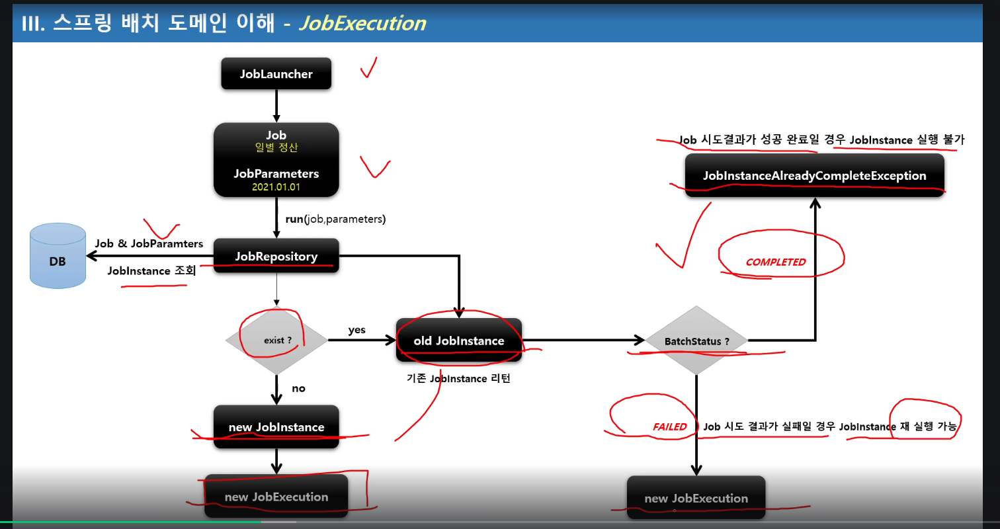
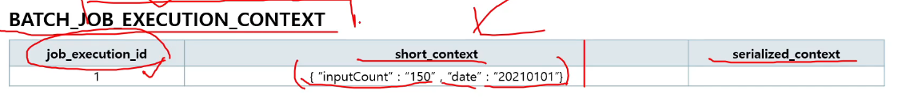
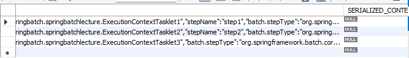
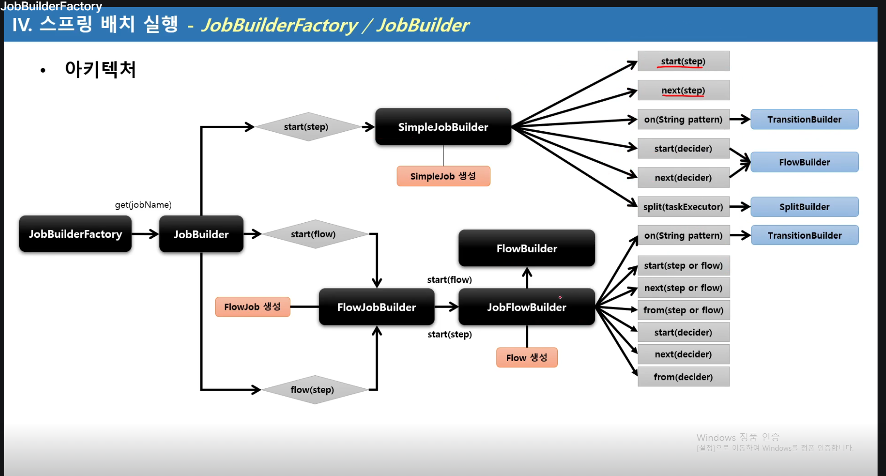
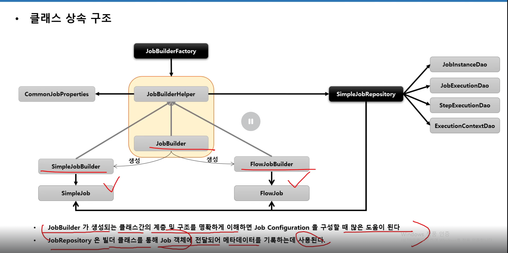

# Section3 스프링 배치 시작

## DB 스키마 생성 및 이해
1. 스프링 배치 메타 데이터
- 스프링 배치의 실행 및 관리를 위한 목적으로 여러 도메인들(Job, Step, JobParameters..)의 정보들을 저장 업데이트, 조회할 수 있는 스키마 제공
- 과거, 현재의 실행에 대한 세세한 정보, 실행에 대한 성공과 실패 여부 등을 일목요연하게 관리함으로서 배치운용에 있어 리스크 발생시 빠른 대처 가능
- DB 와 연동할 경우 필수적으로 메타 테이블이 생성 되어야 함.
- DB 유형별로 제공

2. 스키마 생성 설정
- 수동 생성 - 쿼리 복사 후 직접 실행
- 자동 생성 - spring.batch.jdbc.  -schema 설정
  - ALWAYS : 스크립트 항상 실행, RDBMS 설정이 되어있을 경우 내장 DB보다 우선적으로 실행
  - EMBEDDED : 내장 DB일 때만 실행되며 스키마가 자동 생성됨, 기본값.
  - NEVER : 스크립트 항상 실행 안함, 내장 DB일경우 스크립트가 생성이 안되기 때문에 오류 발생, 운영에서 수동으로 스크립트 생성 후 설정하는 것을 권장.

  

H2는 내장형 db이고, 가볍고 테스트용으로 성능이 좋다.
외부 DB 설치 없이 간편하게 테스트 용이
종료 시 초기화

### Job 관련 테이블
#### BATCH_JOB_INSTANCE
- Job이 실행될 때 JobInstance 정보가 저장되며 job_name과 job_key를 키로하여 하나의 데이터가 저장
- 동일한 job_name과 job_key로 중복 저장될 수 없다

#### BATCH_JOB_EXECUTION
- job의 실행정보가 저장되며 job 생성, 시작, 종료 시간, 실행상태, 메시지 등을 관리

#### BATCH_JOB_EXECUTION_PARAMS
- Job과 함께 실행되는 JobParamter 정보를 저장

#### BATCH_JOB_EXECUTION_CONTEXT
- Job의 실행동안 여러가지 상태정보, 공유 데이터를 직렬화(Json형식)해서 저장
- Step 간 서로 공유 가능함

### Step 관련 테이블
- BATCH_STEP_EXECUTION 
step의 실행정보가 저장되며 생성, 시작, 종료 시간, 실행상태, 메시지 등을 관리

- BATCH_STEP_EXECUTION_CONTEXT
Step의 실행동안 여러가지 상태 정보, 공유 데이터를 직렬화해서 저장
Step별로 저장되며, Step간 서로 공유할 수 없음

BATCH_SEP_EXECUTION


#### 직렬화란
자바 등에서 객체를 저장하거나 전송하기 위해 
메모리에 존재하는 객체를 일련의 바이트로 변환하는 것.

객체를 파일로 저장, 네트워크 전송, 세션 저장


# Section4 스프링 배치 도메인 이해 

## Job

1. 기본 개념
- 배치 계층 구조에서 가장 상위에 있는 개념으로서 하나의 배치작업 자체를 의미
  - API 서버의 접속 로그 데이터를 통계 서버로 옮기는 배치 인 Job 자체를 의미한다.
- Job Configuration을 통해 생성되는 객체 단위로서 배치작업을 어떻게 구성하고 실행한 것인지 전체적으로 설정하고 명세해 놓은 객체
- 배치 Job을 구성하기 위한 최상위 인터페이스이며 스프링 배치가 기본 구현체를 제공한다
- 여러 Step을 포함하고 있는 컨테이너로서 반드시 한 개 이상의 Step으로 구성해야 함

2. 기본 구현체
- SimpleJob
  - 순차적으로 Step을 실행시키는 Job
  - 모든 Job에서 유용하게 사용할 수 있는 표준 기능을 갖고 있음
- FlowJob
  - 특정한 조건과 흐름에 따라 Step을 구성하여 실행시키는 Job
  - Flow 객체를 실행시켜 작업을 진행함

## JobInstance
실행정보를 시점마다, 단계마다 생성되는 논리적 실행 단위. 테이블에 저장을 위한 메타데이터

1. 기본 개념
- Job이 실행될 때 생성되는 Job의 논리적 실행 단위 객채로서 고유하게 식별 가능한 작업 실행을 나타냄
- Job의 설정과 구성은 동일하지만 Job이 실행되는 시점에서 처리하는 내용은 다르기 때문에 Job의 실행을 구분해야 함
  - 예를 들어 하루에 한 번씩 Job이 실행된다면 매일 실행되는 각각의 Job을 JobInstance로 표현합니다.
- JobInstance 생성 및 실행
  - 처음 시작하는 Job + JobParameter 일 경우 새로운 JobInstance 생성
- 이전과 동일한 JOb + JobParameter으로 실행 할 경우 이미 존재하는 JobInstance를 리턴
  - 내부적으로 JobName + jobKey (JobParameter의 해시값)를 가지고 JobInstance 객체를 얻음
Launcer가 실행될때 Job, JobParameter를 받음
- Job과는 1:M 관계

★★★★★★★★★★
Job, Step, Flow : 실제로 배치잡을 실행하고 구성을 하기 위한 용도
Job, Step, Flow가 실행이 되고 수행이 되면 그 단계, 시점마다 메타데이터(Job이 실행되는 상태정보) 등을 데이터베이스에 저장하기 위해서 사용하는 용도로 "그 시점마다" 생성되는 도메인들이 Job Instance, Job excution, Job Parameters 등..
★★★★★★★★★★

2. BATCH_JOB_INSTANCE 테이블과 매핑
- JOB_NAME(job)과 job_key(JobParameter 해시값)가 동일한 데이터는 중복해서 저장할 수 없음


기존의 JobInstance가 리턴되면, 예외를 발생하고 Job을 중단한다.(failed)

@RequiredArgsConstructor : 생성자가 필요한 필드의 생성자를 만들어준다.
final, @NonNull 
final을 붙이지 않으면 해당 필드의 생성자는 만들어주지 않는다.

## JobParameter
1. 기본 개념
- Job을 실행할 때 함께 포함되어 사용하는 파라미터를 가진 도메인 객체
- 하나의 Job에 존재할 수 있는 여러개의 JobInstance를 구분하기 위한 용도
- JobParameters와 JobInstance는 1:1 관계

2. 생성 및 바인딩
- 어플리케이션 실행 시 주입
  - Java - jar LogBatch.jar requestData=20210101
- 코드로 생성
  - JobParameterBuilder, DefaultJobParametersConvereter
- SpEL 이용
  - @Value("#{JobParameter[requestData]}"), @JobScope, @StepScope 선언 필수

3. BATCH_JOB_EXECUTION_PARAM 테이블과 매핑
- JOB_EXECUTION 과 1:M의 관계

jobParameters를 받는 방법

`JobParameters jobParameters = contribution.getStepExecution().getJobExecution().getJobParameters();`

`Map<String, Object> jobParameters1 = chunkContext.getStepContext().getJobParameters();`

참조만 할 때에는 둘 다 상관 x
변수 주소의 값을 변경할 때에는 JobParameters로 받아야하고,
두 번째 방법은 그냥 Map에 key value값으로 저장되어 있기 때문에 값에 직접 접근해서 값을 변경하는 건 안됨. (하려면 Map의 새로운 key value 값으로 넣어주면 될 듯)

cmd에서 mvn명령어를 사용하기 위해서는 우선 환경변수에 maven/bin 폴더가 등록이 되어있어야 한다.

mvn package는 Maven프로젝트를 빌드해서 실행 가능한 JAR또는 WSR파일을 생성하는 명령어.

mvn package를 실행하는 일어나는 일
1. 소스 코드 컴파일
2. 테스트 코드 컴파일 및 실행 (기본적으로 src/test/java)
3. 패키징 (즉 .jar 또는 .war파일로 묶음)
4. 타깃 폴더에 결과 저장 (target/your-project.jar)

mvn clena : 기존의 target/ 폴더 삭제

target폴더의 역할 
1. 빌드 결과 저장소 : mvn package, mvn install 등을 실행하면 모든 결과물이 이곳에 생성
2. 테스트 결과 : 테스트 결과 리포트 파일들도 이 폴더 안에 저장될 수 있음
3. JAR/WAR 파일 : 최종 실행 파일이 여기 생김
4. 임시/컴파일 파일 .class 등 컴파일된 결과물도 이 폴더에 저장

## JobExecution
1. 기본 개념
- JobInstance에 대한 한 번의 시도를 의미하는 객체로서 Job실행 중에 발생한 정보들을 저장하고 있는 객체
  - 시작시간, 종료시간, 상태(시작됨, 완료, 실패), 종료상태의 속성을 가짐
- JobInstance와의 관계
  - JobExecution은 'FAILED' 또는 'COMPLETED' 등의 Job의 실행 결과 상태를 가지고 있음
  - JobExecution의 실행 상태 결과가 'COMPLETED' 면 JobInstance 실행이 완료된 것으로 간주해서 재 실행이 불가함
  - JobExecution의 실행 상태 결과가 'FAILED'면 JobInstance실행이 완료되지 않은 것으로 간주해서 재실행이 가능함
    - JobParameter가 동일한 값으로 Job을 실행할지라도 JobInstance를 계속 실행할 수 있음
  - JobExecution의 실행 상태 결과가 'COMPLETED' 될 때까지 하나의 JobInstance 내에서 여러 번의 시도가 생길 수 있음

2. BATCH_JOB_EXECUTION 테이블과 매핑
- JobInstance와 JobExecution은 1:M 관계로서 JobInstance에 대한 성공/실패의 내역을 가지고 있음

 
 JobLauncher -> Job (Job Parameter) -> run(job,parameters) -> JobRepository -> DB -> 존재 ? no -> new JobInstance -> JobExecution 
 old JobInstance -> BatchStatus ? -> Completed : JobInstanceAlreadyCompleteException 
 -> FAILED -> new JobExecution 

## Step

1. 기본 개념
- Batch job을 구성하는 독립적인 하나의 단계로서 실제 배치 처리를 정의하고 컨트롤하는 데 필요한 모든 정보를 담고 있는 도메인 객체
- 단순한 단일 태스크 뿐 아니라 입력과 처리 그리고 출력과 관련된 복잡한 비즈니스 로직을 포함하는 모든 설정들을 담고 있다.
- 배치작업을 어떻게 구성하고 실행할 것인지 Job의 세부 작업을 Task 기반으로 설정하고 명세해 놓은 객체
- 모든 Job은 하나 이상의 step으로 구성됨

2. 기본 구현체
- TaskletStep
  - 가장 기본이 되는 클래스로서 Tasklet 타입의 구현체들을 제어한다.
- PartitionStep 
  - 멀티 스레드 방식으로 Step을 여러 개로 분리해서 실행한다.
- JobStep 
  - Step 내에서 Job을 실행하도록 한다
- FlowStep
  - Step 내에서 Flow를 실행하도록 한다

  

  ## StepExuction

 1. 기본 개념
  - Step에 대한 한번의 시도를 의미하는 객체. Step 실행 중 발생한 정보들을 저장하고 있는 객체
    - 시작시간, 종료시간, 상태, commit count, rollback count 등의 속성을 가짐
  - Step이 매번 시도될 때마다 생성되며 각 Step별로 생성된다.
  - Job이 재시작 하더라도 이미 성공적으로 완료된 Step은 재 실행되지 않고 실패한 Step만 실행된다.
  - 이전 단계 Step이 실패해서 현재 Step을 실행하지 않았다면 StepExecution을 생성하지 않는다. Step이 실제로 시작됐을 때만 StepExecutuon을 생성한다.
  - JobExecution과의 관계
    - Step의 StepExecutuon이 모두 정상적으로 완료되어야 JobExecutuion이 정상적으로 완료된다.
    - Step의 StepExecution 중 하나라도 실패하면 JobExecution은 실패한다.

2. BATCH_STEP_EXECUTION 테이블과 매핑
  - JobExecution과 StepExecution는 1:M
  - 하나의 Job에 여러 개의 ㅣStep으로 구성했을 경우, 각 StepExecution는 하나의 JobExecution을 부모로 가진다.

Step2에서 실패하면 Step3은 실행도 안 됨.
재 시작할 경우 성공한 Step1은 실행되지 않고, Step2부터 실행 됨.

## StepContribution

1. 기본 개념
  - 청크 프로세스의 변경 사항을 버퍼링 한 후 StepExecution 상태를 업데이트하는 도메인 객체
  - 청크 커밋 직전에 StepExecution의 apply 메서드를 호출하여 상태를 업데이트 함
  - ExitStatus의 기본 종료코드 외 사용자 정의 종료코드를 생성해서 적용 할 수 있음


### StepContribution
현재 Chunk 처리 중인 모든 통계 정보를 임시로 담고 있는 객체

readCount : 몇 개 읽었는지
writeCount : 몇 개 썼는지
filterCount : 몇 개가 필터링(= 처리 중 제외) 됐는지
skipCount : 오류 등으로 건너뛴 항목 수

버퍼링한다 뜻?
처리 중간중간 통계를 StepContribution에 기록해두지만,
바로 DB에 반영되지 않고, 해당 청크(트랜잭션)가 끝날 때 반영된다는 의미.
즉, 처리 도중 문제가 생기면 해당 버퍼 내용은 롤백

-> 트랜잭션 롤백 시 통계가 잘못 저장되지 않도록 하기 위함.

### TaskletStep
doInTransaction : StepExecution.createStepContribution() -> StepContribution객체 생성 tasklet이 수행되는 과정
↓
tasklet.execute(contribution, chunkContext);
↓
finally에서 StepExecution.apply(contribution)
```
readCount += contribution.getReadSkeipCount();
writeSkipCount += contribution.getwriteSkipCount();
등등..해서 전체 context에 개수 추가해줌.
exitStatus = exitStatus.and(contribution.getExitStatus());
```

commit은 청크단위로 실행되고, 일반적으로 하나의 청크가 실패하면
rollback 후 step 중단.
단, faultTolerant(), skip(). retry() 등으로 최대 실패 횟수 등을 지정할 수 있음

## ExecutionContext

1. 기본 개념
- 프레임워크에서 유지 및 관리하는 키/값으로 된 컬렉션으로 StepExecution 또는 JobExecution 객체의 상태(state)를 저장하는 공유 객체
- DB에 직렬화 한 값으로 저장됨 - {"Key":"value"}
- 공유 범위
  - Step 범위 - 각 Step의 StepExecution에 저장되며 Step 간 서로 공유 안됨
  - Job 범위 - 각 Job의 JobExecution에 저장되면 Job간 서로 공유 안되며 해당 Job의 Step간 서로 공유됨
- Job 재 시작시 이미 저리한 Row는 건너뛰고 이후로 수행하도록 할 대 상태 정보를 활용한다.



ExecutionContext에 put으로 넣은 key, value값은 
DB의 BATCH_JOB_EXECUTION_CONTEXT 테이블에
short_context 컬럼에 저장이 된다.

batch_step_execution_context


stepExecutionContext.put으로 넣으면 위의 테이블에 map의 key value가 저장되고
아무것도 넣지 않으면 기본 step의 정보 "batch.stepType"만 저장됨

```
19. ExecutionContext 요약정리

ExecutionContext는 jobExecutionContext와 stepExecutionContext로 나뉜다.
Map으로 구성되어, put을 통해 key value 값을 넣어준다.

jobExecutionContext는 하나의 jobInstance에서 공유가능하다.
stepExecutionContext는 해당 스텝에서 사용 가능하다.

즉, jobExecutionContext에 저장한 값은 해당 job이 실행되는 모든 step에서 / 실패 후 재 실행시에도 재활용 가능하며
stepExecutionContext는 해당 step / 실패 후 재 실행시 해당 step에서 다시 사용 가능하다.

각 Context는 DB의 batch_job(step)_execution_context에 저장된다.
```

## JobRepository 
1. 기본 개념
- 배치 작업 중의 정보를 저장하는 저장소 역할
- Job이 언제 수행되었고, 언제 끝났으며, 몇 번 실행되었고 실행에 대한 결과 등의 배치 작업 수행과 관련된 모든 meta data를 저장함.
  - JobLauncher, Job, Step 구현체 내부에서 CRUD 기능을 처리함

  
  ### JobRepository 설정
  - @EnableBatchProcessing 어노테이션만 선언하면 JobRepositroy가 자동으로 빈으로 생성됨
  - BatchConfiguerer 인터페이스를 구현하거나 BasicBatchConfiguerer를 상속해서 JobRepositroy 설정을 커스터마이징 할 수 있다.
    - JDBC 방식으로 설정 - JobRepositoryFactoryBean
      - 내부적으로 AOP 기술을 통해 트랜잭션 처리를 해주고 있음
      - 트래잭션 isolation의 기본값은 SERIALIZABLE 로 최고 수준, 다른 레벨(READ_COMMITED, REPEATABLE_READ)로 지정 가능
      - 메타테이블의 Table Prefix를 변경할 수 있음, 기본 값은 "BATCH_" 임
    - In Memory 방식으로 설정 - MapJobRepositoryFactoryBean
      - 성능 등의 이유로 도메인 오브젝트를 굳이 데이터베이스에 저장하고 싶지 않을 경우
      - 보통 Test나 프로토타입의 빠른 개발이 필요할 때 사용

```
요약
jobRepository는 배치 처리의 실행 상태와 메타데이터를 저장하고 관리하는 핵심 컴포넌트.
JobInstance, JobExecution, StepExecution 등의 메타데이터를 저장/조회하는 저장소 인터페이스
데이터베이스를 기반으로 동작, 트랜잭션 처리와 상태 추적을 위해 사용

주요 기능
1. JobInstance저장
  - Job 이름 + 파라미터 조합으로 생성된 인스턴스
2. JobExecution 생성 및 저장
  - 실제 Job이 실행될 때마다 생성되며 실행 상태, 시작/종료 시간, 상태 코드 등을 포함 
3. 상태 관리
Job/Step의 실행 상태(STARTED, COMPLTED, FAILED 등)을 관리하여 재시작이나 실패 처리에 활용
```

## JobLauncher
1. 기본 개념
- 배치 Job을 실행시키는 역할
- Job과 Job Parameters를 인자로 받으며 요청된 배치 작업을 수행한 후 최종 client에게 JobExecution을 반환
- 스프링 부트 배치가 구동이 되면 JobLauncher 빈이 자동 생성
- Job 실행
  - JobLauncher.run(Job, JobParameters)
  - 스프링 부트 배치에서는 JobLauncherApplicationRunner 가 자동적으로 JobLauncher을 실행시킨다.
  - 동기적 실행
    - taskExecutor를 SyncTaskExecutor로 설정할 경우 (기본값은 SysncTaskExecutor)
    - JobExecution을 획득하고 배치 처리를 최종 완료한 이후 Client 에게 JobExecution을 반환
    - 스케줄러에 의한 배치처리에 적합함 - 배치처리시간이 길어도 상관없는 경우
  - 비 동기적 실행
    - taskExecutor가 SimpleAsyncTaskExecutor로 설정할 경우
    - JobExeuction을 획득한 후 Client에게 바로 JobExecution을 반환하고 배치처리를 진행한다.
    - HTTP 요청에 의한 배치처리에 적합함 - 배치처리 시간이 길 경우 응답이 늦어지지 않도록 함

```
SimpleJobLauncher JobLauncher = (SimpleJobLauncher) BasicBatchConfiguerer.getJobLauncher();
jobLauncher.setTaskExecutor(new SimpleAsyncTaskExecutor());

또는 (ChatGPT)
    SimpleJobLauncher jobLauncher = new SimpleJobLauncher();
    jobLauncher.setJobRepository(jobRepository);
    jobLauncher.setTaskExecutor(new SimpleAsyncTaskExecutor());  // 핵심!
    return jobLauncher;
```

프록시 객체 : 실제 객체를 감싸고 대리 역할을 수행하는 객체
-즉 사용자는 진짜 객체처럼 보이지만, 실제로는 그 앞에 다른 "대리 객체(프록시)"가 존재해서 요청을 가로채거나 추가 작업을 수행하는 구조.

# Section5 스프링 배치 실행 - Job
## 배치 초기화 설정

1. JobLauncherApplicationRunner
- Spring Batch 작업을 시작하는 ApplicationRunner로서 BatchAutoConfiguration에서 생성됨
- 스프링 부트에서 제공하는 ApllicationRunner의 구현체로 어플리케이션이 정상적으로 구동되자마자 실행됨
- 기본적으로 빈으로 등록된 모든 job을 실행시킨다.

2. BatchProperties
- Spring Batch의 환경 설정 클래스 
- Job 이름, 스키마 초기화 설정, 테이블 Prefix 등의 값을 설정할 수 있다.
- application.properties파일에 설정
  - batch:
    job:
      names: ${job.name:NONE}
    initilaize-schema: NEVER
    tablePrefix: SYSTEM
3. Job 실행 옵션
- 지정한 Batch Job만 실행하도록 할 수 있음
- spring.batch.job.names: ${job.name:NONE}
  - --job.name=hellojob
    --job.name=hellojob,simpleJob (하나 이상의 job을 실행할 경우 쉼표로 구분)

```
spring.batch.jdbc.initialize-schema=always

always : 항상 스키마 초기화 (테이블이 없으면 만들고, 있으면 DROP후 재생성)
embedded : 내장 DB(H2 등) 사용할 때만 자동 생성 (기본값)
never : 절대 자동으로 스키마를 생성하지 않음 (테이블 수동 생성 필요)

초기 DB 세팅 후에는 never로 바꾸고 Git으로 버전 관리하는 것이 좋음
```

```
application.yml에 table-prefix: SYSTEM_를 붙이는 건 
table을 SYSTEM_ 을 붙여서 만드는 건 아니고,
SYSTEM_을 붙인 테이블 정보를 불러오겠다는 것.

실제 create sql은 
org.springframework.batch:spring-batch-core
의 schema-db2.sql에 정의되어 있기 때문에 
table-prefix와는 관련이 없다.
```

## JobBuilderFactory

1. 스프링 배치는 Job과 Step을 쉽게 생성 및 설정할 수 있도록 util성격의 빌더 클래스들을 제공함

2. JobBuilderFactory
- JobBuiler를 생성하는 팩토리 클래스로서 get(String name)메서드 제공
- JobBuilderFactory.get("jobName")
  - "jobName"은 스프링 배치가 Job을 실행시킬 때 참조하는 Job의 이름 

3. JobBuilder
- Job을 구성하는 설정 조건에 따라 두 개의 하위 빌더 클래스를 생성하고 실제 Job 생성을 위임한다.
  - SimpleJobBuilder
    - simpleJob을 생성하는 Builder클래스
  - FlowJobBuilder
    - FlowJob을 생성하는 Builder 클래스
    - 내부적으로 flowJob을 생성하는 Builder클래스
    - 내부적으로 FlowBuilder을 반환함으로써 Flow실행과 관련된 여러 설정 API를 제공한다.

총 3가지 아키텍처

JobBuilderFactory -> JobBuilder -> start(step) -> SimpleJobBuilder -> SimpleJob생성 

start(flow) -> FlowJobBuilder -> FlowJob 생성

flow(step) -> FlowJobBuilder -> flowJob생성


FlowJobBuilder -> JobFlowBuilder -> FlowBuilder, Flow생성

FlowJobBuilder는 FlowJob 생성
JobFlowBuilder는 Flow생성


Flow는 step, flow 둘다 사용가능
SimpleJobBuilder는 step만 받음

### JobBuilder클래스의 상속구조



JobBuilderFactory는 get Method를 하나 가지고 있는, 내부적으로 jobBuilder를 생성하는 역할을 한다.

JobBuilder에는 start method 2개, flow method가 한 개 있음.

start는 step을 넣느냐, flow를 넣느냐에 따라서 생성하는 객체가 다르다.
SimpleJobBuilder / FlowJobBuilder

FlowJob으로 start를 하면, 그다음 next(step())을 넣었을 때 FlowBuilder를 반환함.

## SimpleJob
1. 기본 개념
- SimpleJob은 Step을 실행시키는 Job 구현체로서 SimpleJobBuilder에 의해 생성된다.
- 여러 단계의 Step으로 구성할 수 있으며 Step을 순차적으로 실행시킨다.
- 모든 Step의 실행이 성공적으로 완료되어야 Job이 성공적으로 완료된다.
- 맨 마지막에 실행한 Step의 BatchStatus가 Job의 최종 Status가 된다.


.start(Step) : 처음 실행 할 Step 설정, 최초 한 번 설정. SimpleJobBuilder반환
.next(Step) : 다음 실행할 Step설정. 횟수제한 x. 모든 next()가 실행되면 Job 종료
.incrementer(JobParametersIncrementer) : JobParameter의 값을 자동 증가해주는 주는 JobParametersIncrementer 설정.