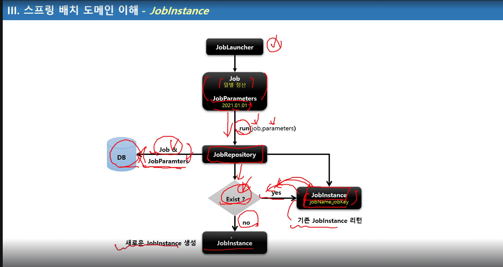

# Section3 스프링 배치 시작

## DB 스키마 생성 및 이해
1. 스프링 배치 메타 데이터
- 스프링 배치의 실행 및 관리를 위한 목적으로 여러 도메인들(Job, Step, JobParameters..)의 정보들을 저장 업데이트, 조회할 수 있는 스키마 제공
- 과거, 현재의 실행에 대한 세세한 정보, 실행에 대한 성공과 실패 여부 등을 일목요연하게 관리함으로서 배치운용에 있어 리스크 발생시 빠른 대치 가능
- DB 와 연동할 경우 필수적으로 메타 테이블이 생성 되어야 함.
- DB 유형별로 제공

2. 스키마 생성 설정
- 수동 생성 - 쿼리 복사 후 직접 실행
- 자동 생성 - spring.batch.jdbc.initialize-schema 설정
  - ALWAYS : 스크립트 항상 실행, RDBMS 설정이 되어있을 경우 내장 DB보다 우선적으로 실행
  - EMBEDDED : 내장 DB일 때만 실행되며 스키마가 자동 생성됨, 기본값.
  - NEVER : 스크립트 항상 실행 안함, 내장 DB일경우 스크립트가 생성이 안되기 때문에 오류 발생, 운영에서 수동으로 스크립트 생성 후 설정하는 것을 권장.

  

H2는 내장형 db이고, 가볍고 테스트용으로 성능이 좋다.
외부 DB 설치 없이 간편하게 테스트 용이
종료 시 초기화

### Job 관련 테이블
#### BATCH_JOB_INSTANCE
- Job이 실행될 때 JobInstance 정보가 저장되며 job_name과 job_key를 키로하여 하나의 데이터가 저장
- 동일한 job_name과 job_key로 중복 저장될 수 없다

#### BATCH_JOB_EXECUTION
- job의 실행정보가 저장되며 job 생성, 시작, 종료 시간, 실행상태, 메시지 등을 관리

#### BATCH_JOB_EXECUTION_PARAMS
- Job과 함께 실행되는 JobParamter 정보를 저장

#### BATCH_JOB_EXECUTION_CONTEXT
- Job의 실행동안 여러가지 상태정보, 공유 데이터를 직렬화(Json형식)해서 저장
- Step 간 서로 공유 가능함

### Step 관련 테이블
- BATCH_STEP_EXECUTION 
step의 실행정보가 저장되며 생성, 시작, 종료 시간, 실행상태, 메시지 등을 관리

- BATCH_STEP_EXECUTION_CONTEXT
Step의 실행동안 여러가지 상태 정보, 공유 데이터를 직렬화해서 저장
Step별로 저장되며, Step간 서로 공유할 수 없음

BATCH_SEP_EXECUTION

#### 직렬화란
자바 등에서 객체를 저장하거나 전송하기 위해 
메모리에 존재하는 객체를 일련의 바이트로 변환하는 것.

객체를 파일로 저장, 네트워크 전송, 세션 저장

# Section4 스프링 배치 도메인 이해 

## Job

1. 기본 개념
- 배치 계층 구조에서 가장 사위에 있는 개념으로서 하나의 배치작업 자체를 의미
  - API 서버의 접속 로그 데이터를 통계 서버로 옮기는 배치 인 Job 자체를 의미한다.
- Job Configuration을 통해 생성되는 객체 단위로서 배치작업을 어떻게 구성하고 실행한 것인지 전체적으로 설정하고 명세해 놓은 객체
- 배치 Job을 구성하기 위한 최상위 인터페이스이며 스프링 배치가 기본 구현체를 제공한다
- 여러 Step을 포함하고 있는 컨테이너로서 반드시 한 개 이상의 Step으로 구성해야 함

2. 기본 구현체
- SimpleJob
  - 순차적으로 Step을 실행시키는 Job
  - 모든 Job에서 유용하게 사용할 수 있는 표준 기능을 갖고 있음
- FlowJob
  - 특정한 조건과 흐름에 따라 Step을 구성하여 실행시키는 Job
  - Flow 객체를 실행시켜 작업을 진행함

## JobInstance
실행정보를 시점마다, 단계마다 생성되는 논리적 실행 단위. 테이블에 저장을 위한 메타데이터

1. 기본 개념
- Job이 실행될 때 생성되는 Job의 논리적 실행 단위 객채로서 고유하게 식별 가능한 작업 실행을 나타냄
- Job의 설정과 구성은 동일하지만 Job이 실행되는 시점에서 처리하는 내용은 다르기 때문에 Job의 실행을 구분해야 함
  - 예를 들어 하루에 한 번씩 Job이 실행된다면 매일 실행되는 각각의 Job을 JobInstance로 표현합니다.
- JobInstance 생성 및 실행
  - 처음 시작하는 Job + JobParameter 일 경우 새로운 JobInstance 생성
- 이전과 동일한 JOb + JobParameter으로 실행 할 경우 이미 존재하는 JobInstance를 리턴
  - 내부적으로 JobName + jobKey (JobParameter의 해시값)를 가지고 JobInstance 객체를 얻음
Launcer가 실행될때 Job, JobParameter를 받음
- Job과는 1:M 관계

★★★★★★★★★★
Job, Step, Flow : 실제로 배치잡을 실행하고 구성을 하기 위한 용도
Job, Step, Flow가 실행이 되고 수행이 되면 그 단계, 시점마다 메타데이터(Job이 실행되는 상태정보) 등을 데이터베이스에 저장하기 위해서 사용하는 용도로 "그 시점마다" 생성되는 도메인들이 Job Instance, Job excution, Job Parameters 등..
★★★★★★★★★★

2. BATCH_JOB_INSTANCE 테이블과 매핑
- JOB_NAME(job)과 job_key(JobParameter 해시값)가 동일한 데이터는 중복해서 저장할 수 없음

기존의 JobInstance가 리턴되면, 예외를 발생하고 Job을 중단한다.(failed)

@RequiredArgsConstructor : 생성자가 필요한 필드의 생성자를 만들어준다.
final, @NonNull 
final을 붙이지 않으면 해당 필드의 생성자는 만들어주지 않는다.

## JobParameter
1. 기본 개념
- Job을 실행할 때 함께 포함되어 사용하는 파라미터를 가진 도메인 객체
- 하나의 Job에 존재할 수 있는 여러개의 JobInstance를 구분하기 위한 용도
- JobParameters와 JobInstance는 1:1 관계

2. 생성 및 바인딩
- 어플리케이션 실행 시 주입
  - Java - jar LogBatch.jar requestData=20210101
- 코드로 생성
  - JobParameterBuilder, DefaultJobParametersConvereter
- SpEL 이용
  - @Value("#{JobParameter[requestData]}"), @JobScope, @StepScope 선언 필수

3. BATCH_JOB_EXECUTION_PARAM 테이블과 매핑
- JOB_EXECUTION 과 1:M의 관계

jobParameters를 받는 방법

`JobParameters jobParameters = contribution.getStepExecution().getJobExecution().getJobParameters();`

`Map<String, Object> jobParameters1 = chunkContext.getStepContext().getJobParameters();`

참조만 할 때에는 둘 다 상관 x
변수 주소의 값을 변경할 때에는 JobParameters로 받아야하고,
두 번째 방법은 그냥 Map에 key value값으로 저장되어 있기 때문에 값에 직접 접근해서 값을 변경하는 건 안됨. (하려면 Map의 새로운 key value 값으로 넣어주면 될 듯)
