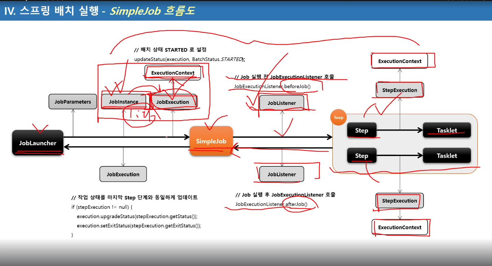
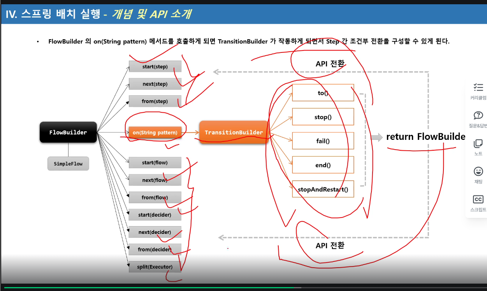

# Section3 스프링 배치 시작

## DB 스키마 생성 및 이해
1. 스프링 배치 메타 데이터
- 스프링 배치의 실행 및 관리를 위한 목적으로 여러 도메인들(Job, Step, JobParameters..)의 정보들을 저장 업데이트, 조회할 수 있는 스키마 제공
- 과거, 현재의 실행에 대한 세세한 정보, 실행에 대한 성공과 실패 여부 등을 일목요연하게 관리함으로서 배치운용에 있어 리스크 발생시 빠른 대처 가능
- DB 와 연동할 경우 필수적으로 메타 테이블이 생성 되어야 함.
- DB 유형별로 제공

2. 스키마 생성 설정
- 수동 생성 - 쿼리 복사 후 직접 실행
- 자동 생성 - spring.batch.jdbc.  -schema 설정
  - ALWAYS : 스크립트 항상 실행, RDBMS 설정이 되어있을 경우 내장 DB보다 우선적으로 실행
  - EMBEDDED : 내장 DB일 때만 실행되며 스키마가 자동 생성됨, 기본값.
  - NEVER : 스크립트 항상 실행 안함, 내장 DB일경우 스크립트가 생성이 안되기 때문에 오류 발생, 운영에서 수동으로 스크립트 생성 후 설정하는 것을 권장.

  

H2는 내장형 db이고, 가볍고 테스트용으로 성능이 좋다.
외부 DB 설치 없이 간편하게 테스트 용이
종료 시 초기화

### Job 관련 테이블
#### BATCH_JOB_INSTANCE
- Job이 실행될 때 JobInstance 정보가 저장되며 job_name과 job_key를 키로하여 하나의 데이터가 저장
- 동일한 job_name과 job_key로 중복 저장될 수 없다

#### BATCH_JOB_EXECUTION
- job의 실행정보가 저장되며 job 생성, 시작, 종료 시간, 실행상태, 메시지 등을 관리

#### BATCH_JOB_EXECUTION_PARAMS
- Job과 함께 실행되는 JobParamter 정보를 저장

#### BATCH_JOB_EXECUTION_CONTEXT
- Job의 실행동안 여러가지 상태정보, 공유 데이터를 직렬화(Json형식)해서 저장
- Step 간 서로 공유 가능함

### Step 관련 테이블
- BATCH_STEP_EXECUTION 
step의 실행정보가 저장되며 생성, 시작, 종료 시간, 실행상태, 메시지 등을 관리

- BATCH_STEP_EXECUTION_CONTEXT
Step의 실행동안 여러가지 상태 정보, 공유 데이터를 직렬화해서 저장
Step별로 저장되며, Step간 서로 공유할 수 없음

BATCH_SEP_EXECUTION


#### 직렬화란
자바 등에서 객체를 저장하거나 전송하기 위해 
메모리에 존재하는 객체를 일련의 바이트로 변환하는 것.

객체를 파일로 저장, 네트워크 전송, 세션 저장


# Section4 스프링 배치 도메인 이해 

## Job

1. 기본 개념
- 배치 계층 구조에서 가장 상위에 있는 개념으로서 하나의 배치작업 자체를 의미
  - API 서버의 접속 로그 데이터를 통계 서버로 옮기는 배치 인 Job 자체를 의미한다.
- Job Configuration을 통해 생성되는 객체 단위로서 배치작업을 어떻게 구성하고 실행한 것인지 전체적으로 설정하고 명세해 놓은 객체
- 배치 Job을 구성하기 위한 최상위 인터페이스이며 스프링 배치가 기본 구현체를 제공한다
- 여러 Step을 포함하고 있는 컨테이너로서 반드시 한 개 이상의 Step으로 구성해야 함

2. 기본 구현체
- SimpleJob
  - 순차적으로 Step을 실행시키는 Job
  - 모든 Job에서 유용하게 사용할 수 있는 표준 기능을 갖고 있음
- FlowJob
  - 특정한 조건과 흐름에 따라 Step을 구성하여 실행시키는 Job
  - Flow 객체를 실행시켜 작업을 진행함

## JobInstance
실행정보를 시점마다, 단계마다 생성되는 논리적 실행 단위. 테이블에 저장을 위한 메타데이터

1. 기본 개념
- Job이 실행될 때 생성되는 Job의 논리적 실행 단위 객채로서 고유하게 식별 가능한 작업 실행을 나타냄
- Job의 설정과 구성은 동일하지만 Job이 실행되는 시점에서 처리하는 내용은 다르기 때문에 Job의 실행을 구분해야 함
  - 예를 들어 하루에 한 번씩 Job이 실행된다면 매일 실행되는 각각의 Job을 JobInstance로 표현합니다.
- JobInstance 생성 및 실행
  - 처음 시작하는 Job + JobParameter 일 경우 새로운 JobInstance 생성
- 이전과 동일한 JOb + JobParameter으로 실행 할 경우 이미 존재하는 JobInstance를 리턴
  - 내부적으로 JobName + jobKey (JobParameter의 해시값)를 가지고 JobInstance 객체를 얻음
Launcer가 실행될때 Job, JobParameter를 받음
- Job과는 1:M 관계

★★★★★★★★★★
Job, Step, Flow : 실제로 배치잡을 실행하고 구성을 하기 위한 용도
Job, Step, Flow가 실행이 되고 수행이 되면 그 단계, 시점마다 메타데이터(Job이 실행되는 상태정보) 등을 데이터베이스에 저장하기 위해서 사용하는 용도로 "그 시점마다" 생성되는 도메인들이 Job Instance, Job excution, Job Parameters 등..
★★★★★★★★★★

2. BATCH_JOB_INSTANCE 테이블과 매핑
- JOB_NAME(job)과 job_key(JobParameter 해시값)가 동일한 데이터는 중복해서 저장할 수 없음


기존의 JobInstance가 리턴되면, 예외를 발생하고 Job을 중단한다.(failed)

@RequiredArgsConstructor : 생성자가 필요한 필드의 생성자를 만들어준다.
final, @NonNull 
final을 붙이지 않으면 해당 필드의 생성자는 만들어주지 않는다.

## JobParameter
1. 기본 개념
- Job을 실행할 때 함께 포함되어 사용하는 파라미터를 가진 도메인 객체
- 하나의 Job에 존재할 수 있는 여러개의 JobInstance를 구분하기 위한 용도
- JobParameters와 JobInstance는 1:1 관계

2. 생성 및 바인딩
- 어플리케이션 실행 시 주입
  - Java - jar LogBatch.jar requestData=20210101
- 코드로 생성
  - JobParameterBuilder, DefaultJobParametersConvereter
- SpEL 이용
  - @Value("#{JobParameter[requestData]}"), @JobScope, @StepScope 선언 필수

3. BATCH_JOB_EXECUTION_PARAM 테이블과 매핑
- JOB_EXECUTION 과 1:M의 관계

jobParameters를 받는 방법

`JobParameters jobParameters = contribution.getStepExecution().getJobExecution().getJobParameters();`

`Map<String, Object> jobParameters1 = chunkContext.getStepContext().getJobParameters();`

참조만 할 때에는 둘 다 상관 x
변수 주소의 값을 변경할 때에는 JobParameters로 받아야하고,
두 번째 방법은 그냥 Map에 key value값으로 저장되어 있기 때문에 값에 직접 접근해서 값을 변경하는 건 안됨. (하려면 Map의 새로운 key value 값으로 넣어주면 될 듯)

cmd에서 mvn명령어를 사용하기 위해서는 우선 환경변수에 maven/bin 폴더가 등록이 되어있어야 한다.

mvn package는 Maven프로젝트를 빌드해서 실행 가능한 JAR또는 WSR파일을 생성하는 명령어.

mvn package를 실행하는 일어나는 일
1. 소스 코드 컴파일
2. 테스트 코드 컴파일 및 실행 (기본적으로 src/test/java)
3. 패키징 (즉 .jar 또는 .war파일로 묶음)
4. 타깃 폴더에 결과 저장 (target/your-project.jar)

mvn clena : 기존의 target/ 폴더 삭제

target폴더의 역할 
1. 빌드 결과 저장소 : mvn package, mvn install 등을 실행하면 모든 결과물이 이곳에 생성
2. 테스트 결과 : 테스트 결과 리포트 파일들도 이 폴더 안에 저장될 수 있음
3. JAR/WAR 파일 : 최종 실행 파일이 여기 생김
4. 임시/컴파일 파일 .class 등 컴파일된 결과물도 이 폴더에 저장

## JobExecution
1. 기본 개념
- JobInstance에 대한 한 번의 시도를 의미하는 객체로서 Job실행 중에 발생한 정보들을 저장하고 있는 객체
  - 시작시간, 종료시간, 상태(시작됨, 완료, 실패), 종료상태의 속성을 가짐
- JobInstance와의 관계
  - JobExecution은 'FAILED' 또는 'COMPLETED' 등의 Job의 실행 결과 상태를 가지고 있음
  - JobExecution의 실행 상태 결과가 'COMPLETED' 면 JobInstance 실행이 완료된 것으로 간주해서 재 실행이 불가함
  - JobExecution의 실행 상태 결과가 'FAILED'면 JobInstance실행이 완료되지 않은 것으로 간주해서 재실행이 가능함
    - JobParameter가 동일한 값으로 Job을 실행할지라도 JobInstance를 계속 실행할 수 있음
  - JobExecution의 실행 상태 결과가 'COMPLETED' 될 때까지 하나의 JobInstance 내에서 여러 번의 시도가 생길 수 있음

2. BATCH_JOB_EXECUTION 테이블과 매핑
- JobInstance와 JobExecution은 1:M 관계로서 JobInstance에 대한 성공/실패의 내역을 가지고 있음

 
 JobLauncher -> Job (Job Parameter) -> run(job,parameters) -> JobRepository -> DB -> 존재 ? no -> new JobInstance -> JobExecution 
 old JobInstance -> BatchStatus ? -> Completed : JobInstanceAlreadyCompleteException 
 -> FAILED -> new JobExecution 

## Step

1. 기본 개념
- Batch job을 구성하는 독립적인 하나의 단계로서 실제 배치 처리를 정의하고 컨트롤하는 데 필요한 모든 정보를 담고 있는 도메인 객체
- 단순한 단일 태스크 뿐 아니라 입력과 처리 그리고 출력과 관련된 복잡한 비즈니스 로직을 포함하는 모든 설정들을 담고 있다.
- 배치작업을 어떻게 구성하고 실행할 것인지 Job의 세부 작업을 Task 기반으로 설정하고 명세해 놓은 객체
- 모든 Job은 하나 이상의 step으로 구성됨

2. 기본 구현체
- TaskletStep
  - 가장 기본이 되는 클래스로서 Tasklet 타입의 구현체들을 제어한다.
- PartitionStep 
  - 멀티 스레드 방식으로 Step을 여러 개로 분리해서 실행한다.
- JobStep 
  - Step 내에서 Job을 실행하도록 한다
- FlowStep
  - Step 내에서 Flow를 실행하도록 한다

  

  ## StepExuction

 1. 기본 개념
  - Step에 대한 한번의 시도를 의미하는 객체. Step 실행 중 발생한 정보들을 저장하고 있는 객체
    - 시작시간, 종료시간, 상태, commit count, rollback count 등의 속성을 가짐
  - Step이 매번 시도될 때마다 생성되며 각 Step별로 생성된다.
  - Job이 재시작 하더라도 이미 성공적으로 완료된 Step은 재 실행되지 않고 실패한 Step만 실행된다.
  - 이전 단계 Step이 실패해서 현재 Step을 실행하지 않았다면 StepExecution을 생성하지 않는다. Step이 실제로 시작됐을 때만 StepExecutuon을 생성한다.
  - JobExecution과의 관계
    - Step의 StepExecutuon이 모두 정상적으로 완료되어야 JobExecutuion이 정상적으로 완료된다.
    - Step의 StepExecution 중 하나라도 실패하면 JobExecution은 실패한다.

2. BATCH_STEP_EXECUTION 테이블과 매핑
  - JobExecution과 StepExecution는 1:M
  - 하나의 Job에 여러 개의 ㅣStep으로 구성했을 경우, 각 StepExecution는 하나의 JobExecution을 부모로 가진다.

Step2에서 실패하면 Step3은 실행도 안 됨.
재 시작할 경우 성공한 Step1은 실행되지 않고, Step2부터 실행 됨.

## StepContribution

1. 기본 개념
  - 청크 프로세스의 변경 사항을 버퍼링 한 후 StepExecution 상태를 업데이트하는 도메인 객체
  - 청크 커밋 직전에 StepExecution의 apply 메서드를 호출하여 상태를 업데이트 함
  - ExitStatus의 기본 종료코드 외 사용자 정의 종료코드를 생성해서 적용 할 수 있음


### StepContribution
현재 Chunk 처리 중인 모든 통계 정보를 임시로 담고 있는 객체

readCount : 몇 개 읽었는지
writeCount : 몇 개 썼는지
filterCount : 몇 개가 필터링(= 처리 중 제외) 됐는지
skipCount : 오류 등으로 건너뛴 항목 수

버퍼링한다 뜻?
처리 중간중간 통계를 StepContribution에 기록해두지만,
바로 DB에 반영되지 않고, 해당 청크(트랜잭션)가 끝날 때 반영된다는 의미.
즉, 처리 도중 문제가 생기면 해당 버퍼 내용은 롤백

-> 트랜잭션 롤백 시 통계가 잘못 저장되지 않도록 하기 위함.

### TaskletStep
doInTransaction : StepExecution.createStepContribution() -> StepContribution객체 생성 tasklet이 수행되는 과정
↓
tasklet.execute(contribution, chunkContext);
↓
finally에서 StepExecution.apply(contribution)
```
readCount += contribution.getReadSkeipCount();
writeSkipCount += contribution.getwriteSkipCount();
등등..해서 전체 context에 개수 추가해줌.
exitStatus = exitStatus.and(contribution.getExitStatus());
```

commit은 청크단위로 실행되고, 일반적으로 하나의 청크가 실패하면
rollback 후 step 중단.
단, faultTolerant(), skip(). retry() 등으로 최대 실패 횟수 등을 지정할 수 있음

## ExecutionContext

1. 기본 개념
- 프레임워크에서 유지 및 관리하는 키/값으로 된 컬렉션으로 StepExecution 또는 JobExecution 객체의 상태(state)를 저장하는 공유 객체
- DB에 직렬화 한 값으로 저장됨 - {"Key":"value"}
- 공유 범위
  - Step 범위 - 각 Step의 StepExecution에 저장되며 Step 간 서로 공유 안됨
  - Job 범위 - 각 Job의 JobExecution에 저장되면 Job간 서로 공유 안되며 해당 Job의 Step간 서로 공유됨
- Job 재 시작시 이미 저리한 Row는 건너뛰고 이후로 수행하도록 할 대 상태 정보를 활용한다.


ExecutionContext에 put으로 넣은 key, value값은 
DB의 BATCH_JOB_EXECUTION_CONTEXT 테이블에
short_context 컬럼에 저장이 된다.

batch_step_execution_context


stepExecutionContext.put으로 넣으면 위의 테이블에 map의 key value가 저장되고
아무것도 넣지 않으면 기본 step의 정보 "batch.stepType"만 저장됨

```
19. ExecutionContext 요약정리

ExecutionContext는 jobExecutionContext와 stepExecutionContext로 나뉜다.
Map으로 구성되어, put을 통해 key value 값을 넣어준다.

jobExecutionContext는 하나의 jobInstance에서 공유가능하다.
stepExecutionContext는 해당 스텝에서 사용 가능하다.

즉, jobExecutionContext에 저장한 값은 해당 job이 실행되는 모든 step에서 / 실패 후 재 실행시에도 재활용 가능하며
stepExecutionContext는 해당 step / 실패 후 재 실행시 해당 step에서 다시 사용 가능하다.

각 Context는 DB의 batch_job(step)_execution_context에 저장된다.
```

## JobRepository 
1. 기본 개념
- 배치 작업 중의 정보를 저장하는 저장소 역할
- Job이 언제 수행되었고, 언제 끝났으며, 몇 번 실행되었고 실행에 대한 결과 등의 배치 작업 수행과 관련된 모든 meta data를 저장함.
  - JobLauncher, Job, Step 구현체 내부에서 CRUD 기능을 처리함

  
  ### JobRepository 설정
  - @EnableBatchProcessing 어노테이션만 선언하면 JobRepositroy가 자동으로 빈으로 생성됨
  - BatchConfiguerer 인터페이스를 구현하거나 BasicBatchConfiguerer를 상속해서 JobRepositroy 설정을 커스터마이징 할 수 있다.
    - JDBC 방식으로 설정 - JobRepositoryFactoryBean
      - 내부적으로 AOP 기술을 통해 트랜잭션 처리를 해주고 있음
      - 트래잭션 isolation의 기본값은 SERIALIZABLE 로 최고 수준, 다른 레벨(READ_COMMITED, REPEATABLE_READ)로 지정 가능
      - 메타테이블의 Table Prefix를 변경할 수 있음, 기본 값은 "BATCH_" 임
    - In Memory 방식으로 설정 - MapJobRepositoryFactoryBean
      - 성능 등의 이유로 도메인 오브젝트를 굳이 데이터베이스에 저장하고 싶지 않을 경우
      - 보통 Test나 프로토타입의 빠른 개발이 필요할 때 사용

```
요약
jobRepository는 배치 처리의 실행 상태와 메타데이터를 저장하고 관리하는 핵심 컴포넌트.
JobInstance, JobExecution, StepExecution 등의 메타데이터를 저장/조회하는 저장소 인터페이스
데이터베이스를 기반으로 동작, 트랜잭션 처리와 상태 추적을 위해 사용

주요 기능
1. JobInstance저장
  - Job 이름 + 파라미터 조합으로 생성된 인스턴스
2. JobExecution 생성 및 저장
  - 실제 Job이 실행될 때마다 생성되며 실행 상태, 시작/종료 시간, 상태 코드 등을 포함 
3. 상태 관리
Job/Step의 실행 상태(STARTED, COMPLTED, FAILED 등)을 관리하여 재시작이나 실패 처리에 활용
```

## JobLauncherㅜ
1. 기본 개념
- 배치 Job을 실행시키는 역할
- Job과 Job Parameters를 인자로 받으며 요청된 배치 작업을 수행한 후 최종 client에게 JobExecution을 반환
- 스프링 부트 배치가 구동이 되면 JobLauncher 빈이 자동 생성
- Job 실행
  - JobLauncher.run(Job, JobParameters)
  - 스프링 부트 배치에서는 JobLauncherApplicationRunner 가 자동적으로 JobLauncher을 실행시킨다.
  - 동기적 실행
    - taskExecutor를 SyncTaskExecutor로 설정할 경우 (기본값은 SysncTaskExecutor)
    - JobExecution을 획득하고 배치 처리를 최종 완료한 이후 Client 에게 JobExecution을 반환
    - 스케줄러에 의한 배치처리에 적합함 - 배치처리시간이 길어도 상관없는 경우
  - 비 동기적 실행
    - taskExecutor가 SimpleAsyncTaskExecutor로 설정할 경우
    - JobExeuction을 획득한 후 Client에게 바로 JobExecution을 반환하고 배치처리를 진행한다.
    - HTTP 요청에 의한 배치처리에 적합함 - 배치처리 시간이 길 경우 응답이 늦어지지 않도록 함

```
SimpleJobLauncher JobLauncher = (SimpleJobLauncher) BasicBatchConfiguerer.getJobLauncher();
jobLauncher.setTaskExecutor(new SimpleAsyncTaskExecutor());

또는 (ChatGPT)
    SimpleJobLauncher jobLauncher = new SimpleJobLauncher();
    jobLauncher.setJobRepository(jobRepository);
    jobLauncher.setTaskExecutor(new SimpleAsyncTaskExecutor());  // 핵심!
    return jobLauncher;
```

프록시 객체 : 실제 객체를 감싸고 대리 역할을 수행하는 객체
-즉 사용자는 진짜 객체처럼 보이지만, 실제로는 그 앞에 다른 "대리 객체(프록시)"가 존재해서 요청을 가로채거나 추가 작업을 수행하는 구조.

# Section5 스프링 배치 실행 - Job
## 배치 초기화 설정

1. JobLauncherApplicationRunner
- Spring Batch 작업을 시작하는 ApplicationRunner로서 BatchAutoConfiguration에서 생성됨
- 스프링 부트에서 제공하는 ApllicationRunner의 구현체로 어플리케이션이 정상적으로 구동되자마자 실행됨
- 기본적으로 빈으로 등록된 모든 job을 실행시킨다.

2. BatchProperties
- Spring Batch의 환경 설정 클래스 
- Job 이름, 스키마 초기화 설정, 테이블 Prefix 등의 값을 설정할 수 있다.
- application.properties파일에 설정
  - batch:
    job:
      names: ${job.name:NONE}
    initilaize-schema: NEVER
    tablePrefix: SYSTEM
3. Job 실행 옵션
- 지정한 Batch Job만 실행하도록 할 수 있음
- spring.batch.job.names: ${job.name:NONE}
  - --job.name=hellojob
    --job.name=hellojob,simpleJob (하나 이상의 job을 실행할 경우 쉼표로 구분)

```
spring.batch.jdbc.initialize-schema=always

always : 항상 스키마 초기화 (테이블이 없으면 만들고, 있으면 DROP후 재생성)
embedded : 내장 DB(H2 등) 사용할 때만 자동 생성 (기본값)
never : 절대 자동으로 스키마를 생성하지 않음 (테이블 수동 생성 필요)

초기 DB 세팅 후에는 never로 바꾸고 Git으로 버전 관리하는 것이 좋음
```

```
application.yml에 table-prefix: SYSTEM_를 붙이는 건 
table을 SYSTEM_ 을 붙여서 만드는 건 아니고,
SYSTEM_을 붙인 테이블 정보를 불러오겠다는 것.

실제 create sql은 
org.springframework.batch:spring-batch-core
의 schema-db2.sql에 정의되어 있기 때문에 
table-prefix와는 관련이 없다.
```

## JobBuilderFactory

1. 스프링 배치는 Job과 Step을 쉽게 생성 및 설정할 수 있도록 util성격의 빌더 클래스들을 제공함

2. JobBuilderFactory
- JobBuiler를 생성하는 팩토리 클래스로서 get(String name)메서드 제공
- JobBuilderFactory.get("jobName")
  - "jobName"은 스프링 배치가 Job을 실행시킬 때 참조하는 Job의 이름 

3. JobBuilder
- Job을 구성하는 설정 조건에 따라 두 개의 하위 빌더 클래스를 생성하고 실제 Job 생성을 위임한다.
  - SimpleJobBuilder
    - simpleJob을 생성하는 Builder클래스
  - FlowJobBuilder
    - FlowJob을 생성하는 Builder 클래스
    - 내부적으로 flowJob을 생성하는 Builder클래스
    - 내부적으로 FlowBuilder을 반환함으로써 Flow실행과 관련된 여러 설정 API를 제공한다.

총 3가지 아키텍처

JobBuilderFactory -> JobBuilder -> start(step) -> SimpleJobBuilder -> SimpleJob생성 

start(flow) -> FlowJobBuilder -> FlowJob 생성

flow(step) -> FlowJobBuilder -> flowJob생성


FlowJobBuilder -> JobFlowBuilder -> FlowBuilder, Flow생성

FlowJobBuilder는 FlowJob 생성
JobFlowBuilder는 Flow생성


Flow는 step, flow 둘다 사용가능
SimpleJobBuilder는 step만 받음

### JobBuilder클래스의 상속구조


JobBuilderFactory는 get Method를 하나 가지고 있는, 내부적으로 jobBuilder를 생성하는 역할을 한다.

JobBuilder에는 start method 2개, flow method가 한 개 있음.

start는 step을 넣느냐, flow를 넣느냐에 따라서 생성하는 객체가 다르다.
SimpleJobBuilder / FlowJobBuilder

FlowJob으로 start를 하면, 그다음 next(step())을 넣었을 때 FlowBuilder를 반환함.

## SimpleJob
1. 기본 개념
- SimpleJob은 Step을 실행시키는 Job 구현체로서 SimpleJobBuilder에 의해 생성된다.
- 여러 단계의 Step으로 구성할 수 있으며 Step을 순차적으로 실행시킨다.
- 모든 Step의 실행이 성공적으로 완료되어야 Job이 성공적으로 완료된다.
- 맨 마지막에 실행한 Step의 BatchStatus가 Job의 최종 Status가 된다.


.start(Step) : 처음 실행 할 Step 설정, 최초 한 번 설정. SimpleJobBuilder반환
.next(Step) : 다음 실행할 Step설정. 횟수제한 x. 모든 next()가 실행되면 Job 종료
.incrementer(JobParametersIncrementer) : JobParameter의 값을 자동 증가해주는 주는 JobParametersIncrementer 설정.

### validator()

검증 시기

기능이 시작하기 전 단계에서 한 번. job이 실행되기 전 한 번 해서 두 번 검증함.

두번 검증이유 : 책임의 분리

첫 번째 검증 : SimpleJob 자체의 Validator
- Job 정의 자체가 올바른지 검증 (ex:필수속성:name, JobRepository등이 있는지)

두 번째 검증 : JobLauncher 
- JobParameters가 필수값을 포함하는지

즉
- Job 정의 검증 : 프로그램이 시작할 때 올바른 Job 구성이 준비되어 있는가?
- 실행 시점 검증 : 실제로 실행할 수 있는 안전한 조건이 충족되었는가?

validator를 따로 안만들어주면 DefaultJobParametersValidator를 사용한다.

```java
.validator(new DefaultJobParametersValidator(new String[]{"name", "date"}, new String[]{"count"}));

앞의 건 required keys 뒤의 건 optional keys
name, date : 필수 
count : 옵션

여기서 parameters에 옵션도, 필수도 아닌 키를 넘겨주게 되면 에러발생
```


config에서 

#### job : enable : false 를 사용하는 이유
Spring Boot가 어플 시작 시 자동으로 Batch Job을 실행하지 않도록 막는 옵션

기본 동작
- Spring Boot + Spring Batch를 같이 사용하면 컨텍스트에 등록된 모든 Job을 자동으로 한 번에 실행해줌
- 실행 시에는 JobLauncherApplicationRunner라는 빈이 Job들을 찾아서 실행

왜 enable = false 로 할까?

1. 여러 개의 Job이 있을 때 
  - 어플이 시작될 때 모든 Job이 실행되면 곤란
  - 원하는 Job만 골라서 실행하려고
2. 개발/테스트 환경에서
  - 서버 실행할 때마다 Job이 돌면 DB가 초기화되거나 데이터가 중복 처리될 수 있음
  - 이럴 땐 수동으로 실행하고 싶어서 false
3. 웹 서버와 배치 분리 운영할 때
  - Spring Boot로 API 서버와 배치 서버를 같은 코드베이스로 운영할 수도 있는데, 웹서버는 Job실행이 필요 없으니 꺼둠

enable = false일 때 실행 방법
- CommandLineRunner / ApplicationRunner를 이용해서 원하는 시점에 Job을 실행
- REST API 컨트롤러 만들어서 특정 Job 호출 가능

-> Job을 중복없이 계속 실행할 수 있도록
.preventRestart(true) : Job의 재시작 가능 여부 설정, 기본값은 true (실패 시 등.)
->false로하면 실패해도 재시작 못함
.validator(JobParameterValidator) : JobParameter를 실행하기 전에 올바른 구성이 되었는지 검증하는 JobParametersValidator 설정
.listener(JobExecutionListener) : Job 라이프 사이클의 특정 시점에 콜백 제공받도록 JobExecutionListener 설정
.build() : SimpleJob 생성

위에서 설정한 정보들은 SimpleJobBuilder가 상속하고있는 JobBuilderHelper에서 
CommonJobProperties properties속성으로 넣어주고,
build()에서 불러오는 enhance라는 메소드에서 job.set(properties.get~~)으로 SimpleJob에 다 넣어준다.
즉, SimpleJob은 위의 속성을 모두 가지고 있다는 것.

## validator()
1. 기본개념
- Job 실행에 꼭 필요한 파라미터를 검증하는 용도
- DefaultJobParametersValidator 구현체를 지원하며, 좀 더 복잡한 제약 조건이 있다면 인터페이스를 직접 구현할 수도 있음.

2. 구 조
JobParameterValidator
void validate(@Nullable JobParameters parameters)

3. 흐름도

SimpleJob -> validate() -> JobParametersVaildator -> requiredKeys: {key, key, key ...} ex){}"date=20200102", "name=cho"}
                                                  -> optionalKeys: {key}


### SimpleJob 흐름도


JobLauncherApplicationRunner
ApplicationRunner를 구현하여 어플리케이션 시작 시 스프링 배치의 자동 설정을 통해 등록된 
Job 빈들을 찾아 실행하는 역할을 합니다.

JobBuilderFactory 
JobBuilder를 생성하고, 이 빌더를 통해 SimpleJob 또는 FlowJob 등 실제 Job객체를 설정하고 빌드합니다.

# Section6 스프링 배치 실행 - Step

## StepBuilderFactory / Stepbuilder

1.StepBuilderFactory
- StepBuilder를 생성하는 팩토리 클래스로서 get(String name)메서드 제공
- StepBuilderFactory.get("stepName")
  - "stepName"으로 Step을 생성

2. StepBuilder
- Step을 구성하는 설정 조건에 따라 다섯 개의 하위  빌더 클래스를 생성하고 실제 Step생성을 위임한다.

1. TaskletStepBuilder : TaskletStep을 생성하는 기본 빌더 클래스
2. SimpleStepBuilder : TaskletStep을 생성하며 내부저으로 청크기반의 작업을 처리하는 ChunkOrientedTasklet 클래스를 생성한다. (TaskletStepBuilder와의 차이.)
3. PartitionStepBuilder : PartitionStep을 생성하며 멀티 스레드 방식으로 Job을 실행한다.
4. JobStepBuilder : JobStep을 생성하여 Step안에서 Job을 실행한다.
5. FlowStepBuilder : FlowStep을 생성하여 Step안에서 Flow를 실행한다.

StepBuilderFactory -> get메소드 : StepBuilder 객체 
-> .partitioner() -> PartitionStepBuilder객체 -> build() -> PartitionStep 객체 생성
-> .chunk() -> SimpleStepBuilder 객체
-> .job() -> JobStepBuilder 객체 
-> .flow() -> FlowStepBuilder 객체 
-> .tasklet() -> TaskletStepBuilder 객체 


## TaskletStep
1. 기본 개념 
- 스프링 배치에서 제공하는 Step의 구현체로서 Tasklet을 실행시키는 도메인 객체
- RepeatTemplate를 사용해서 Tasklet의 구문을 트랜잭션 경계 내에서 반복해서 실행함
- Task기반과 Chunk기반으로 나누어서 Tasklet을 실행함

2. Task vs Chunk기반 비교
- 스프링 배치에서 Step의 실행 단위는 크게2가지로 나누어짐
  - chunk 기반
    - 하나의 큰 덩어리를 n개씩 나누어서 실행한다는 의미로 대량 처리를 하는 경우 효과적
    - ItemReader, ItemProcessor, ItemWriter를 사용하며 청크 기반 전용 Tasklet인 ChunkOrientedTasklet구현체가 제공된다.
    - Job -> TaskletStep -> RepeatTemplate -> [(Transaction, Loop)ChunkOrientedTasklet -> ItemReader, , ItemProcessor, ItemWriter]
  - Task 기반
    - ItemReader와 ItemWriter과 같은 청크 기반의 작업 보다 단일 작업 기반으로 처리되는 것이 더 효율적인 경우
    - 주로 Tasklet 구현체를 만들어 사용
    - 대량 처리를 하는 경우 chunk기반에 비해 더 복잡한 구현 필요
    - Job -> TaskletStep -> RepeatTemplate -> [(Loop, Transaction)Tasklet -> BL]
```
chunkStep 내부 소스를 보면 reader로 items을 읽어와서,
chunkIterator로 hasNext로 아이템을 하나 씩 가져와서 
```

콜백이란 ? 
어떤 동작이 끝난 다음에 호출되도록 미리 등록해 놓는 함수(또는 메서드)

ex)음식이 도착하면 알람을 보냄 (이 알림 기능이 콜백임)

### TaskletStep - tasklet()
1. 기본 개념
  - Tasklet 타입의 클래스를 설정한다.
    - Tasklet
      - Step내에서 구성되고 실행되는 도메인 객체로서 주로 단일 태스크를 수행하기 위한 것
      - TaskletStep에 의해 반복적으로 수행되며 반환값에 따라 계속 수행 혹은 종료한다.
      - RepeatStatus - Tasklet의 반복 여부 상태 값
        - RepeatStatus.FINISHED - Tasklet 종료, RepeatStatus를 null로 변화하면 RepeatStatus.FINISHED로 해석됨
        - RepeatStatus.CONTINUALBE - Tasklet 반복
        - RepeatStatus.FINISHED가 리턴되거나 실패 예외가 던져지기 전까지 TaskletStpe에 의해 while문 안에서 반복적으로 호출됨(무한루프 주의)
  - 익명 클래스 혹은 구현 클래스를 만들어서 사용한다.
  - 이 메소드를 실행하게 되면 TaskletStepBuilder가 반환되어 관련 API를 설정할 수 있다.
  - Step에 오직 하나의 Tasklet 설정이 가능하며 두개 이상을 설정 했을 경우 마지막에 설정한 객체가 실행된다.

2. 구조
RepeatStatus execute(StepContribution, ChunkContext);

```
Stepcontribution 과 ChunkContext의 차이 
StepContribution
StepExecution과 관련된 통계 정보 객체
읽기/쓰기/스킵 건수 통계 기록
ItemWriter, Tasklet, SkipListener 등
몇 개 읽고 썼는지, 커밋했는지 등의 숫자
getReadCount() / incrementWriteCounte() 등

ChunkContext
Chunk실행 시 컨텍스트 정보(메타데이터 포함)
ExecutionContex 접근, 파라미터, 상태 고융 
Tasklet, StepListener, RetryListener 등
Step 이름, Job/StepExecution, ExecutionContext 등 

✅ 한 줄 정리

🔸 StepContribution은 숫자 중심의 실행 통계,
🔸 ChunkContext는 메타정보 + 컨텍스트 데이터 공유의 중심입니다.
```

### startLimit() / allowStartIfComplete()

1. 기본 개념
  - 재시작 가능한 job에서 step의 이전 성공 여부와 상관없이 항상 step을 실행하기 위한 설정
  - 실행 마다 유효성을 검증하는 Step이나 사전 작업이 꼭 필요한 Step 등 
  - 기본적으로 COMPLETE 상태를 가진 Step은 재 시작 시 실행하지 않고 스킵한다.
  - allow-start-if-complete가 "true"로 설정된 step은 항상 실행한다.


```java
public Step batchStep(){
  return stepBuilderFactory.get("batchStep")
  .tasklet(Tasklet)
  .startLimit(10) //이 횟수를 넘어가는 시행은 StepExecution에서는 실행/저장되지 않고, jobExecution의 상태값이 fail-> limit exception
  .allowStartIfComplete(true) // default : false
  .listner(StepExecutionListener)
  .build();
}
```

Job 
↓
StepExecution-> ExecutionContext (ExitStatus exitStatus - ExistStatus.EXECUTING / updateStatus(execution, BatchStatus.STARTED)) 
↓
TaskletStep
↓
StepListener (CompositeStepExecutionListener.beforeStep()) //Step실행 전 StepExecutionListener 호출
↓
//Step실행 후 StepExecutionListener 호출
CompositeStepExecutionListener.afterStep()
↓
RepeatStatus.CONTINUABLE
↓
Tasklet
↓
RepeatStatus.FINISHED


```java
//StepExecution안에  ExecutionContext를 만들어서 저장
currentStepExecution.setExecutionContext(new ExecutionContext(executionContext));

getCompositeListener().beforeStep(stepExecution); // beforeStep Listner호출
```

✅ TaskletStep

제어 방식: Tasklet.execute(...) 의 반환값 RepeatStatus

RepeatStatus.CONTINUABLE → 같은 Tasklet 다시 실행

RepeatStatus.FINISHED → 반복 종료, Step 완료

즉, Tasklet 안에서 개발자가 반복 여부를 직접 결정합니다.
(ex: 카운트, 조건, 타임아웃 등)

✅ ChunkOrientedTasklet (Chunk 기반 Step)

제어 방식: Reader가 null 반환할 때까지

ItemReader.read() → 아이템 있으면 계속 반복

null 이 나오면 더 이상 읽을 게 없다고 판단 → Step 종료

추가로, 반복 단위는 chunk(size) 또는 chunk(CompletionPolicy) 로 조절됩니다.
(ex: 10개씩 모아서 write, 또는 30초마다 flush)

ExitStatus를 설정 한 뒤, afterStep을 불러옴


## JobStep

### JobStep
1. 기본 개념
- Job에 속하는 step 중 외부의 Job을 포함하고 있는 Step
- 외부의 Job이 실패하면 해당 Step이 실패하므로 결국 최종 기본 Job 도 실패한다.
- 모든 메타데이터는 기본 Job과 외부 Job 별로 각각 저장된다.
- 커다란 시스템을 작은 모듈로 쪼개고 job의 흐름을 관리하고자 할 때 사용할 수 있다.

2. API 소개

StepBuilderFactory > StepBuilder > JobStepBuilder > JobStep

``` java
public Step jobStep(){
  return stepBuilderFactory.get("jobStep") // StepBuilder를 생성하는 팩토리, Step의 이름을 매개변수로 받음
  .job(job) // JobStep내 에서 실행 될 Job설정, JobStepBuilder 반환
  .launcher(JobLauncher) // Job을 실행할 JobLauncher설정
  .parametersExtractor(JobParametersExtractor) // Step의 ExecutionContext를 Job이 실행되는 데 필요한 JobParameters로 변환
  .build() // JobStep을 생성
}
```

ParentJob > JobStep -> Childjob (step1) -> Step2

두 개의 Job은 다른 Job Instance로 별도 저장/관리된다.

childeJob은 extractor.setKeys(""); 로 추가 파라미터를 전달할 수 있고,
parentJob이 가지고있는 parameter도 기본 가지고 있다.

### Quiz
StepBuilderFactory의 역할
JobBuilderFactory와 유사하게 StepName을 받아 StepBuilder를 생성하는 역할
어떤 종류의 스텝(Tasklet, Chunk, Job 등)을 만들지는 이후 API설정에 따라 결정되는 StepBuilder의 하위 빌더에 의해 정해짐.

TaskletStep에서 Task-based 처리와 Chunk-based 처리의 주요 차이점은?
Task-based는 사용자 정의 로직을, Chunk-based는 Reader/Processor/Writer를 사용한다.

# Section7 스프링 배치 실행 - Flow

1. 기본개념
  - Step을 순차적으로만 구성하는 것이 아닌 특정한 상태에 따라 흐름을 전환하도록 구성할 수 있으며 FlowJobBuilder에 의해 생성된다.
  - Step이 실패하더라도 Job은 실패로 끝나지 않도록 해야 하는 경우
  - Step이 성공 했을 때 다음에 실행해야 할 Step을 구분해서 실행해야 하는 경우
- Flow와 Job의 흐름을 구성하는데만 관여하고 실제 비즈니스 로직은 Step에서 이루어진다.
- 내부적으로 SimpleFlow 객체를 포함하고 있으며 Job실행 시 호출한다.

JobBuilderFactory -> JobBuilder -> JobFlowBuilder > FlowBuilder > Flowjob

```java
public Job batchJob(){
  return jobBuilderFactory("batchJob")
        .start(Step) // Flow를 시작하는 Step 설정
        .on(String pattern) // Step의 실행 결과로 돌려받는 종료상태(ExitStatus)를 캐치하여 매칭하는  패턴, TransitionBuilder 반환
        .to(Step) // 다음으로 이동할 Step 지정
        .stop() / fail() / end() / stopAndRestart() // Flow를 중지/실패/종료 하도록 Flow 종료
        .from(Step) // 이전 단계에서 정의한 Step의 Flow를 추가적으로 정의함
        .next(Step) // 다음으로 이동할 Step 지정
        .end() // build() 앞에 위치하면 FlowBuilder를 종료하고 SimpleFlow객체 생성
        .build() // FlowJob 생성하고 flow 필드에 SimpleFlow 저장
}
```



on(String pattern)이 TransitionBuilder를 불러와, 그 안에 있는 to(), stop(), fail(), end(), stopAndRestart()를 사용할 수 있게되고,
끝나면 FlowBuilder를 다시 반환하여, 다른 API기능을 다시 사용할 수 있게된다.


FlowJob에서 on("FAILED").to(step3())

의 경우, Failed한 Step의 상태값은 ABANDONED, ExitCode는 FAILED

SimpleJobBuilder 생성
on이라는 메소드에서 JobFlowBuilder(new FlowJobBuilder) 

on에서 TransitionBuilder를 return

 FlowJob이 simpleFlow를 필드로 가지고있어서 실행시켜줌.
 
### start() / next()

```java
public Job batchJob(){
  return jobBuilderFactory.get("batchJob")
              .start(Flow) // 처음  실행할 Flow 설정, JobFlowBuilder가 반환된다.
              // 여기에 Step이 인자로 오게 되면 SimpleJobBuilder 반환
              .next(Step or Flow or JobExecutionDecider)
              .on(String pattern) // 여기서 조건을 줘야만 실패해도 Job이 실패하지 않도록 구성함. Flow라고 무조건 성공하는건아님.
              .to(Step)
              .stop() / fail() / end() / stopAndRestart()
              .end()
              .build();
}
```

### on() / to() / stop() / fail() / end() / stopAndRestart()

on : 위에서 준 Step이나 Flow의 실행 종료코드가 pattern과 일치한다면, to, stop, fail, end, stopAndRestart 등 다음 단계로 보내라.
일치하지 않는다면 안 보냄.

### Transition
기본 개념
Transition
1. Flow내 Step의 조건부 전환(전이)를 정의함
2. Job의 API설정에서 on(String pattern)메소드를 호출하면 TransitionBuilder가 반환되어 Transition Flow를 구성할 수 있음
3. Step의 종료상태(ExitStatus)가 어떤 pattern과도 매칭되지 않으면 스프링 배치에서 예외를 발생하고 Job은 실패
4. transition은 구체적인 것부터 그렇지 않은 순서로 적용된다.
(ex : Step 1 -> A -> Step2 / Step1 -> * -> Step 3 : A를 제외한 나머지는 Step3을 실행) 
API
1. on(String pattern)
  - Step의 실행 결과로 돌려받는 종료상태(ExitStatus)와 매칭하는 패턴 스키마. BatchStatus와 매칭하는 것이 아님
  - pattern과 ExitStatus와 매칭이 되면 다음으로 실행할 Step을 지정할 수 있다.
  - 특수문자는 두 가지만 허용
    - "*" : 0개 이상의 문자와 매칭, 모든 ExitStatus와 매칭된다.
    - "?" : 정확히 1개의 문자와 매칭
    - ex) "c*t"는 "cat과 "count"에 매칭되고, "c?t"는 "cat"에는 되고 "count"는 안됨

2. to()
  - 다음으로 실행할 단계를 지정
3. from()
  - 이전 단계에서 정의한 Transition을 새롭게 추가 정의함

Job을 중단하거나 종료하는 Transition API
- Flow가 실행되면 FlowExecutionStatus에 상태값이 저장되고 최종적으로 Joㅠ의 BatchStatus와 ExitStatus에 반영된다.
- Step의 BatchStatus 및 ExitStatus에는 아무런 영향을 주지 않고 Job의 상태만을 변경한다.

.end() : COMPLETED

on("FAILED:).end() : step은 FAILED, JOB : COMPLETED


# Section7 스프링 배치 실행 - 사용자 정의 ExitStatus
1. 기본 개념
  - ExistStatus에 존재하지 않는 exitCode를 새롭게 정의해서 설정
  - StepExecutionListener의 afterStep()메서드에서 Custom exitCode 생성 후 새로운 ExitStatus 반환
  - Step 실행 후 완료 시점에서 현재 exitCode를 사용자 정의 exitCode로 수정할 수 있음
```java
    @Bean
    public Job batchJob() {
        return this.jobBuilderFactory.get("batchJob")
                .incrementer(new RunIdIncrementer())
                .start(step1())
                .on("FAILED") 
                .to(step2())
                .on("PASS")
                .stop()
                .end()
                .build();
    }
이 경우, StepExecution의 step2는 COMPLETE, COMPETE이더라도,
 내가 정의한 on이외에 처리가 없기 때문에, JOBSTATUS는 FAILED, EXITCODE도 FAILED가 된다.
반면, EXITSTATUS가 FAILED라도 상태가 COMPLETED가 됨. 
```

## FlowJob
만약 step1의 status : COMPLETED 이고, exitCode가 fail이면,

SpringBatch는 기본적으로 이전 Step이 완료된 경우에만 다음 Step을 실행.
완료라고 판단하는 두 조건
- StepExecution.status == COMPLETED
- ExitStatus == ExitStatus.COMPLETED (혹은 FlowExecutionStatus.COMPLETED)

